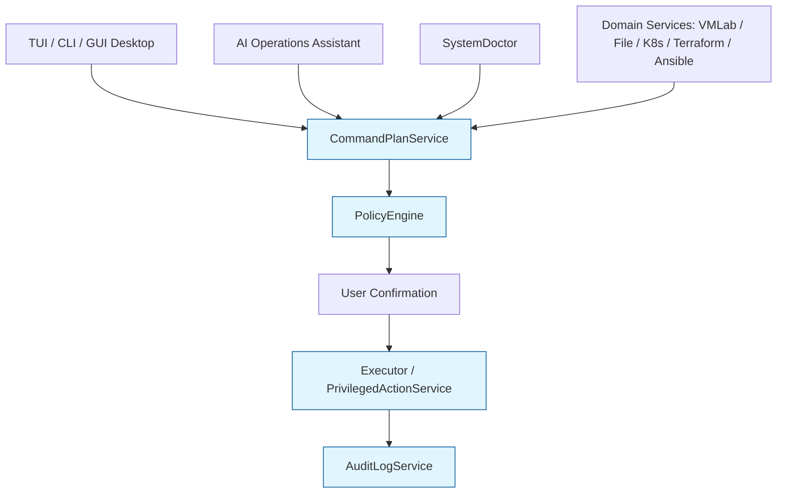
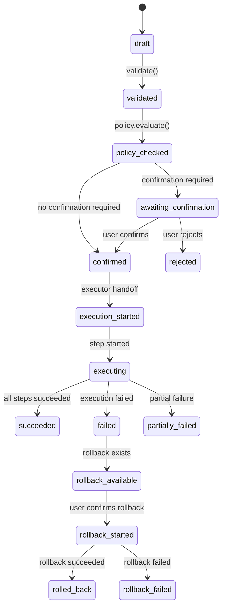
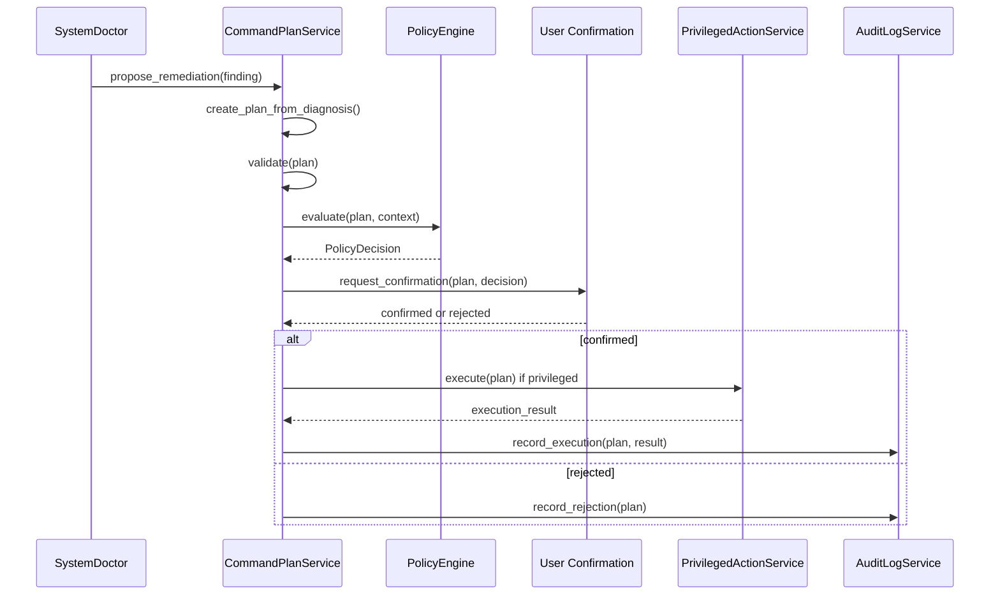

<!--
SPDX-License-Identifier: Apache-2.0

Project: ECLI
File: docs/architecture/command-plan-service.md
Website: https://www.ecli.io
Repository: https://github.com/SSobol77/ecli
Author: Siergej Sobolewski
License: Apache License, Version 2.0

Copyright (c) 2026 Siergej Sobolewski

Licensed under the Apache License, Version 2.0.
See the LICENSE file in the project root for full license text.
-->

# CommandPlanService

**Core Safety Primitive of ECLI Professional Operations Workbench**

**Version:** 1.0
**Date:** 2026-05-15
**Status:** Strategic Direction
**Part of:** [Product Vision](./product-vision.md) | [Services Foundation](./services-foundation.md)

---

## 1. Purpose

`CommandPlanService` is the central safety, governance, review, and execution-control primitive of ECLI.

It ensures that every risky, privileged, destructive, infrastructure-affecting, or production-affecting operation is:

- explicit;
- previewable;
- confirmable;
- auditable;
- reproducible;
- policy-checkable;
- exportable as plain text;
- blocked when unsafe.

No high-risk operation may bypass this service.

`CommandPlanService` is foundational for:

- VMLab remediation;
- privileged file operations;
- System Doctor fixes;
- Kubernetes / OpenShift mutations;
- Terraform operations;
- Ansible execution;
- service manager operations;
- package manager operations;
- AI-assisted remediation workflows;
- future GUI Desktop actions.

`CommandPlanService` is not a VMLab-specific service. It is a core ECLI architectural primitive.

---

## 2. Core Philosophy

```text
Never execute silently. Always plan first.
````

ECLI follows this rule:

```text
ECLI does not run sudo silently.
```

The correct design is not to ban privileged workflows.

The correct design is to make privileged workflows explicit, reviewable, confirmable, logged, reproducible, and policy-checkable.

Every risky operation must be represented as a plan before execution.

---

## 3. Position in the Architecture

`CommandPlanService` sits between domain services and execution backends.



The UI never executes infrastructure actions directly.

Domain services understand their domain and generate domain-specific plan requests.

Examples:

- `VMLabService` may generate a plan to fix KVM access.
- `SystemDoctor` may generate a plan to install missing packages.
- `FileManagerPro` may generate a plan to write a root-owned file.
- `KubernetesService` may generate a plan to scale a deployment.
- `TerraformService` may generate a plan to run `terraform apply`.

`CommandPlanService` validates, normalizes, stores, previews, exports, confirms, and coordinates those plans.

---

## 4. Responsibility Boundary

### 4.1 CommandPlanService Owns

`CommandPlanService` owns:

- plan schema definition and versioning;
- plan creation and normalization;
- plan validation against typed contracts;
- plan lifecycle state management;
- risk classification;
- policy evaluation coordination via `PolicyEngine`;
- confirmation requirement enforcement;
- dry-run representation;
- export formats: JSON, shell script, Markdown;
- rollback metadata;
- integration with `AuditLogService`;
- execution handoff to the correct executor backend.

### 4.2 CommandPlanService Does Not Own

`CommandPlanService` does not own:

- QEMU-specific runtime logic or QMP protocol details;
- Kubernetes resource semantics;
- Terraform state management or HCL parsing;
- package manager dependency resolution;
- privileged password handling;
- low-level process spawning;
- terminal UI rendering;
- AI decision-making;
- domain-specific business logic.

Domain services generate plan requests.

Execution services execute approved plans.

`CommandPlanService` controls the safety envelope.

---

## 5. Plan Lifecycle

Every plan follows a strict, auditable lifecycle.



Plans may also enter terminal non-execution states:

```text
rejected
cancelled
expired
blocked_by_policy
```

### 5.1 State Rules

- A `draft` plan cannot be executed.
- A plan must be validated before policy evaluation.
- A plan must pass policy evaluation before confirmation.
- A plan requiring confirmation cannot be executed until confirmed.
- A privileged plan must be executed only through `PrivilegedActionService`.
- A failed plan must preserve step-level results and sanitized error context.
- Rollback is best-effort and must never be implied when unavailable.
- All state transitions must be audit logged.

---

## 6. Command Plan Schema v1

The schema must be typed, serializable, validation-friendly, and forward-compatible.

The implementation may use Pydantic or dataclasses, but the public contract must preserve these fields.

### 6.1 Required Model Concepts

```python
from __future__ import annotations

from datetime import datetime, timezone
from enum import Enum
from typing import Any, Literal
from uuid import uuid4

from pydantic import BaseModel, Field


class PlanRisk(str, Enum):
    """Risk classification used by policy and confirmation flows."""

    LOW = "low"
    MEDIUM = "medium"
    HIGH = "high"
    CRITICAL = "critical"


class PlanStatus(str, Enum):
    """Auditable lifecycle state of a command plan."""

    DRAFT = "draft"
    VALIDATED = "validated"
    POLICY_CHECKED = "policy_checked"
    AWAITING_CONFIRMATION = "awaiting_confirmation"
    CONFIRMED = "confirmed"
    REJECTED = "rejected"
    CANCELLED = "cancelled"
    EXPIRED = "expired"
    BLOCKED_BY_POLICY = "blocked_by_policy"
    EXECUTION_STARTED = "execution_started"
    EXECUTING = "executing"
    SUCCEEDED = "succeeded"
    FAILED = "failed"
    PARTIALLY_FAILED = "partially_failed"
    ROLLBACK_AVAILABLE = "rollback_available"
    ROLLBACK_STARTED = "rollback_started"
    ROLLED_BACK = "rolled_back"
    ROLLBACK_FAILED = "rollback_failed"


class PlanCategory(str, Enum):
    """High-level operation category for routing and policy rules."""

    GENERAL = "general"
    SYSTEM = "system"
    FILE = "file"
    VM = "vm"
    KUBERNETES = "kubernetes"
    OPENSHIFT = "openshift"
    TERRAFORM = "terraform"
    ANSIBLE = "ansible"
    CLOUD = "cloud"
    CICD = "cicd"
    OBSERVABILITY = "observability"


class PlanSource(str, Enum):
    """Origin of a plan request."""

    USER = "user"
    DOCTOR = "doctor"
    AI_ASSISTANT = "ai-assistant"
    SERVICE = "service"


def new_plan_id() -> str:
    """Create a filesystem-friendly, sortable plan identifier."""
    now = datetime.now(timezone.utc).strftime("%Y%m%dT%H%M%SZ")
    return f"plan-{now}-{uuid4().hex[:8]}"


class CommandStep(BaseModel):
    """One executable step inside a command plan."""

    step_id: str
    title: str

    # Authoritative execution representation.
    argv: list[str]

    # Human-readable representation only.
    display: str

    cwd: str | None = None
    env: dict[str, str] = Field(default_factory=dict)

    requires_privilege: bool = False
    destructive: bool = False
    idempotent: bool = False

    expected_exit_codes: list[int] = Field(default_factory=lambda: [0])
    timeout_seconds: int | None = None

    redacted: bool = False
    metadata: dict[str, Any] = Field(default_factory=dict)


class PolicyDecision(BaseModel):
    """Policy evaluation result attached to a command plan."""

    allowed: bool
    reason: str

    policy_id: str | None = None
    violated_rules: list[str] = Field(default_factory=list)

    override_allowed: bool = False
    override_required: bool = False

    metadata: dict[str, Any] = Field(default_factory=dict)


class CommandPlan(BaseModel):
    """Serializable command plan contract."""

    schema_version: Literal[1] = 1

    plan_id: str = Field(default_factory=new_plan_id)
    title: str
    description: str | None = None

    category: PlanCategory = PlanCategory.GENERAL
    risk: PlanRisk
    status: PlanStatus = PlanStatus.DRAFT

    requires_privilege: bool = False
    confirmation_required: bool = True
    requires_relogin: bool = False
    dry_run_supported: bool = False

    commands: list[CommandStep]
    rollback: list[CommandStep] = Field(default_factory=list)

    explanation: str | None = None
    affected_resources: list[str] = Field(default_factory=list)
    estimated_impact: str | None = None

    policy_decision: PolicyDecision | None = None

    created_at: datetime = Field(default_factory=lambda: datetime.now(timezone.utc))
    created_by: str | None = None
    source: PlanSource = PlanSource.USER

    metadata: dict[str, Any] = Field(default_factory=dict)

```

### 6.2 Model Purity and Service-Owned Helpers

`CommandPlan` is a typed data model.

It must not own service behavior such as export rendering, policy execution, confirmation routing, or execution coordination.

Service-level behavior belongs to `CommandPlanService` or dedicated helper functions.

Required service/helper functions:

```python
def needs_confirmation(plan: CommandPlan) -> bool:
    """Return true when a plan requires explicit user confirmation."""
    return (
        plan.confirmation_required
        or plan.risk in (PlanRisk.HIGH, PlanRisk.CRITICAL)
        or plan.requires_privilege
    )
````

Rules:

- `CommandPlan` may expose framework-provided serialization primitives;
- `CommandPlan` must not generate shell scripts;
- `CommandPlan` must not make policy decisions;
- `CommandPlan` must not execute or apply itself;
- export and confirmation logic belongs to `CommandPlanService`.

### 6.3 Schema Rules

- `plan_id` must be unique and filesystem-friendly.
- `argv` is authoritative for execution.
- `display` is only for human review.
- Variables may appear in `display`.
- Variables in `argv` must be resolved before execution.
- `commands` must not be empty.
- `rollback` is optional and best-effort.
- `confirmation_required` is a policy input, not a replacement for policy evaluation.
- `policy_decision` is attached after policy evaluation.
- `created_by` identifies the user, service, or assistant that created the plan.
- `metadata` must not contain raw secrets.

---

## 7. Command Step Rules

Command steps must be `argv`-first for security and reproducibility.

Example:

```json
{
  "argv": ["sudo", "usermod", "-aG", "kvm", "ssobol"],
  "display": "sudo usermod -aG kvm \"$USER\""
}
```

Rules:

- `argv` is authoritative for execution.
- `display` is never parsed for execution.
- shell execution is not the default.
- shell execution must be explicitly marked if ever allowed.
- arguments must not be concatenated into unsafe command strings.
- secrets must never be stored in plain text.
- environment variables containing secrets must be redacted in audit logs.
- every step must have a stable `step_id`.
- every step must define `expected_exit_codes`.
- destructive steps must be marked with `destructive: true`.
- privileged steps must be marked with `requires_privilege: true`.

---

## 8. PolicyEngine Interface

Phase 1 requires an abstract `PolicyEngine` interface.

It does not require a concrete OPA implementation.

The policy layer must be replaceable so ECLI can start with a simple built-in policy engine and later support OPA/Rego or external policy bundles without breaking the command plan contract.

### 8.1 Policy Context

```python
from __future__ import annotations

from typing import Any, Protocol
from abc import ABC, abstractmethod

from pydantic import BaseModel, Field


class PolicyContext(BaseModel):
    """Context provided to the policy engine during evaluation."""

    user: str
    user_groups: list[str] = Field(default_factory=list)

    environment: str = "development"
    source: str = "user"

    plan_category: str
    risk: str
    requires_privilege: bool
    destructive: bool = False

    affected_resources: list[str] = Field(default_factory=list)
    metadata: dict[str, Any] = Field(default_factory=dict)


class PolicyRule(Protocol):
    """Protocol for a single policy rule."""

    def evaluate(self, plan: CommandPlan, context: PolicyContext) -> PolicyDecision:
        """Evaluate this rule against the plan and context."""
        ...


class PolicyEngine(ABC):
    """Abstract policy evaluation interface for command plans."""

    @abstractmethod
    async def evaluate(
        self,
        plan: CommandPlan,
        context: PolicyContext,
    ) -> PolicyDecision:
        """Evaluate a plan against the active policy set."""
        raise NotImplementedError

    @abstractmethod
    def register_rule(self, rule_id: str, rule: PolicyRule) -> None:
        """Register a custom rule for the built-in policy engine."""
        raise NotImplementedError

    @abstractmethod
    def get_registered_rules(self) -> list[str]:
        """Return registered rule identifiers."""
        raise NotImplementedError
```

Implementation note: `CommandPlan` and `PolicyDecision` may live in separate modules. The concrete implementation must avoid circular imports.

### 8.2 Built-In Policy Engine

Phase 1 ships with a deterministic built-in policy engine.

The built-in engine must be:

- local;
- deterministic;
- testable;
- dependency-light;
- fail-closed;
- replaceable through the `PolicyEngine` interface.

Required built-in rules:

| Rule ID | Predicate | Decision |
|---------|-----------|----------|
| `BUILTIN-001` | `plan.source == PlanSource.AI_ASSISTANT` and `plan.risk in {HIGH, CRITICAL}` | Deny by default. Human review is required. |
| `BUILTIN-002` | `plan.risk == PlanRisk.CRITICAL` | Require explicit confirmation. |
| `BUILTIN-003` | Any `CommandStep.requires_privilege == true` | Route only through `PrivilegedActionService`; direct execution is forbidden. |
| `BUILTIN-004` | Any `CommandStep.destructive == true` and `context.environment == "production"` | Deny unless a policy override is explicitly allowed and audit metadata is provided. |
| `BUILTIN-005` | Any `affected_resource` matches configured forbidden resource patterns | Deny. |
| `BUILTIN-006` | Policy override is used | Require audit metadata: actor, reason, timestamp, and policy rule ID. |

Engine behavior:

- rules are evaluated in registration order;
- first non-overridable deny wins;
- allow requires all applicable rules to pass;
- missing or malformed policy context causes fail-closed denial;
- override decisions must be explicit and audit-logged;
- user-local policy must not weaken stricter project or system policy.

Policy precedence:

```text
system policy > project policy > user policy > built-in defaults
```

Lower-precedence policy may tighten behavior only if it does not conflict with stricter policy above it.

### 8.3 OPA-Compatible Backend

ECLI may support OPA/Rego later.

OPA must remain behind the `PolicyEngine` interface.

OPA is not a Phase 1 blocker.

---

## 9. SystemDoctor Integration

`SystemDoctor` is a diagnostic and remediation planning service.

It is not responsible for applying fixes directly.

It detects problems, produces diagnostics, and generates `CommandPlan` objects through `CommandPlanService`.

### 9.1 Responsibilities

`SystemDoctor` owns:

- environment diagnostics;
- prerequisite detection;
- configuration validation diagnostics;
- permission checks;
- virtualization readiness checks;
- tooling availability checks;
- remediation plan generation.

`SystemDoctor` does not own:

- privileged execution;
- direct package installation;
- direct file mutation;
- direct service restart;
- direct QEMU execution;
- direct Kubernetes or cloud mutation.

### 9.2 Diagnostic Model

```python
from enum import Enum
from typing import Any

from pydantic import BaseModel, Field


class DoctorSeverity(str, Enum):
    """Severity of a diagnostic finding."""

    INFO = "info"
    WARNING = "warning"
    ERROR = "error"
    CRITICAL = "critical"


class DoctorFinding(BaseModel):
    """Structured diagnostic finding produced by SystemDoctor."""

    finding_id: str
    title: str
    severity: DoctorSeverity
    category: str

    description: str
    affected_resources: list[str] = Field(default_factory=list)

    remediation_available: bool = False
    remediation_plan_id: str | None = None

    metadata: dict[str, Any] = Field(default_factory=dict)


class DoctorContext(BaseModel):
    """Read-only diagnostic execution context for SystemDoctor."""

    user: str | None = None
    project_root: str | None = None

    categories: list[str] = Field(default_factory=list)
    environment: str = "development"
    verbosity: int = 0

    dry_run: bool = True
    metadata: dict[str, Any] = Field(default_factory=dict)

```

Rules:

- `dry_run` defaults to `True`;
- `SystemDoctor` must not mutate host state;
- `SystemDoctor` must not run privileged commands;
- `SystemDoctor` must not install packages;
- project paths must be resolved through `ProjectService`;
- configuration must be read through `ConfigService`;
- generated development diagnostics and evidence must be written only under repository-level `logs/`.

### 9.3 CLI Surface

```bash
ecli doctor
ecli doctor --category vm
ecli doctor --category config
ecli doctor --category permission
ecli doctor --json
ecli doctor --plan-fixes
ecli doctor --apply-fixes
```

Rules:

- `ecli doctor` reports findings only.
- `ecli doctor --json` prints machine-readable diagnostics.
- `ecli doctor --plan-fixes` generates command plans but does not apply them.
- `ecli doctor --apply-fixes` still routes through `CommandPlanService`, `PolicyEngine`, user confirmation, and `PrivilegedActionService` where required.

### 9.4 Integration Flow



SystemDoctor must never bypass this flow.

---

## 10. Service Responsibilities

`CommandPlanService` must provide these capabilities:

### 10.1 Plan Creation

Create plans from:

- domain services;
- SystemDoctor findings;
- AI-generated recommendations;
- CLI requests;
- TUI/GUI actions.

### 10.2 Plan Validation

Validate:

- schema version;
- required fields;
- command step structure;
- empty command list;
- invalid risk/category/status values;
- unsafe shell usage;
- missing expected exit codes;
- privilege mismatch between plan and steps;
- rollback metadata consistency;
- secret redaction requirements.

### 10.3 Risk Classification

Risk is influenced by:

- privilege requirements;
- destructive flag;
- affected resources;
- production environment;
- cloud or Kubernetes mutation;
- Terraform apply;
- file ownership changes;
- service restarts;
- rollback availability;
- AI-generated source.

### 10.4 Policy Evaluation

Phase 1 requirement:

- provide `PolicyEngine` interface;
- provide built-in local policy backend;
- support deterministic allow/block decisions;
- record policy decisions in the plan;
- keep OPA optional for future phases.

### 10.5 User Confirmation

Confirmation must show:

- title;
- explanation;
- risk;
- source;
- affected resources;
- exact commands;
- privilege requirements;
- destructive steps;
- rollback availability;
- policy decision.

### 10.6 Export

Support export formats:

- JSON;
- shell script;
- Markdown summary.

Shell export must be safe and explicit.

Exported shell scripts must include warning comments for privileged and destructive operations.

### 10.6.1 Export Ownership Rule

Export behavior belongs to `CommandPlanService`, not to `CommandPlan`.

Required service methods:

```python
class CommandPlanService:
    def export_json(self, plan: CommandPlan) -> str:
        """Export a command plan as deterministic redacted JSON."""
        ...

    def export_shell(self, plan: CommandPlan) -> str:
        """Export a command plan as a safe reviewable shell script."""
        ...

    def export_markdown(self, plan: CommandPlan) -> str:
        """Export a command plan as a human-readable Markdown summary."""
        ...
```

Rules:

- JSON export must be deterministic for identical input;
- shell export must use `shlex.join(argv)` or equivalent safe quoting;
- shell export must start with:

```bash
#!/usr/bin/env bash
set -euo pipefail
```

- privileged steps must be preceded by:

```bash
# WARNING: this step requires privilege.
```

- destructive steps must be preceded by:

```bash
# WARNING: this step is destructive.
```

- exported content must pass the same redaction rules as audit records;
- `display` is never parsed to reconstruct execution commands;
- `argv` remains authoritative.

### 10.7 Execution Coordination

Coordinate execution but do not bypass executors.

Execution handoff rules:

- non-privileged local commands may be executed by a local executor;
- privileged commands must go through `PrivilegedActionService`;
- future remote commands may go through an SSH executor;
- Kubernetes commands may go through a Kubernetes execution backend;
- Terraform commands may go through a Terraform execution backend.

### 10.8 Result Recording

Record:

- step start;
- sanitized step output metadata;
- exit code;
- duration;
- failure reason;
- final plan result;
- rollback result if applicable.

All execution records must be forwarded to `AuditLogService`.

---

## 11. Integration with AuditLogService

`CommandPlanService` has mandatory integration with `AuditLogService`.

Required audit event types:

```text
plan.created
plan.validated
plan.policy_checked
plan.viewed
plan.confirmed
plan.rejected
plan.cancelled
plan.execution_started
plan.step_started
plan.step_completed
plan.step_failed
plan.execution_completed
plan.execution_failed
plan.rollback_available
plan.rollback_started
plan.rollback_completed
plan.rollback_failed
```

Audit requirements:

- audit records must be append-only;
- audit records must be structured;
- audit records must redact secrets;
- audit records must not contain sudo passwords, API tokens, private keys, or raw secret values;
- failed operations must be logged with sanitized context;
- policy overrides must be logged with actor and reason.

### 11.1 Audit JSONL Record Schema

Audit records must be append-only JSONL.

Each line is one JSON object.

Required schema:

```json
{
  "schema_version": 1,
  "event_id": "audit-20260515T143201Z-a1b2c3d4",
  "timestamp": "2026-05-15T14:32:01.123456Z",
  "event_type": "plan.created",
  "actor": "user",
  "plan_id": "plan-20260515T143201Z-a1b2c3d4",
  "category": "vm",
  "risk": "medium",
  "source": "user",
  "details": {},
  "metadata": {
    "ecli_version": "0.2.2",
    "schema_revision": "audit-v1"
  }
}
```

Required file layout during development:

```text
logs/audit/
└── audit-YYYY-MM-DD.jsonl
```

Rules:

- one JSON object per line;
- UTF-8 encoding;
- append-only writes;
- redaction before write;
- no raw passwords, tokens, API keys, private keys, or credentials;
- no full unredacted command output;
- policy override records must include actor and reason;
- audit write failure must fail closed for security-sensitive operations.

---

## 12. Integration with PrivilegedActionService

`PrivilegedActionService` executes privileged steps only after a plan is:

- validated;
- policy-checked;
- confirmed;
- audit-prepared.

Allowed privilege backends may include:

- `sudo`;
- `doas`;
- `pkexec`.

Backend support must be explicit and configurable.

Important rule:

```text
Password prompting is delegated to the system privilege tool and terminal.
ECLI must not capture, store, replay, or log the password.
```

---

## 13. Integration with AI Operations Assistant

AI may generate draft plans.

AI-generated plans must be marked:

```json
{
  "source": "ai-assistant"
}
```

AI must not:

- directly execute commands;
- bypass policy checks;
- bypass confirmation;
- hide command text;
- mark high-risk operations as low-risk without validation;
- access secret values unnecessarily.

AI may:

- explain plan risks;
- summarize logs;
- propose remediation;
- generate a draft `CommandPlan`;
- suggest rollback strategy;
- explain command effects and side effects.

---

## 14. CLI Interface

Phase 1 CLI surface is intentionally non-executing.

Allowed Phase 1 commands:

```bash
ecli plan list
ecli plan list --status pending
ecli plan list --status failed
ecli plan list --category vm
ecli plan list --source ai-assistant

ecli plan show <plan-id>
ecli plan show <plan-id> --format json
ecli plan show <plan-id> --format markdown

ecli plan validate <plan-id>
ecli plan explain <plan-id>

ecli plan export <plan-id> --format json
ecli plan export <plan-id> --format shell
ecli plan export <plan-id> --format markdown

ecli plan cancel <plan-id>
```

Deferred command:

```bash
ecli plan apply <plan-id>
```

`plan apply` is not part of Phase 1 execution scope.

Rationale:

- Phase 1 `PrivilegedActionService` is refusal-only / dry-run only;
- Phase 1 does not execute real privileged operations;
- Phase 1 must not mutate filesystem, host system, runtime, QEMU, QMP, Kubernetes, Terraform, Ansible, or cloud state;
- exposing real `plan apply` too early would imply an execution contract that does not yet exist.

Future execution-ready phases may introduce `plan apply` after policy, audit, confirmation, executor, dry-run, and rollback semantics are fully implemented.

CLI safety rules:

- `--yes` must not bypass policy;
- `--yes` must not bypass privilege handling;
- `--override-policy` must be restricted, explicit, and audit logged;
- `--dry-run` must never modify the system;
- export must not reveal secrets;
- failed plans must preserve sanitized diagnostic output.

---

## 15. TUI / GUI Contract

TUI and future GUI Desktop must expose the same plan semantics.

Required UI actions:

```text
Show Plan
Copy Commands
Export Plan
Dry Run
Apply Selected
Cancel
```

Required visible fields:

- title;
- category;
- risk;
- source;
- affected resources;
- privilege requirement;
- destructive steps;
- commands;
- policy result;
- rollback availability;
- audit destination.

GUI Desktop must be a thin client over `CommandPlanService`.

It must not implement independent command execution logic.

---

## 16. Security and Safety Rules

These rules are non-negotiable:

1. No high-risk operation may bypass `CommandPlanService`.
2. No privileged command may be hidden from the user.
3. No privileged operation may execute silently.
4. No sudo password may be stored.
5. No secret value may be written to plans or audit logs.
6. AI-generated plans must require human review.
7. Shell command strings must not be the authoritative execution format.
8. `argv` must be the authoritative execution representation.
9. Variables in `argv` must be resolved before execution.
10. Destructive actions must be marked.
11. Policy decisions must be recorded.
12. Policy overrides must be audit logged.
13. Rollback must be explicit and never implied.
14. Dry-run must never mutate the system.
15. UI must never execute infrastructure actions directly.
16. Every executed plan must have corresponding audit records.

---

## 17. Phase 1 Implementation Scope

### 17.1 Phase 1 Must Include

- typed plan model;
- command step model;
- plan lifecycle state model;
- risk model;
- `PolicyEngine` interface;
- built-in local policy backend;
- built-in safety rules;
- `SystemDoctor` diagnostic model;
- SystemDoctor-to-plan integration;
- JSON export;
- shell export;
- Markdown export;
- basic non-executing CLI commands: `plan list`, `plan show`, `plan validate`, `plan explain`, `plan export`, `plan cancel`;
- audit integration;
- privileged execution handoff;
- TUI confirmation dialog.

### 17.2 Phase 1 Must Not Require

- full OPA/Rego integration;
- remote approval workflows;
- plan scheduling;
- distributed execution;
- GitOps policy source;
- Sigstore/SLSA attestation;
- cloud policy integration;
- GUI Desktop implementation.

---

## 18. Required Tests

Phase 1 must include tests for:

- plan model validation;
- command step validation;
- lifecycle transitions;
- policy evaluation decisions;
- AI-generated plan restrictions;
- privileged plan routing;
- audit event emission;
- secret redaction;
- shell export safety;
- dry-run non-mutation;
- SystemDoctor plan generation without direct mutation.

Tests must use the actual repository imports and must not assume module names that do not exist yet.

---

## 19. Future Extensions

Future extensions may include:

- OPA policy backend;
- plan templates;
- approval workflows;
- multi-user approval;
- external policy sources;
- GitOps-managed policy bundles;
- plan scheduling;
- plan batching;
- advanced rollback orchestration;
- remote execution targets;
- Sigstore / SLSA plan attestation;
- signed plans;
- plan provenance;
- environment-aware policy profiles.
- controlled `plan apply` execution after Phase 1 refusal-only boundaries are complete;

---

## 20. Risks and Mitigations

### Risk 1 — CommandPlanService Becomes a New God Service

Mitigation:

- keep domain logic in domain services;
- keep execution logic in executor backends;
- keep privileged execution in `PrivilegedActionService`;
- keep `CommandPlanService` focused on plan lifecycle and safety envelope.

### Risk 2 — Plans Become Unsafe Shell Strings

Mitigation:

- use `argv` as authoritative command representation;
- treat shell export as export-only;
- require explicit marking for shell-based execution if ever allowed;
- validate command steps before execution.

### Risk 3 — Policy Engine Blocks Phase 1

Mitigation:

- implement built-in policy interface first;
- keep OPA as optional future backend;
- avoid making Rego or OPA a hard dependency in Phase 1.

### Risk 4 — Audit Logs Leak Secrets

Mitigation:

- redact before logging;
- use allowlist-first audit records where possible;
- never log password prompts;
- never log raw secret values;
- test redaction behavior.

### Risk 5 — AI Plans Are Trusted Too Much

Mitigation:

- mark AI-generated plans with `source: ai-assistant`;
- require human review;
- reclassify risk in ECLI validation;
- block AI high-risk plans without explicit confirmation;
- audit all AI-generated plan transitions.

### Risk 6 — SystemDoctor Becomes an Executor

Mitigation:

- keep SystemDoctor diagnostic-only;
- allow SystemDoctor to generate plans only through `CommandPlanService`;
- route all privileged remediation through `PrivilegedActionService`;
- test that doctor findings do not mutate the system.

---

## 21. Relationship to Other Documents

This document implements the safety and execution model required by:

- [Product Vision](./product-vision.md)
- [Services Foundation](./services-foundation.md)

It must be treated as the foundation for:

- VMLab;
- File Manager Pro;
- System Doctor;
- Cloud Inventory;
- Kubernetes / OpenShift;
- Terraform;
- Ansible;
- CI/CD;
- Observability;
- AI Operations Assistant.

`docs/extensions/vmlab-overview.md` should reference this document before defining remediation, privileged fixes, QMP lifecycle operations, or acceleration doctor workflows.

---

## Approval

- **Status:** Approved as CommandPlanService Strategic Direction
- **Approved by:** Siergej Sobolewski
- **Date:** 2026-05-12
