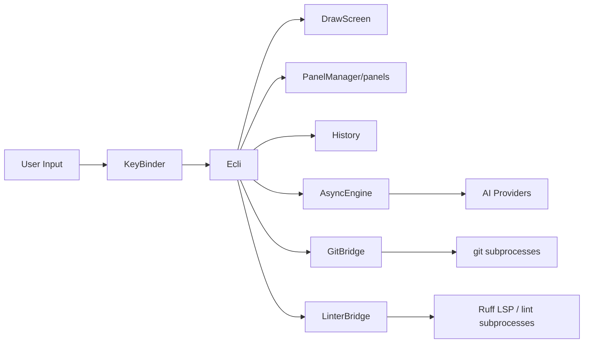
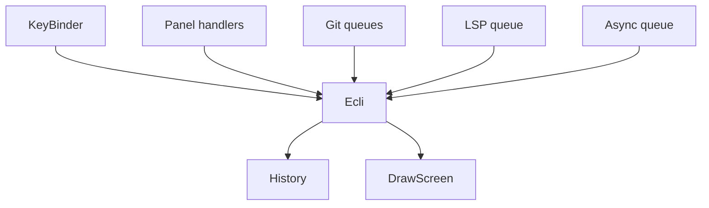

<!--
SPDX-License-Identifier: GPL-2.0-only

Project: Ecli
File: docs/architecture/current-architecture.md
Website: https://www.ecli.io
Repository: https://github.com/SSobol77/ecli
PyPI: https://pypi.org/project/ecli-editor/0.0.1/

Copyright (c) 2026 Siergej Sobolewski

Licensed under the GNU General Public License version 2 only.
See the LICENSE file in the project root for full license text.
-->
# Current Architecture (Observed State)

## Observed Current State

Ecli is currently a modular monolith with `src/ecli/core/Ecli.py` as orchestration and mutable state center.

## Current Project / Module Tree

```text
src/ecli/
  core/ (Ecli, History, CodeCommenter, AsyncEngine)
  ui/ (DrawScreen, KeyBinder, PanelManager, TerminalAppMode, panels.py)
  integrations/ (AI, GitBridge, LinterBridge)
  utils/ (utils, logging_config)
main.py
scripts/
.github/workflows/
```

## Current Runtime Topology



## Current Interaction Diagram



## Module-to-Module Dependency Matrix

| Module | Depends on | Dependency type | Coupling level | Risk |
|---|---|---|---|---|
| `Ecli` | core/ui/integrations/utils | direct import + runtime orchestration | High | high blast radius |
| `KeyBinder` | `Ecli`, curses | direct method dispatch | High | behavior tightly coupled |
| `DrawScreen` | `Ecli` state fields/methods | direct state reads | Medium/High | rendering coupled to internals |
| `PanelManager`/`panels.py` | `Ecli`, curses, integrations/utilities | direct calls + shared state usage | High | weak boundary isolation |
| `History` | `Ecli` internals | direct state manipulation | High | replay correctness risk |
| `GitBridge` | `Ecli`, queues, subprocess | async callbacks/messages | Medium | re-entry ambiguity |
| `LinterBridge` | `Ecli`, queues, subprocess | async callbacks/messages | Medium | diagnostics handling risk |

## Current Dependency Hotspots

- `Ecli` central import and call hub.
- `panels.py` single-file multi-domain dependency concentration.
- `History` direct internal-state assumptions.

## Current Direct Coupling Hotspots

| Hotspot | Description | Risk |
|---|---|---|
| `Ecli` <-> UI components | UI depends on concrete internals | High |
| Panels -> editor state | mixed direct/indirect mutation paths | High |
| History -> editor fields | correctness sensitive replay path | Critical |

## Current Mutation Hotspot Map

| Mutation path | Current owner | Direct/Indirect | Risk | Migration target |
|---|---|---|---|---|
| key event -> editor mutation | `Ecli` via `KeyBinder` | Direct | High | command gateway path |
| panel action -> editor mutation | panel methods + editor APIs | Mixed | High | panel command adapter |
| worker result -> state/status update | queue consumer in core loop | Indirect | Medium | typed event gateway |
| undo/redo replay | `History` | Direct | Critical | state API + invariants |

## Current Architecture Confidence and Evidence Basis

- **Observed from repo structure/code**:
  - module tree, runtime components, queue presence, orchestration centralization.
- **Inferred from behavior/documented flow**:
  - exact event ordering guarantees across all workers.
  - full coverage of mutation call sites without automated instrumentation.

## What Is Observed vs Inferred

| Claim class | Status |
|---|---|
| Module ownership concentration in `Ecli` | Observed |
| Existence of queue-based async handoff | Observed |
| Deterministic ordering across all queue channels | Inferred (validation required) |
| Full absence of cross-thread direct mutation | Inferred target, not guaranteed observed |

## Known Architecture Debt

| Debt item | Observed impact | Risk level | Governing contract |
|---|---|---|---|
| Monolithic orchestrator | large change blast radius | High | `target-architecture.md`, `module-contracts.md` |
| Weak ownership boundaries | hidden mutation paths | High | `module-contracts.md` |
| Weak panel boundaries | panel/core coupling | High | `module-contracts.md` |
| Incomplete concurrency contracts (historically) | race/debug complexity | High | `event-and-concurrency-model.md` |
| Missing tests baseline | limited confidence | High | `docs/quality/test-strategy.md` |

## Known Observed Gaps vs Target Design

- No explicit command gateway abstraction in current runtime structure.
- No dedicated read-model projection boundary for UI.
- No formal dependency direction enforcement in code tooling.
- Payload contracts are partly implicit and need stricter typing/validation.
