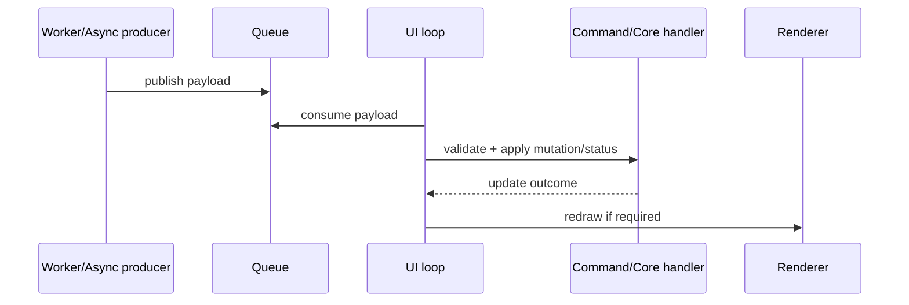
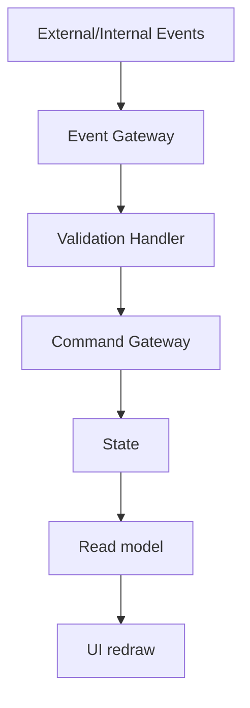

<!--
Filename: docs/architecture/event-and-concurrency-model.md
Project:  ECLI
License:  MIT
Author:   Siergej Sobolewski
Copyright: (c) 2026 Siergej Sobolewski
-->

# Event and Concurrency Model

## Observed Concurrency Primitives

- `threading.Thread`
- `queue.Queue`
- dedicated asyncio loop (`AsyncEngine`)
- shared-state lock in editor core

## Queue/Channel Contract Table

| Queue | Producer | Consumer | Expected payload shape | Malformed handling | Ordering expectations |
|---|---|---|---|---|---|
| `_git_q` | git info worker | UI loop | tuple-like git info (`branch`,`user`,`commits`) | log + discard invalid tuple | FIFO per queue producer |
| `_git_cmd_q` | git command worker | UI loop | string command result / update signal | log + fallback status | FIFO per queue producer |
| `lsp_message_q` | LSP reader | UI loop | JSON-RPC dict (`method`,`params`) | log + discard malformed JSON/payload | FIFO arrival order |
| `to_ui_queue` (`AsyncEngine`) | async task handlers | UI loop | dict with `type` (`ai_reply`/`task_error`) | log + discard unknown type | FIFO arrival order |

## Required Payload Fields (Where Known)

| Channel | Required fields |
|---|---|
| `_git_q` | `branch` (string), `user` (string), `commits` (array) |
| `_git_cmd_q` | command result string; optional args object for structured updates |
| `lsp_message_q` | `method`, optional `params` |
| `to_ui_queue` | `type`; for `ai_reply`: `provider`, `text`; for `task_error`: `task_type`, `error` |

## Payload Versioning Note

- Current observed state: no explicit payload version field.
- Target state: introduce optional `v`/`schema_version` for queue payload evolution.
- Validation required: assess migration impact before enforcing version checks.

## Worker Result Flow

## Event Gateway Diagram (Target)

## Redraw Trigger Matrix

| Event type | Requires redraw? | Requires mutation? | UI-thread only? |
|---|---:|---:|---:|
| key input command success | Yes | Yes | Yes |
| key input no-op/status-only | Maybe | No/low | Yes |
| git info update | Yes | Usually status/state | Yes |
| lint diagnostics publish | Yes | Yes (diagnostic state) | Yes |
| AI reply event | Yes | Yes (panel/status) | Yes |
| resize event | Yes | layout state | Yes |

## Synchronization Notes by Subsystem

| Subsystem | Startup sync note | Shutdown sync note |
|---|---|---|
| GitBridge | UI queue consumer must be active before updates processed | stop worker before terminal teardown |
| LinterBridge | LSP init ordering sensitive; queue consumer must handle late init messages | send shutdown/exit and drain queue best-effort |
| AsyncEngine | event loop thread starts before task submission | stop signal + timeout join path |

## Event Ordering Expectations

- Per-queue FIFO is expected.
- Cross-queue global ordering is not guaranteed.
- Consumers must not assume ordering between independent channels.

## Event Drop/Discard Policy

- Malformed payload: discard + log warning/error.
- Unknown event type: discard + log and continue.
- Queue overload behavior: validation required (depends on queue sizing and producer behavior).

## UI-Thread Mutation Rule

- All final state mutation and redraw decisions must be executed on UI thread.
- Worker threads may compute and publish events only.

## Failure Propagation

- Producer exception -> error payload or log entry -> UI status fallback.
- Consumer parse/validation failure -> discard + log -> continue loop.
- Rendering failure -> log + continue when possible.
