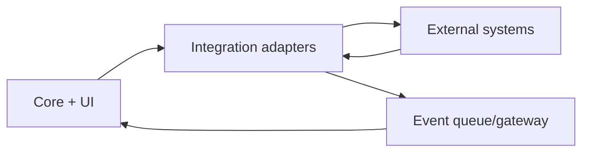

<!--
SPDX-License-Identifier: Apache-2.0

Project: Ecli
File: docs/architecture/integration-boundaries.md
Website: https://www.ecli.io
Repository: https://github.com/SSobol77/ecli
PyPI: https://pypi.org/project/ecli-editor/0.0.1/

Copyright (c) 2026 Siergej Sobolewski

Licensed under the Apache License, Version 2.0.
See the LICENSE file in the project root for full license text.
-->
# Integration Boundaries

## Integration Capability Classification

| Integration | Criticality | Runtime role | Operational class |
|---|---|---|---|
| GitBridge | High | repo status/command feedback | editor-adjacent subprocess |
| LinterBridge | High | diagnostics pipeline | diagnostics subprocess/LSP |
| AI provider adapters | Medium/Optional | assistant feature path | network/provider |
| Packaging/release scripts | High (release) | artifact production | packaging subprocess |

## Boundary Model

## Failure Consequence Matrix

| Integration | Failure effect | User-visible effect | Log severity | Retry allowed |
|---|---|---|---|---:|
| GitBridge | stale git info / command failure | status message; editor continues | warning/error | limited |
| LinterBridge | missing or delayed diagnostics | lint panel/status degradation | warning/error | limited |
| AI provider | no response / provider error | AI panel error text | warning/error | limited/provider-specific |
| Packaging scripts | build artifact missing/failure | release/build failure | error/critical | manual rerun |

## Severity and Consequence Rules

- Critical consequence: release artifact generation failure.
- High consequence: core editing feedback pipeline degraded (lint/git status).
- Medium consequence: optional feature degraded (AI).

## Operational vs User-Facing Fallback

| Integration class | Operational fallback | User-facing fallback |
|---|---|---|
| Editor command subprocess | return-code/status handling | concise status message |
| Diagnostics subprocess/LSP | ignore malformed diagnostics and continue | lint panel fallback text |
| Network/provider | timeout/error path and continue runtime | panel/status degraded response |
| Packaging/release | stop pipeline, emit diagnostics | explicit failure in build logs |

## Subprocess Categories

- editor command subprocesses (for example git commands)
- diagnostics/lint subprocesses (Ruff server and linter commands)
- packaging/release subprocesses (PyInstaller/FPM/NSIS/build scripts)
- external provider/network calls (AI HTTP APIs)

## Retry Policy Notation

The Integration Contract Table uses the following retry policy abbreviations:

- **R0**: no automatic retry; failure results in user notification only
- **R1**: single retry with exponential backoff; used for transient network/timing failures
- **manual rerun**: operator/maintainer must manually re-execute the failed pipeline step; typical for release/packaging operations

## Integration Contract Table

| Integration | Boundary owner | Timeout policy | Retry policy | User-facing fallback | Security notes |
|---|---|---|---|---|---|
| GitBridge | integration maintainers | short interactive timeout | R0/R1 | status + continue editing | sanitize subprocess stderr for UI |
| LinterBridge | integration maintainers | bounded analysis timeout | R1 | diagnostics degraded, editor continues | avoid blocking UI thread |
| AI adapters | integration maintainers | bounded network timeout | R1 (provider dependent) | task error in panel/status | credentials from env/config only |
| Packaging flows | release maintainers | job/script timeout | manual rerun | fail release/build stage | no secret output in logs |

## Secret and Config Source Policy

- Secrets must be sourced only from configured env/config channels.
- Precedence and override behavior: `docs/config/config-precedence.md`.
- Hardcoded credentials are prohibited.

## Validation Required

- Exact retry consistency across all adapters requires implementation verification.
- Log severity mappings should be validated against runtime logging policy.
