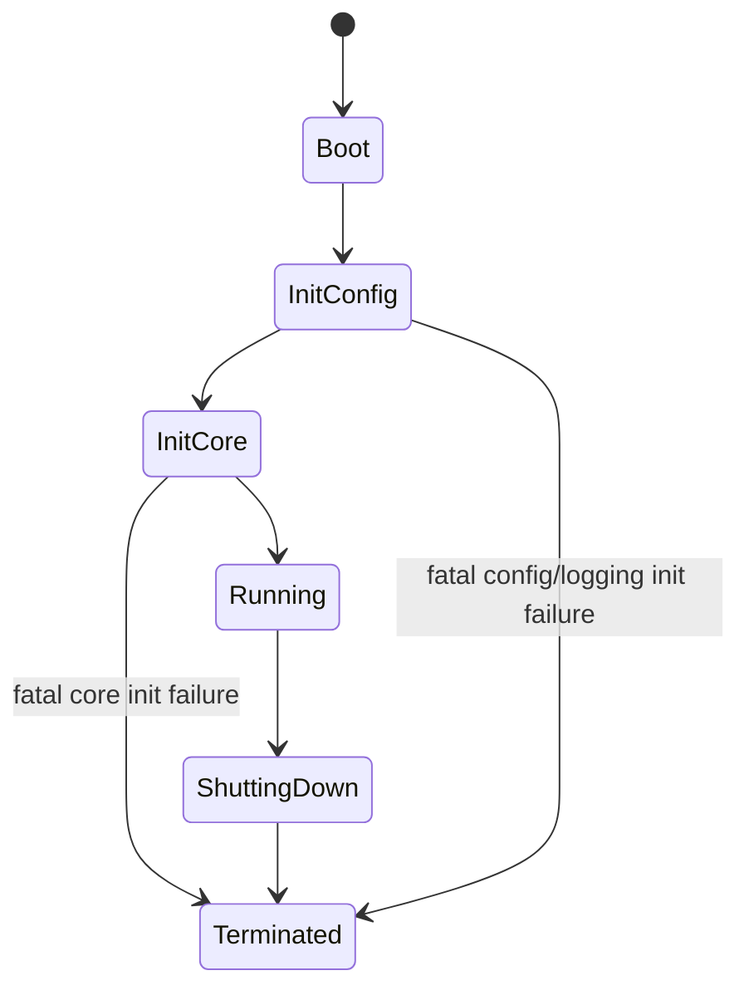
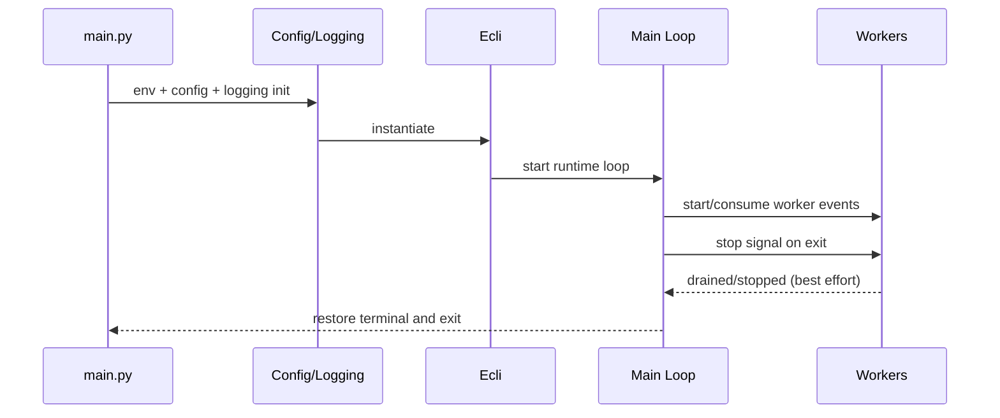

<!--
SPDX-License-Identifier: Apache-2.0

Project: Ecli
File: docs/architecture/runtime-model.md
Website: https://www.ecli.io
Repository: https://github.com/SSobol77/ecli
PyPI: https://pypi.org/project/ecli-editor/0.0.1/

Copyright (c) 2026 Siergej Sobolewski

Licensed under the Apache License, Version 2.0.
See the LICENSE file in the project root for full license text.
-->
# Runtime Model

## Runtime State Machine (Operational View)

## Startup Prerequisites

- loadable runtime environment
- parsable/usable configuration path
- logging initialization path
- terminal/curses availability

## Lifecycle Phase Matrix

| Lifecycle phase | Required components | Failure class | Expected outcome |
|---|---|---|---|
| Boot | `main.py`, loadable runtime environment | fatal/recoverable | continue to config init or exit with diagnostics |
| Config+logging init | config loader + logging setup | fatal if core init impossible | fail-fast with diagnostics or fallback |
| Core init | `Ecli` construction, wrappers | fatal/recoverable | enter runtime loop |
| Running | UI loop + workers + queues | recoverable/degraded | continue service with fallback messaging |
| Shutting down | worker stop + terminal restore | timeout/degraded | best effort graceful exit |

## Startup and Shutdown Sequence

## Steady-State Runtime Responsibilities

| Context | Responsibility | Must not do |
|---|---|---|
| UI thread | consume input/events, apply state changes, trigger redraw | block on long network/subprocess operations |
| Worker threads | perform blocking/async tasks | directly mutate editor state |
| Async loop | provider requests and async task processing | bypass the event queue or mutate shared state without proper synchronization; the event queue ensures serial task processing and state mutations occur only through designated queues (see serial execution contract above) |

## Shutdown Guarantees and Best-Effort Clauses

- Guarantee: terminal restoration attempt is always executed.
- Best-effort: worker termination within timeout; force-stop path allowed when graceful stop fails.
- Guarantee: no new user commands accepted once shutdown intent is latched.

## Observability Expectations by Phase

| Phase | Required logs/events |
|---|---|
| Boot/Init | startup phase markers, config/logging errors |
| Running | worker lifecycle events, integration failures, queue handling anomalies |
| Shutdown | stop signal, timeout/fallback actions, terminal restoration status |

## Validation Required

- Exact runtime event coverage in logs should be verified with execution traces under CI/local scenarios.
