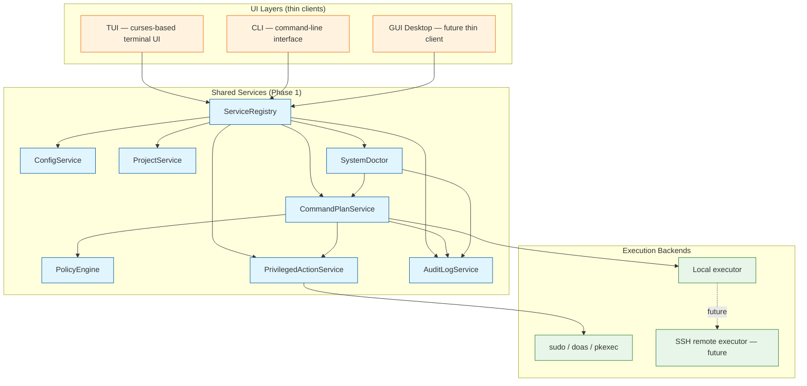
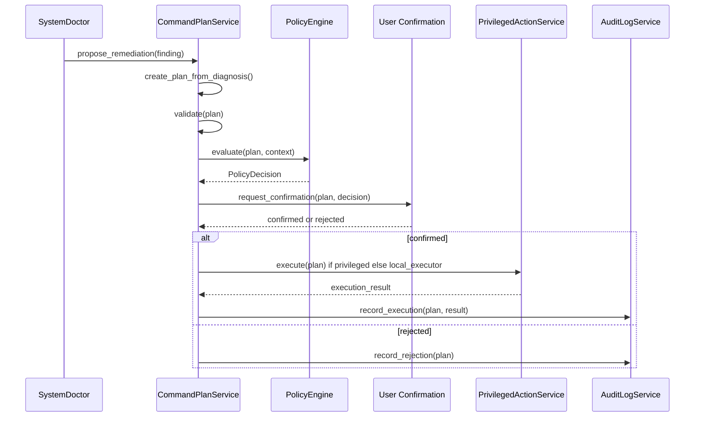

<!--
SPDX-License-Identifier: Apache-2.0

Project: ECLI
File: docs/architecture/services-foundation.md
Website: https://www.ecli.io
Repository: https://github.com/SSobol77/ecli
Author: Siergej Sobolewski
License: Apache License, Version 2.0

Copyright (c) 2026 Siergej Sobolewski

Licensed under the Apache License, Version 2.0.
See the LICENSE file in the project root for full license text.
-->

# Services Foundation

**Phase 1 — Architectural Foundation**

**Version:** 1.0
**Date:** 2026-05-15
**Status:** Approved Strategic Architecture Contract
**Part of:** [Product Vision](./product-vision.md) | [CommandPlanService](./command-plan-service.md)

---

## 1. Purpose

The goal of **Phase 1 — Services Foundation** is to establish a clean, maintainable, and extensible service architecture for ECLI before implementing complex operational modules such as VMLab, Kubernetes integration, Cloud Inventory, Terraform, Ansible, CI/CD, observability, or advanced orchestration.

This phase is required to prevent future operational modules from being added directly into the existing large `Ecli` application class.

Phase 1 creates the architectural foundation for the long-term product direction defined in `product-vision.md`:

```text
ECLI = terminal-first IDE + DevOps control plane + VM/runtime lab + cloud/system orchestration console
```

The immediate goal is **not** to build every module.

The immediate goal is to make future modules:

* safe (mediated through `CommandPlanService`);
* testable (services are independently testable);
* reusable (shared across TUI/CLI/GUI);
* auditable (all significant actions logged);
* independent from UI implementation details.

---

## 2. Strategic Context

### 2.1 Current State (May 2026)

ECLI is a modular monolith centered around the `Ecli` application class (`src/ecli/core/Ecli.py`).

**Existing product capabilities**:

| Area | Current role |
|------|--------------|
| Terminal-first TUI | Primary user interface |
| Code editor | Core daily workflow |
| Syntax highlighting | Existing editor capability |
| LSP / diagnostics | Existing engineering capability |
| Git panel | Existing project workflow capability |
| AI panel | Existing assistant workflow capability |
| TOML-based configuration | Existing configuration direction |
| Multi-platform packaging | Existing delivery direction |

**Current architectural risks** (audit findings):

* `Ecli.py` owns too many responsibilities (editor state, UI coordination, config parsing, integrations, operations);
* UI, editor state, configuration, and operational logic are tightly coupled;
* Configuration schema is not fully typed or versioned (`config.toml` parsed ad-hoc);
* Service boundaries are implicit, not explicit;
* Testability is constrained by central state ownership;
* Future modules (VMLab, Kubernetes, etc.) could pollute the editor core if added without service boundaries.

### 2.2 Target Direction

ECLI must evolve from a large central application object into a **service-oriented architecture** with clear bounded contexts.



**Core architectural rule**:

```text
UI never performs infrastructure actions directly.
UI calls services.
Services generate plans.
Plans are previewed.
User confirms.
Executor applies.
Audit log records the result.
```

This rule applies uniformly to TUI, CLI, and future GUI Desktop.

---

## 3. Refactoring Strategy

ECLI will use the **Strangler Fig pattern** in an evolutionary, low-risk internal-refactoring form.

### 3.1 Why Strangler Fig?

The classic Strangler Fig pattern avoids high-risk big-bang rewrites by:

1. Placing a new layer beside or around the old system;
2. Routing new functionality through the new layer;
3. Gradually migrating old functionality into the new architecture;
4. Removing old code once the new implementation fully replaces it.

### 3.2 ECLI Variation: Internal Extraction

ECLI uses a conservative variation suited to its constraints:

```text
Classic Strangler Fig:
  new system built beside old system

ECLI Services Foundation:
  new services extracted from inside the existing system
```

This is the correct approach because:

* The goal is **not** to build a second editor beside the current one;
* The goal is to keep the current TUI fully functional while gradually reducing the responsibilities of `Ecli.py`;
* Users must not experience workflow disruption during migration.

### 3.3 ECLI Strangler Fig Rules

ECLI applies the pattern using these non-negotiable rules:

| Rule | Rationale |
|------|-----------|
| Introduce new services alongside existing code | Avoid breaking changes during migration |
| Keep current TUI operational at all times | User experience must not regress |
| Move one responsibility at a time | Minimize regression risk per change |
| Preserve user-visible behavior during extraction | Characterization tests guard against drift |
| Add tests before and during extraction | Testability is a design goal, not an afterthought |
| Route new functionality through services first | Prevent new code from coupling to `Ecli.py` |
| Keep old code as fallback only during migration | Temporary duplication is acceptable; permanent is not |
| Remove migrated legacy paths once service ownership is proven | Avoid long-term maintenance burden |
| Avoid duplicate long-term implementations | Single source of truth per capability |
| Never introduce a second editor core | ECLI remains one product, not two |

---

## 4. Comparison with Classic Strangler Fig

| Aspect | Classic Strangler Fig | ECLI Phase 1 Approach | Assessment |
|--------|----------------------|----------------------|------------|
| **Risk model** | Old system runs while new system grows | Existing TUI runs while services are extracted | ✅ Very good fit |
| **Migration style** | New components built beside old system | Responsibilities extracted from `Ecli.py` into services | ✅ Good fit |
| **Boundary layer** | Facade / Anti-Corruption Layer | `ServiceRegistry` / dependency injection container | ✅ Good fit |
| **Old code behavior** | Old system remains operational | `Ecli` class remains operational and gradually shrinks | ✅ Very good fit |
| **First priority** | Often new feature paths | Foundational services first (Config, Project, CommandPlan) | ✅ Better for ECLI |
| **Initial complexity** | Can require parallel systems | Minimal, incremental internal decomposition | ✅ Better for ECLI |
| **Testability** | Improves gradually | Services designed for isolated testing from start | ✅ Better for ECLI |
| **Regression risk** | Medium if routing is complex | Lower: TUI behavior preserved at each step | ✅ Better for ECLI |
| **Long-term goal** | Replace old system | Convert `Ecli.py` into thin coordinator | ✅ Correct for ECLI |

ECLI's approach is therefore best described as:

```text
Internal Strangler Fig refactor with service-first extraction.
```

---

## 5. Why This Strategy Fits ECLI

This strategy fits ECLI because:

| Reason | Implication |
|--------|-------------|
| ECLI already has a working TUI that must not be disrupted | Migration must preserve all existing user workflows |
| The project needs architecture modernization, not a full rewrite | Extract, don't replace; evolve, don't restart |
| Future operations modules require shared services | Build `CommandPlanService` once, reuse everywhere |
| Privileged operations require central safety primitives | `PrivilegedActionService` enforces "no silent sudo" |
| AI-assisted operations require strict planning and audit boundaries | AI proposes → human confirms → service executes |
| GUI Desktop must later reuse the same services | UI layers are thin clients over shared services |
| VMLab must be built as a service-backed module | VMLab uses `CommandPlanService`, not direct QEMU calls |

**The most important outcome of Phase 1 is not feature count.**

**The most important outcome is architectural control.**

## 5.1 Repository Hygiene Prerequisites

Before Phase 1 implementation begins, repository-owned files must have consistent Apache-2.0 license metadata.

Required baseline:

* `pyproject.toml` declares Apache-2.0 consistently;
* project-owned Python files include Apache-2.0 SPDX metadata where applicable;
* shell scripts preserve shebangs and include Apache-2.0 SPDX metadata;
* documentation files use the approved project header format where applicable;
* packaging scripts must not declare conflicting `MIT` metadata if the project license is Apache-2.0;
* generated, cache, binary, and third-party vendored artifacts are excluded unless explicitly project-owned.

This prerequisite must be completed before new Phase 1 service code is introduced.

---

## 6. Core Services for Phase 1

### 6.1 ConfigService

**Responsibility:** Configuration loading, validation, migration, normalization, and access.

**Owns**:

| Capability | Description |
|------------|-------------|
| Default configuration loading | Built-in defaults with inline documentation |
| User configuration loading | `~/.config/ecli/config.toml` (platform-specific paths) |
| Project-local configuration loading | `.ecli.toml` in project root overrides user config |
| Environment integration | `ECLI_*` env vars take precedence over file config |
| Typed schema validation | Pydantic-style models for config structure |
| Migration from older config shapes | Automatic migration with backup to `config.toml.bak` |
| Normalized runtime configuration access | Single source of truth for config values |
| Clear diagnostics for malformed configuration | Human-readable error messages, not stack traces |

**Does not own**:

* Parsing of TOML files (delegated to `tomllib` / `tomli`);
* Keybinding resolution (delegated to keybinding subsystem);
* Theme color resolution (delegated to UI rendering layer).

**Integration points**:

* `ServiceRegistry` constructs `ConfigService` first (no dependencies);
* All other services receive normalized config via constructor injection;
* UI layers read config only via `ConfigService.get_*()` methods.

**Contract sketch** (architecture-level only):

```python
# Conceptual interface — implementation details belong in code, not docs

class ConfigService:
    @classmethod
    def load(cls, path: Path | None = None) -> "ConfigService":
        """Load and validate configuration from file + env + defaults."""
        ...

    def get_editor_config(self) -> EditorConfig:
        """Return normalized editor settings (tab width, encoding, etc.)."""
        ...

    def get_ai_config(self) -> AIConfig:
        """Return normalized AI provider configuration."""
        ...

    def get_keybinding(self, action: str) -> str | None:
        """Return custom keybinding for action, or None if default applies."""
        ...

    def migrate_if_needed(self) -> MigrationResult:
        """Apply config schema migrations if version mismatch detected."""
        ...
```

---

### 6.2 ProjectService

**Responsibility:** Project discovery, workspace context, and project-local settings.

**Owns**:

| Capability | Description |
|------------|-------------|
| Current workspace detection | Determine project root from cwd or `--project` flag |
| Project root discovery | Walk up directory tree for markers (`.git`, `.ecli.toml`, etc.) |
| Project metadata extraction | Name, VCS type, language hints, runtime profile |
| Project-local ECLI directory conventions | `.ecli/` for project-specific state, plugins, themes |
| Project-local configuration lookup | Merge user config + project config with precedence rules |
| Path normalization for project-aware workflows | Resolve relative paths against project root |
| Future project runtime profiles | Per-project LSP/linter/AI settings (Phase 2+) |

**Does not own**:

* File system operations beyond discovery (delegated to executor services);
* Git repository operations (delegated to Git integration layer);
* Language-specific tooling detection (delegated to LSP/linter services).

**Integration points**:

* `ConfigService` provides base config; `ProjectService` adds project-layer overrides;
* `SystemDoctor` uses `ProjectService` to scope diagnostics to project context;
* `CommandPlanService` uses `ProjectService` to attach `affected_resources` with project-relative paths.

**Contract sketch**:

```python
class ProjectService:
    @classmethod
    def discover(cls, start_path: Path) -> "ProjectService":
        """Discover project root and load project context."""
        ...

    @property
    def root(self) -> Path:
        """Absolute path to project root."""
        ...

    @property
    def metadata(self) -> ProjectMetadata:
        """Project meta name, VCS, languages, etc."""
        ...

    def resolve_path(self, relative: str) -> Path:
        """Resolve a project-relative path to absolute."""
        ...

    def get_effective_config(self, user_config: ConfigService) -> MergedConfig:
        """Merge user config with project-local overrides."""
        ...
```

---

### 6.3 CommandPlanService

**Responsibility:** Creation, validation, preview, confirmation, export, and execution coordination for explicit operation plans.

**Priority**: Highest-priority Phase 1 service. Central safety primitive of ECLI architecture.

**Owns**:

| Capability | Description |
|------------|-------------|
| Plan creation | Typed `CommandPlan` model with validation |
| Plan schema validation | Enforce `schema_version`, required fields, step structure |
| Risk classification | Infer `PlanRisk` from privileges, destructiveness, environment |
| Command representation | `argv`-first execution model; `display` for human review |
| Dry-run behavior | Simulate execution without side effects |
| Shell export | Generate safe, commented shell scripts for manual execution |
| Confirmation requirements | Enforce `needs_confirmation()` policy before execution |
| Policy checks | Coordinate with `PolicyEngine` interface for allow/deny decisions |
| Rollback metadata | Attach best-effort rollback steps to plans |
| Execution handoff | Route to `PrivilegedActionService` or local executor as appropriate |
| Plan result recording | Forward execution outcomes to `AuditLogService` |

**Does not own**:

* Domain-specific logic (VMLab, Kubernetes, Terraform, etc.);
* Privilege escalation mechanics (delegated to `PrivilegedActionService`);
* Policy rule definitions (delegated to `PolicyEngine` implementations);
* UI rendering of confirmation dialogs (delegated to TUI/CLI/GUI layers).

**Integration points**:

* All risky operations from any source (UI, AI, SystemDoctor, domain services) must route through `CommandPlanService`;
* `PrivilegedActionService` executes only plans that are `validated → policy_checked → confirmed`;
* `AuditLogService` receives all plan lifecycle events.

**Contract sketch** (aligned with `command-plan-service.md`):

```python
class CommandPlanService:
    def create_plan(
        self,
        title: str,
        commands: list[CommandStep],
        risk: PlanRisk,
        category: PlanCategory = PlanCategory.GENERAL,
        source: PlanSource = PlanSource.USER,
        **kwargs
    ) -> CommandPlan:
        """Create and validate a new command plan."""
        ...

    async def evaluate_policy(self, plan: CommandPlan, user: str) -> PolicyDecision:
        """Evaluate plan against active policy engine."""
        ...

    def export_plan(self, plan: CommandPlan, format: Literal["json", "shell", "markdown"]) -> str:
        """Export plan in requested format with safety comments."""
        ...

    async def execute_plan(self, plan: CommandPlan, executor: str = "auto") -> ExecutionResult:
        """Coordinate plan execution through appropriate backend."""
        ...
```

> 📌 **Critical rule**: `CommandPlanService` is **not** VMLab-specific. It is a core ECLI service used by all operational modules.

---

### 6.4 PrivilegedActionService

**Responsibility:** Safe, auditable execution of privileged operations through command plans.

**Owns**:

| Capability | Description |
|------------|-------------|
| Privilege escalation backend selection | `sudo`, `doas`, `pkexec` based on config + platform |
| Explicit command display | Show exact `argv` to user before execution |
| Refusal to store passwords | Never capture, store, replay, or log sudo passwords |
| Policy enforcement before execution | Reject plans not passing `PolicyEngine` evaluation |
| Execution status reporting | Return structured `ExecutionResult` with exit codes, output metadata |
| Failure diagnostics | Sanitize error output for audit logging |

**Does not own**:

* Password prompting (delegated to terminal + system privilege tool);
* Command parsing or shell expansion (delegated to executor backends);
* Policy decision logic (delegated to `PolicyEngine`).

**Philosophy**:

```text
✅ Correct: "ECLI does not run sudo silently."
❌ Incorrect: "ECLI does not run sudo."
```

Privileged operations are allowed **only when** they are:

* explicit (visible `argv` before execution);
* previewable (user sees exact command);
* confirmable (user must approve);
* logged (audit record created);
* reproducible (exportable as shell script);
* policy-checkable (evaluated by `PolicyEngine`).

**Contract sketch**:

```python
class PrivilegedActionService:
    async def execute(self, plan: CommandPlan) -> ExecutionResult:
        """
        Execute a privileged plan with safety guarantees.

        Pre-conditions (enforced by caller):
        - plan.status == PlanStatus.CONFIRMED
        - plan.policy_decision.allowed == True
        - plan has been audit-logged

        This service never:
        - stores sudo passwords
        - hides command text from user
        - executes without explicit argv
        """
        ...
```

---

### 6.5 AuditLogService

**Responsibility:** Structured logging of significant actions, command plans, privileged operations, and service-level events.

**Owns**:

| Event type | Description |
|------------|-------------|
| `plan.created` | Plan drafted with metadata |
| `plan.validated` | Plan passed schema validation |
| `plan.policy_checked` | Policy evaluation completed |
| `plan.confirmed` | User explicitly confirmed execution |
| `plan.execution_started` | Handoff to executor backend |
| `plan.step_completed` / `step_failed` | Per-step execution result |
| `plan.execution_completed` / `execution_failed` | Final plan outcome |
| `privileged.action_executed` | Privileged command executed with sanitized context |

**Requirements**:

* Append-only records (no updates or deletes);
* Structured JSON format for machine parsing;
* Secret redaction before logging (denylist: `password`, `token`, `key`, `secret`);
* Sanitized error context (no stack traces with secrets);
* Policy override events logged with actor and reason.

**Contract sketch**:

```python
class AuditLogService:
    def log_plan_created(self, plan: CommandPlan) -> str:
        """Record plan creation; returns audit event ID."""
        ...

    def log_policy_evaluated(self, plan: CommandPlan, decision: PolicyDecision) -> None:
        """Record policy evaluation result."""
        ...

    def log_execution_result(self, plan: CommandPlan, result: ExecutionResult) -> None:
        """Record execution outcome with sanitized metadata."""
        ...

    def redact_sensitive(self, data: dict) -> dict:
        """Apply redaction rules to prevent secret leakage."""
        ...
```

---

### 6.6 SystemDoctor

**Responsibility:** Environment diagnostics and remediation-plan generation.

**Phase 1 scope**: Skeleton with foundational diagnostics only.

**Owns**:

| Diagnostic category | Examples |
|--------------------|----------|
| Hardware & virtualization | KVM/HVF/WHPX availability, `/dev/kvm` permissions |
| System & permissions | User groups, file permissions, `PATH` sanity |
| Tooling & dependencies | `git`, `qemu`, language servers, Python env health |
| Configuration | ECLI config validation, deprecated keys, schema version |

**Does not own**:

* Privileged execution (delegated to `PrivilegedActionService`);
* Direct package installation or file mutation;
* Direct service restart or QEMU execution;
* Direct Kubernetes or cloud mutation.

**CLI surface** (planned):

```bash
ecli doctor                    # Report findings only
ecli doctor --category vm      # Filter by category
ecli doctor --json             # Machine-readable output
ecli doctor --plan-fixes       # Generate plans, do not apply
ecli doctor --apply-fixes      # Planned surface; Phase 1 may reject with "not implemented yet"
```

**Integration flow**:



**Contract sketch**:

```python
class SystemDoctor:
    def detect_problems(self, context: DoctorContext) -> list[DoctorFinding]:
        """Run diagnostics and return structured findings."""
        ...

    def propose_remediation(self, finding: DoctorFinding) -> CommandPlan | None:
        """Generate a remediation plan for a finding, or None if not applicable."""
        ...
```

---

## 7. Service Registry and Dependency Injection

Phase 1 introduces a minimal `ServiceRegistry` as the composition root for shared services.

**Goal**: Provide explicit ownership and predictable service wiring **without** over-engineering.

**Provides**:

| Capability | Description |
|------------|-------------|
| Service construction | Instantiate services in dependency order |
| Dependency ordering | Ensure `ConfigService` before `ProjectService`, etc. |
| Test substitution | Allow mock services for isolated testing |
| CLI/TUI reuse | Same registry instance for all entrypoints |
| Future GUI reuse | GUI Desktop will use identical service layer |
| Clean startup diagnostics | Early failure if required services cannot be constructed |

**Conceptual model**:

```text
ServiceRegistry (composition root)
├── ConfigService          (no dependencies)
├── ProjectService         (depends on ConfigService)
├── AuditLogService        (depends on ConfigService, ProjectService)
├── CommandPlanService     (depends on AuditLogService, PolicyEngine)
├── PrivilegedActionService (depends on CommandPlanService, AuditLogService)
└── SystemDoctor           (depends on CommandPlanService, PrivilegedActionService)
```

**Important rules**:

* `ServiceRegistry` is **not** a service locator to be used everywhere;
* Services receive dependencies via constructor injection, not global lookups;
* UI layers receive the registry (or specific services) at startup, not per-call;
* Business logic never lives in the registry — it only wires services.

**Contract sketch**:

```python
class ServiceRegistry:
    def __init__(self, config_path: Path | None = None):
        """Construct services in dependency order."""
        ...

    @property
    def config(self) -> ConfigService: ...
    @property
    def project(self) -> ProjectService: ...
    @property
    def plans(self) -> CommandPlanService: ...
    @property
    def privileged(self) -> PrivilegedActionService: ...
    @property
    def audit(self) -> AuditLogService: ...
    @property
    def doctor(self) -> SystemDoctor: ...
```

---

## 8. Architecture Principles

These principles guide all Phase 1 design decisions.

### 8.1 Single Responsibility

Each service must have a narrow, clearly defined scope.

* A service should not become a new god-object;
* If a service grows beyond ~500 LOC, consider splitting;
* Use composition over inheritance for shared behavior.

### 8.2 UI Independence

TUI, CLI, and future GUI Desktop must call services.

* UI layers must not contain infrastructure logic;
* UI renders data provided by services;
* UI triggers actions via service methods, not direct execution.

### 8.3 Typed Contracts

Public service interfaces must use typed models.

* Prefer `dataclasses` for simple immutable structures;
* Use Pydantic-style models where validation/schema export is required;
* Define explicit enums for state, risk, status, operation type.

### 8.4 Testability First

Every service must be independently testable.

* Tests cover valid inputs, invalid inputs, failure modes;
* Services accept dependencies via constructor for easy mocking;
* Characterization tests guard user-visible behavior during refactoring.

### 8.5 Incremental Migration

Extraction happens gradually.

* Move one responsibility at a time;
* Preserve user-visible behavior at each step;
* Keep old code as temporary fallback during migration.

### 8.6 Backward Compatibility

The current TUI must remain functional throughout Phase 1.

* Refactor must not require users to change workflows;
* New config keys are additive; old keys are migrated, not removed abruptly;
* Deprecation warnings precede breaking changes.

### 8.7 No Hidden Privilege

Privileged commands must never be hidden.

* Any command requiring elevation must be visible as exact `argv` before execution;
* Password prompting is delegated to system tool + terminal;
* ECLI never captures, stores, or logs passwords.

### 8.8 No Direct AI Execution

AI may propose plans, explain risks, summarize logs, or draft remediations.

* AI must not directly execute privileged or destructive operations;
* AI-generated plans are marked `source: ai-assistant` and require human review;
* All AI proposals route through `CommandPlanService` for validation and confirmation.

### 8.9 Development Logs and Evidence Containment

During development, all generated logs, dry-run reports, smoke outputs, test evidence, and agent-generated debug artifacts must be written only under the repository-level:

```text
logs/
```

Forbidden locations for generated development artifacts:

```text
.ecli/
.ecli/vmlab/
src/
tests/
tmp/
.tmp/
.cache/
$HOME/
/tmp/
project root outside logs/
```

Required repository files:

```text
logs/.gitkeep
logs/README.md
scripts/check-log-invariant.sh
```

This invariant applies to:

* Phase 1 service tests;
* CommandPlan dry-run reports;
* AuditLogService development output;
* SystemDoctor diagnostics;
* VMLab skeleton artifacts;
* agent-generated implementation logs.

Any code path or test that writes generated development artifacts outside `logs/` must fail CI.

---

## 9. Refactoring Execution Plan

### Step 1 — Introduce Service Package

Create the service package structure:

```text
src/ecli/services/
├── __init__.py
├── registry.py              # ServiceRegistry composition root
├── config_service.py        # ConfigService implementation
├── project_service.py       # ProjectService implementation
├── command_plan_service.py  # CommandPlanService implementation
├── privileged_action_service.py  # PrivilegedActionService implementation
├── audit_log_service.py     # AuditLogService implementation
├── system_doctor.py         # SystemDoctor skeleton
├── models/                  # Typed models (Plan, Step, enums)
│   ├── __init__.py
│   └── plan.py
├── policy/                  # PolicyEngine interface + built-in backend
│   ├── __init__.py
│   ├── engine.py
│   └── builtin.py
└── validators/              # Validation helpers
    ├── __init__.py
    └── plan_validator.py
```

**Acceptance**: No user-visible behavior changes; all existing tests pass.

---

### Step 2 — Introduce ServiceRegistry

Add `ServiceRegistry` as the composition root.

**Responsibilities**:

* Construct services in dependency order;
* Wire dependencies via constructor injection;
* Expose services to CLI/TUI entrypoints;
* Support test substitution via optional constructor args.

**Acceptance criteria**:

* Registry can be instantiated with default config path;
* Each service property returns a correctly constructed instance;
* Tests can inject mock services via `ServiceRegistry(config=mock_config, ...)`.

---

### Step 3 — Extract ConfigService

Move configuration loading, validation, migration, and normalization behind `ConfigService`.

**Migration approach**:

1. Add `ConfigService` with new typed schema;
2. Make old config parsing code call `ConfigService.load()` internally;
3. Gradually replace direct config access in `Ecli.py` with `registry.config.get_*()` calls;
4. Remove old parsing code once all callers migrated.

**Acceptance criteria**:

* Default config validates against new schema;
* User config validates with clear error messages;
* Malformed config produces diagnostics, not crashes;
* Service returns typed, normalized configuration;
* Current TUI behavior remains unchanged (characterization tests pass).

---

### Step 4 — Extract ProjectService

Introduce project/workspace context handling.

**Migration approach**:

1. Add `ProjectService.discover()` to find project root;
2. Replace ad-hoc project detection in `Ecli.py` with `registry.project.root`;
3. Migrate project-local config lookup to `ProjectService.get_effective_config()`.

**Acceptance criteria**:

* Project root discovery is deterministic (same input → same output);
* Project-local configuration lookup follows defined precedence rules;
* Service can be tested without curses/TUI dependencies;
* No editor behavior regression (characterization tests pass).

---

### Step 5 — Implement CommandPlanService

Implement the core command planning model.

**Migration approach**:

1. Add typed `CommandPlan`, `CommandStep` models;
2. Implement `CommandPlanService.create_plan()` with validation;
3. Route one existing risky operation (e.g., privileged file save) through the service;
4. Gradually migrate other operations.

**Acceptance criteria**:

* Can create plans with typed models;
* Can validate plan schema and command steps;
* Can classify risk based on privileges, destructiveness, environment;
* Can export shell commands with safety comments;
* Can represent dry-run mode without side effects;
* Can attach rollback metadata;
* Integrates with `AuditLogService` for lifecycle events;
* Does not execute privileged commands directly (delegates to `PrivilegedActionService`).

---

### Step 6 — Implement PrivilegedActionService

Implement explicit privileged execution support.

**Migration approach**:

1. Add `PrivilegedActionService` with `sudo` backend;
2. Route one privileged operation through the service;
3. Add confirmation flow in TUI before privileged execution;
4. Gradually migrate other privileged operations.

**Acceptance criteria**:

* Supports at least one elevation backend (`sudo`) initially;
* Displays exact `argv` commands before execution;
* Never stores sudo passwords;
* Refuses silent elevation (requires user confirmation);
* Routes execution only through approved, validated plans;
* Records results through `AuditLogService`.

---

### Step 7 — Implement AuditLogService

Add structured audit records.

**Migration approach**:

1. Add `AuditLogService` with append-only JSON log file;
2. Instrument `CommandPlanService` to log plan lifecycle events;
3. Add redaction logic for sensitive fields;
4. Gradually instrument other services.

**Acceptance criteria**:

* Plan creation is logged with metadata;
* Plan application is logged with outcome;
* Privileged execution result is logged with sanitized context;
* Failures are logged with error codes, not raw traces;
* Logs redact secrets (denylist-based);
* Logs are useful for debugging (structured, queryable).

---

### Step 8 — Implement SystemDoctor Skeleton

Add basic diagnostics and remediation plan generation.

**Migration approach**:

1. Add `SystemDoctor` with 2-3 foundational checks (e.g., KVM access, config validation);
2. Connect to `CommandPlanService` for remediation plan generation;
3. Add `ecli doctor` CLI command that reports findings only;
4. Defer actual `--apply-fixes` execution to Phase 2. Phase 1 may expose the command surface only if it fails safely and explains that execution is not available yet.

**Acceptance criteria**:

* Detects selected environment problems;
* Reports structured diagnostics (JSON output supported);
* Can generate command plans via `CommandPlanService`;
* Does not directly apply fixes outside `CommandPlanService`;
* Does not mutate the system when run without `--apply-fixes`.

---

### Step 9 — Gradually Reduce Ecli.py

Move responsibilities out of `Ecli.py` one by one.

**Target direction**:

```text
Before:
Ecli.py = state + UI + config + operations + integrations + orchestration

After:
Ecli.py = TUI coordinator + editor orchestration + service calls
```

**Migration candidates** (in priority order):

1. Configuration access → `registry.config.get_*()`;
2. Project context → `registry.project.root`;
3. File operations requiring plans → `registry.plans.create_plan()`;
4. Privileged workflows → `registry.privileged.execute()`;
5. Diagnostics → `registry.doctor.detect_problems()`;
6. Runtime operations → future `RuntimeService`;
7. Command generation → `CommandPlanService.export_shell()`.

**Acceptance criteria**:

* `Ecli.py` LOC reduced by ≥30% after Phase 1;
* No new responsibilities added to `Ecli.py` during Phase 1;
* All migrated paths covered by characterization tests.

---

### Step 10 — Add Service Tests

Add tests for every extracted service.

**Minimum test categories**:

| Service | Test categories |
|---------|----------------|
| `ConfigService` | Schema validation, migration, env var precedence, error diagnostics |
| `ProjectService` | Root discovery, config merging, path resolution |
| `CommandPlanService` | Plan creation, validation, risk classification, export formats, policy integration |
| `PrivilegedActionService` | Backend selection, command preview, refusal paths, audit integration |
| `AuditLogService` | Event emission, secret redaction, append-only behavior |
| `SystemDoctor` | Diagnostic detection, plan generation, non-mutation guarantee |

**Additional requirements**:

* Characterization tests for TUI behavior before/after extraction;
* Property-based tests for plan validation rules;
* Integration tests for service wiring via `ServiceRegistry`.

---

## 10. Deliverables

Phase 1 deliverables:

| Deliverable | Description |
|-------------|-------------|
| `src/ecli/services/` package | New service module structure |
| `ServiceRegistry` | Composition root with dependency injection |
| `ConfigService` | Typed, validated, migratable configuration |
| `ProjectService` | Project discovery and context management |
| `CommandPlanService` | Core safety primitive for operation planning |
| `PrivilegedActionService` | Safe privileged execution backend |
| `AuditLogService` | Structured, redacted audit logging |
| `SystemDoctor` skeleton | Foundational diagnostics + plan generation |
| Typed configuration schema | Pydantic-style models for config structure |
| Configuration migration layer | Automatic migration with backup |
| Stable CLI access to core services | `ecli plan`, `ecli doctor` subcommands |
| Initial command plan schema | `CommandPlan`, `CommandStep` typed models |
| Audit log format | Structured JSON with redaction rules |
| `logs/.gitkeep` | Ensures repository-level development log root exists |
| `logs/README.md` | Documents what may and may not be written under `logs/` |
| `scripts/check-log-invariant.sh` | CI/check script that fails when generated development artifacts are written outside `logs/` |
| Service-level tests | Unit + integration tests for each service |
| Reduced `Ecli.py` footprint | ≥30% LOC reduction, clearer responsibilities |

---

## 11. Non-Goals for Phase 1

Phase 1 **does not include**:

| Excluded | Reason |
|----------|--------|
| Full VMLab implementation | Requires `CommandPlanService` foundation first |
| Full QMP client implementation | Domain-specific; Phase 2+ |
| Kubernetes panel | Requires `CommandPlanService` + policy engine |
| OpenShift panel | Same as Kubernetes |
| Cloud Inventory panel | Requires read-only → plan → apply workflow |
| Terraform control surface | Requires plan/apply mediation via `CommandPlanService` |
| Ansible control surface | Same as Terraform |
| CI/CD panel | Requires plan-based mutation model |
| Observability panel | Requires log/query safety primitives |
| Secrets/Credentials panel | Requires secure storage integration |
| GUI Desktop implementation | TUI/CLI first; GUI is thin client over services |
| Advanced plugin system | Plugin API frozen at 1.0; Phase 1 focuses on core services |
| Full AI orchestration engine | AI remains assistant; execution via `CommandPlanService` |

These modules must be implemented **on top of** the Services Foundation in later phases.

---

## 12. Success Criteria

Phase 1 is successful when **all** of the following are true:

| Criterion | Verification method |
|-----------|---------------------|
| `Ecli.py` is no longer a god-class | LOC analysis, responsibility mapping |
| Service boundaries are explicit | Architecture review, dependency graph |
| Configuration is typed and versioned | Schema validation tests, migration tests |
| Risky operations are represented as command plans | Code audit: all privileged ops route through `CommandPlanService` |
| Privileged operations cannot bypass `CommandPlanService` | Integration tests, policy enforcement tests |
| Audit logging exists for significant operations | Log file inspection, redaction tests |
| `SystemDoctor` can generate remediation plans | Diagnostic + plan generation tests |
| TUI remains fully functional from user perspective | Characterization tests, manual QA |
| CLI can access core service workflows | `ecli plan`, `ecli doctor` subcommand tests |
| New modules can be added without polluting editor core | Architecture review of Phase 2 proposals |
| Generated development artifacts are contained under `logs/` | CI script: `scripts/check-log-invariant.sh`; filesystem invariant tests |
| Repository license metadata is normalized | repo hygiene scan: no conflicting project-owned MIT metadata |
| Core services have meaningful test coverage | Coverage reports ≥80% for service modules |

---

## 13. Risks and Mitigations

### Risk 1 — ServiceRegistry Becomes a New God Object

**Mitigation**:

* Keep registry as composition root only — no business logic;
* Services receive dependencies via constructor, not global lookups;
* Enforce via code review checklist: "Does this belong in registry or service?"

### Risk 2 — CommandPlanService Becomes Too Broad

**Mitigation**:

* `CommandPlanService` owns plan lifecycle, not domain logic;
* Domain services (VMLab, Kubernetes, etc.) generate domain-specific plans;
* `CommandPlanService` validates, stores, exports, confirms, coordinates — nothing more.

### Risk 3 — PrivilegedActionService Becomes Unsafe

**Mitigation**:

* No silent elevation — always preview + confirm;
* No password storage — delegate prompting to system tool;
* Exact command preview — `argv` shown to user before execution;
* Mandatory audit logging — every privileged action recorded;
* Policy checks before execution — `PolicyEngine` integration required.

### Risk 4 — Refactor Breaks TUI Behavior

**Mitigation**:

* Preserve existing user-visible behavior at each step;
* Add characterization tests before extraction;
* Migrate one responsibility at a time;
* Keep old code as temporary fallback during migration;
* Manual QA + automated TUI tests after each migration step.

### Risk 5 — Phase 1 Expands Into Product Features

**Mitigation**:

* Keep Phase 1 focused on services — reject feature creep;
* Allow only skeletons required to validate service architecture;
* Label non-foundation work as "Phase 2+";
* Use a decision gate during review: "Does this belong in Phase 1 services or Phase 2 features?";
* Do not implement full VMLab, Kubernetes, Cloud, Terraform, Ansible, CI/CD, Observability, or GUI Desktop in Phase 1.

### Risk 6 — Policy Engine Blocks Phase 1 Progress

**Mitigation**:

* Implement built-in policy interface first — simple, deterministic, testable;
* Keep OPA/Rego as optional future backend — not a Phase 1 dependency;
* Design `PolicyEngine` interface to be mockable for testing;
* Document that Phase 1 policy rules are minimal and extensible.

### Risk 7 — Audit Logs Leak Secrets

**Mitigation**:

* Redact before logging — denylist + allowlist approach;
* Never log password prompts, API tokens, private keys;
* Test redaction behavior with property-based tests;
* Add audit log schema validation to CI pipeline.

---

## 14. Relationship to Product Vision

This document implements the architectural foundation required by [`product-vision.md`](./product-vision.md).

`product-vision.md` defines the strategic direction:

```text
ECLI — Terminal-First Engineering Operations Workbench
```

This document defines the first implementation foundation:

```text
Services first.
Plans before execution.
Audit before trust.
UI as client, not owner.
```

All future modules must be built on this foundation:

| Module | Dependency on Services Foundation |
|--------|-----------------------------------|
| VMLab | Uses `CommandPlanService` for remediation, `PrivilegedActionService` for QEMU acceleration fixes |
| File Manager Pro | Uses `CommandPlanService` for privileged file writes |
| System Doctor | Uses `CommandPlanService` to generate remediation plans |
| Kubernetes / OpenShift | Uses `CommandPlanService` for cluster mutations |
| Terraform | Uses `CommandPlanService` for `apply`/`destroy` mediation |
| Ansible | Uses `CommandPlanService` for playbook execution control |
| CI/CD | Uses `CommandPlanService` for pipeline mutation safety |
| Observability | Uses `AuditLogService` for log/query safety |
| AI Operations Assistant | Uses `CommandPlanService` to ensure AI proposals require human confirmation |

---

## 15. Next Documents

The next architecture documents are:

1. [`command-plan-service.md`](./command-plan-service.md) — **Already approved** as Strategic Architecture Contract
2. [`vmlab-overview.md`](../extensions/vmlab-overview.md) — Runtime lab module specification

**Recommended order**:

```text
1. command-plan-service.md  ✅ Approved
2. vmlab-overview.md        🟡 Next priority
3. file-manager-pro.md      🔜 After VMLab
4. kubernetes-panel.md      🔜 After CommandPlanService stabilization
```

`CommandPlanService` must be specified before VMLab because VMLab remediation, privileged fixes, QEMU acceleration repair, and future runtime operations depend on explicit command planning.

---

## Appendix A: Integration with Existing ECLI Features

Phase 1 services must integrate cleanly with existing ECLI capabilities.

### A.1 Configuration

* `ConfigService` replaces ad-hoc `config.toml` parsing;
* Supports all existing sections: `[editor]`, `[ui]`, `[keybindings]`, `[ai.*]`, `[git]`, `[lsp]`, `[linters]`, `[panels]`;
* Maintains precedence rules:

```text
CLI flags > environment variables > project config > user config > defaults
```

* Policy and safety settings may be tightened by project or system policy, but user-local configuration must not silently weaken project-defined safety requirements;
* Provides `--check-config` validation via service layer.

### A.2 Keybindings

* `ConfigService.get_keybinding(action)` returns custom binding or `None`;
* Keybinding resolution remains in UI layer; service only provides config values;
* No service logic for key event handling — preserves TUI responsiveness.

### A.3 AI Panel

* `ConfigService.get_ai_config()` returns normalized provider config;
* AI panel remains in UI layer; service only provides config + plan routing;
* AI-generated plans marked `source: ai-assistant` and require confirmation via `CommandPlanService`.

### A.4 Git Integration

* Git operations remain delegated to `git` binary;
* Risky Git operations (force push, reset --hard) routed through `CommandPlanService`;
* `PrivilegedActionService` not used for Git (Git handles auth via credential helpers).

### A.5 LSP Integration

* LSP client remains in editor core;
* LSP server configuration provided via `ConfigService.get_lsp_config()`;
* No plan mediation for LSP (read-only diagnostics, autocomplete).

### A.6 Plugin System

Plugins run in the same process; service boundaries prevent plugin access to privileged execution.

* Plugins must not receive unrestricted access to `ServiceRegistry`.
* Phase 1 may expose a limited plugin-facing service facade that allows safe read-only capabilities by default.
* Risky operations from plugins must generate `CommandPlan` objects and must not call `PrivilegedActionService` directly.
* Plugin API remains unchanged in Phase 1; services accessed via controlled facade.

### A.7 Multi-Platform Packaging

* Services are platform-agnostic; platform-specific logic isolated in executor backends;
* `PrivilegedActionService` selects backend (`sudo`/`doas`/`pkexec`) based on platform detection;
* No changes to packaging pipeline required for Phase 1.

---

## Appendix B: Migration Checklist for Ecli.py

Use this checklist when extracting responsibilities from `Ecli.py`:

```text
[ ] Characterization test added for current behavior
[ ] New service method implemented with typed contract
[ ] Old code path calls new service method (temporary wrapper)
[ ] All callers migrated to use service directly
[ ] Old code path removed
[ ] Characterization test still passes
[ ] New service unit tests added
[ ] Integration test added for service wiring
[ ] Documentation updated (this doc + code docstrings)
[ ] Code review completed with architecture checklist
```

---

## Approval

* **Status:** Approved as Phase 1 Strategic Architecture Contract
* **Approved by:** Siergej Sobolewski
* **Date:** 2026-05-12
* **Next review:** Upon completion of Step 5 (CommandPlanService implementation)
