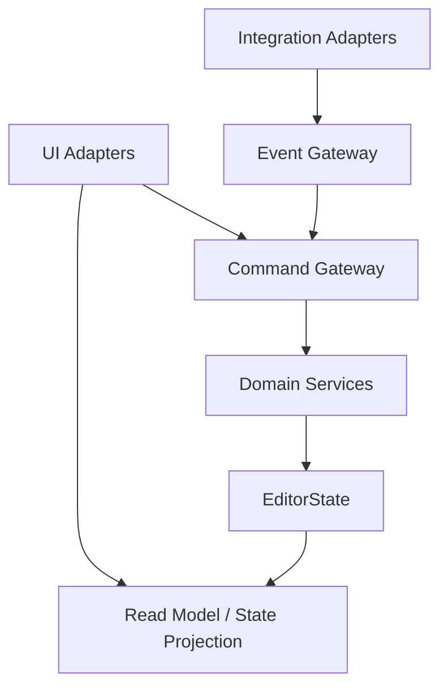
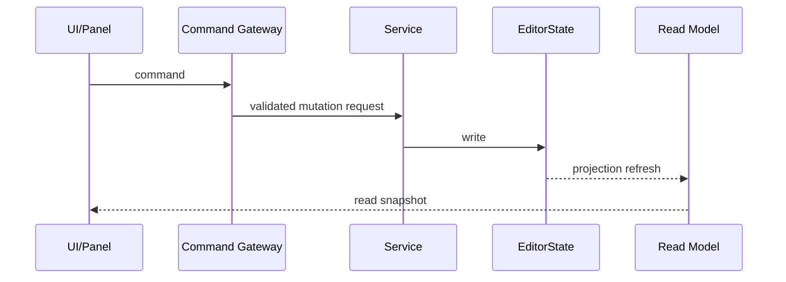

<!--
Filename: docs/architecture/target-architecture.md
Project:  ECLI
License:  MIT
Author:   Siergej Sobolewski
Copyright: (c) 2026 Siergej Sobolewski
-->

# Target Architecture (Normative Direction)

## Target Design Principles

- Command-gateway-controlled writes.
- Read model separated from mutable state core.
- Layered dependency direction with explicit prohibitions.
- Background updates re-enter via event+command gateways only.

## Target Layered Architecture (No UI Direct Writes)

## Command Flow

## Target Dependency Matrix

| Target component | Reads state? | Writes state? | Through what path? | Forbidden shortcuts |
|---|---:|---:|---|---|
| UI adapters | Yes | No | via read model + command gateway calls | direct state mutation |
| Read model | Yes | No | projection from state | command execution |
| Command gateway | Yes (for validation) | No | delegates to services | direct provider/network operations |
| Domain services | Yes | Yes | service API over state model | direct UI rendering |
| Event gateway | No | No | routes integration results to command gateway | direct writes into state |
| Integration adapters | No | No | publish typed events | direct state mutation |

## Allowed / Forbidden Dependency Rules

### Allowed
- UI -> read model
- UI -> command gateway
- command gateway -> services
- services -> state
- integrations -> event gateway -> command gateway

### Forbidden
- UI -> state write path
- UI -> integration mutation path
- integration -> state direct write
- state -> integration/UI imports

## Gateway Semantics

- Command gateway:
  - validates command shape and preconditions,
  - executes mutation through one service boundary.
- Event gateway:
  - normalizes integration result payloads,
  - forwards valid events to command gateway.

## Enforcement Candidates

- PR checklist for forbidden dependency additions.
- static dependency checks for layer violations (candidate tooling).
- targeted tests that fail when mutation bypasses gateway.

## Migration Anti-Patterns

- Moving logic from `Ecli` to services but leaving direct state writes in UI.
- Introducing temporary integration direct callbacks that mutate state.
- Splitting files without contract tests for behavior parity.

## Current -> Target Mapping (Granular)

| Current component | Target destination | Migration strategy | Validation required |
|---|---|---|---|
| `Ecli` mutation methods | command gateway + domain services | extract by feature slice | characterization tests |
| `DrawScreen` direct core reads | read model interface | add projection layer | render parity checks |
| `KeyBinder` action dispatch | command gateway dispatch API | decouple key decode from mutation internals | keybinding regression tests |
| `History` direct internals | history service through state API | isolate replay operations | undo/redo invariant suite |
| `panels.py` mutations | panel adapters -> command gateway | prohibit direct writes | panel behavior tests |
| integration queue consumers | event gateway normalization | typed payload validation | concurrency/event tests |

## Compatibility Constraints

- Existing shortcuts, panel UX, and core editing semantics must remain stable.
- Config compatibility must follow `docs/config/config-migration-policy.md`.
- Release process constraints must follow `docs/release/artifact-contract.md`.

## Non-Goals

- One-shot rewrite.
- Immediate stable public plugin ABI.
- Removing all legacy module names in one release.

## Validation Required

- Exact read-model interface shape remains target-state design and must be validated against refactor implementation constraints.
