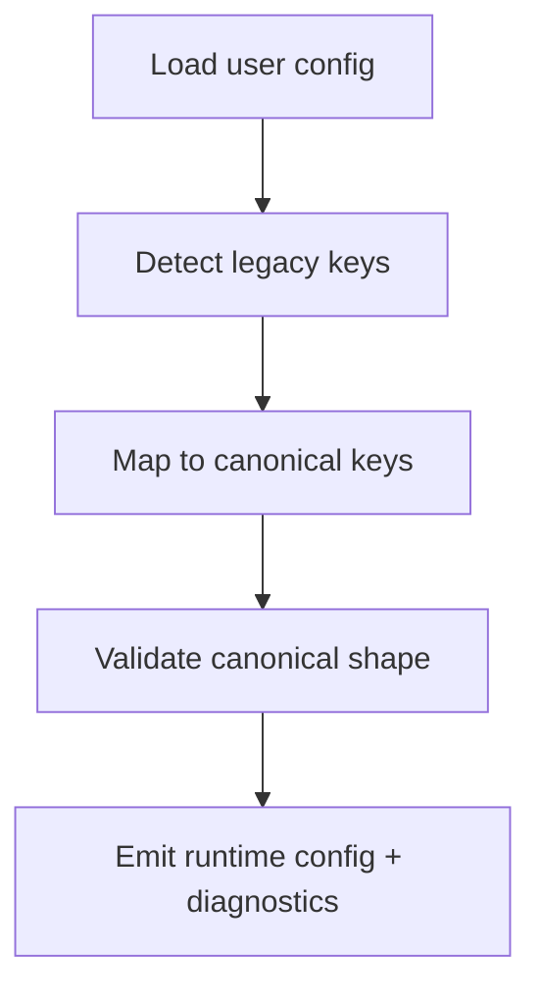

<!--
SPDX-License-Identifier: GPL-2.0-only

Project: Ecli
File: docs/config/config-migration-policy.md
Website: https://www.ecli.io
Repository: https://github.com/SSobol77/ecli
PyPI: https://pypi.org/project/ecli-editor/0.0.1/

Copyright (c) 2026 Siergej Sobolewski

Licensed under the GNU General Public License version 2 only.
See the LICENSE file in the project root for full license text.
-->
# Configuration Migration Policy

## Migration Goals

- Preserve user config compatibility while converging on canonical schema.
- Remove ambiguous/duplicated key patterns safely.
- Ensure migration behavior is observable and testable.

## Backward Compatibility Window

- Default policy: at least one documented release cycle for deprecated key support.
- Earlier removal requires explicit release note + migration warning in prior release.

## Deprecation Lifecycle

1. Introduce canonical key.
2. Keep legacy key readable with warning.
3. Emit startup diagnostics for legacy key usage.
4. Remove legacy key after compatibility window.

## Migration Inventory Source of Truth

- Canonical source: `docs/config/config-schema.md` key tables.
- Legacy inventory source: migration mapping table below + implementation scan (validation required).

## Migration Workflow

## Legacy -> Canonical Mapping Table

| Legacy key | Canonical key | Detection method | Automatic migration | Warning | Removal policy |
|---|---|---|---:|---|---|
| Ambiguous AI model placement (observed mixed patterns) | `ai.models.<provider>` | key-path scan during normalize phase | Yes (target) | Required | one release window minimum |
| Non-canonical provider aliases | canonical provider id | alias mapping table | Yes | Required | one release window minimum |
| Removed-but-present key | none (ignored or mapped) | deprecated key registry | Conditional | Required | remove after documented window |
| Unknown custom top-level key | extension namespace / reject | unknown-key detector | Conditional | Required | case-by-case |

## Normalization Examples

Example:
- Input uses legacy provider alias.
- Normalizer maps alias -> canonical provider id.
- Runtime config stores only canonical key/value.
- Warning emitted once per startup.

## Removal Rules

- A key can be removed only if:
  - canonical replacement exists,
  - warning period completed,
  - release notes include migration guidance.

## Migration Diagnostics Rules

- Diagnostics must include:
  - key path,
  - legacy->canonical mapping applied,
  - fallback action taken,
  - severity (warning/fatal).

## Removed-but-Still-Present User Keys

- Default policy: warn and ignore unless explicit migration mapping exists.
- Strict mode: fail validation for removed keys outside compatibility window.

## End-to-End Migration Example

1. User config includes legacy provider alias and old key path.
2. Migrator detects legacy keys and maps to canonical paths.
3. Normalized config validates.
4. Startup emits warning with legacy->canonical mapping summary.

## Undocumented / Private / Custom Key Handling

- Undocumented keys are not guaranteed compatibility.
- Recommended target: reserve explicit extension namespace for custom keys.
- Without namespace contract, unknown custom keys are warning-level and may be dropped.

## CI Validation Requirements

- CI must validate:
  - schema compliance,
  - deprecated key usage in distributed template/default artifacts,
  - migration map consistency against canonical schema docs.

## Startup Diagnostics Requirements

- Startup must report fatal parse/validation failures explicitly.
- Startup must report migration warnings for legacy keys clearly but non-fatally.

## Release Note Requirements

- Every schema-affecting release must include:
  - added keys,
  - deprecated keys,
  - removed keys,
  - migration examples.

## Validation Required Against Repository Reality

- Full legacy-key inventory is not yet formally enumerated in code.
- Mapping table above includes policy-ready structure, but exact key set needs implementation-side extraction/verification.

## Migration Policy Limits

- Policy does not guarantee compatibility for undocumented/private keys.
- Extension/private custom keys require explicit namespace policy before long-term support commitments.
