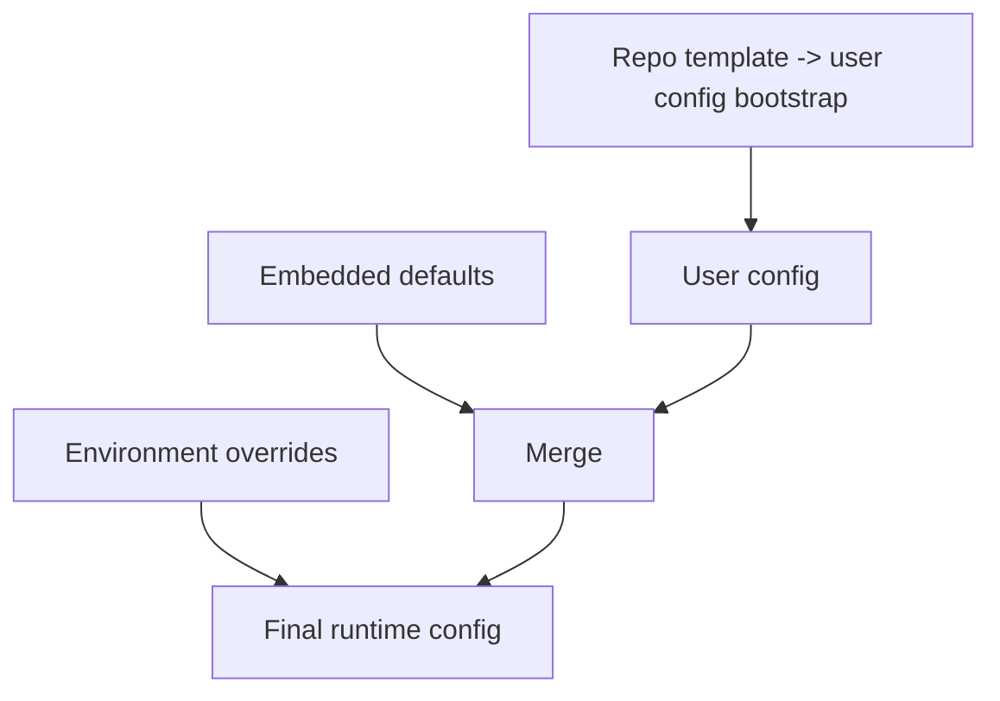

<!--
Path: docs/config/config-precedence.md
File: config-precedence.md
Project: Ecli
Site: www.ecli.io
Author: Siergej Sobolewski
License: Apache License, Version 2.0
Date: 19/04/2026
-->
# Configuration Precedence

## Source Classification

- Embedded defaults (`DEFAULT_CONFIG` in code)
- Repository template (`config.toml`, copied at first run)
- User config (`~/.config/ecli/config.toml`)
- Environment overrides (including `~/.config/ecli/.env` loaded into env)

## Precedence Order (Normative)

1. Embedded defaults establish baseline.
2. User config overrides defaults.
3. Environment overrides (where applicable, especially secrets/provider keys).

Repository template is bootstrap input for first run, not final highest-priority source.

## Precedence Assembly Flow

## Source Policy Table

| Source | Purpose | Override priority | Failure effect | Release-blocking? |
|---|---|---:|---|---:|
| Embedded defaults | runtime safety baseline | 1 (lowest) | fallback if valid, otherwise severe defect | Yes (if malformed in shipped code path) |
| Repo template | first-run seed | bootstrap only | first-run quality defect | Yes |
| User config | user customization | 2 | startup warning + fallback behavior | No (runtime), Yes if silently ignored without diagnostics |
| Environment | secret/runtime override | 3 (highest where mapped) | degraded feature if missing/invalid | No (core), potentially Yes for release env policy checks |

## Merge Behavior Rules

- Dictionary keys merge recursively.
- Scalar override replaces previous value.
- Unknown keys:
  - current observed: tolerated,
  - target: warn and optionally strict-fail in CI schema validation mode.

## First-Run Bootstrap Behavior

- If `~/.config/ecli/config.toml` is missing:
  - create config directory,
  - copy repository template,
  - continue startup with merged config.
- If user config already exists:
  - do not overwrite automatically (idempotent bootstrap behavior),
  - repository template updates in newer release do not auto-merge into existing user file.

## Template-Update Semantics (New Release)

- Observed current state: existing user config remains authoritative and is not replaced by newer template.
- Intended target state: provide optional migration tooling or diagnostics when template introduces new recommended keys.
- Validation required: verify template-diff diagnostics path in implementation.

## Parse-Failure Behavior by Source

- Embedded defaults failure: release-blocking defect.
- Repository template parse failure: release-blocking defect (distribution quality issue).
- User config parse failure: warn + fallback to defaults (must be explicit in diagnostics).
- Environment parse/type mismatch: warn + ignore invalid override.

## Worked Examples

### Example A: same key in defaults + user + env

- defaults: `ai.default_provider = "gemini"`
- user config: `ai.default_provider = "openai"`
- env override present for provider-specific runtime selection (if mapped): final uses env-mapped value.

### Example B: malformed user config

- user config TOML parse fails -> startup warning + fallback to defaults; editor should still start if core requirements are met.

### Example C: malformed repository template/default source

- malformed template/default shipped with release -> release-blocking quality defect; must fail CI validation before release.

### Example D: new release updates template while user config exists

- Existing user config continues to load with current precedence.
- New template keys are not automatically applied.
- Recommended behavior: startup warning or migration report for newly available keys (target; validation required).
