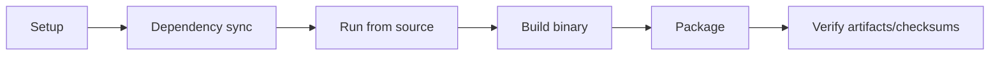

<!--
SPDX-License-Identifier: Apache-2.0

Project: Ecli
File: docs/contributor/build-from-source.md
Website: https://www.ecli.io
Repository: https://github.com/SSobol77/ecli
PyPI: https://pypi.org/project/ecli-editor/0.0.1/

Copyright (c) 2026 Siergej Sobolewski

Licensed under the Apache License, Version 2.0.
See the LICENSE file in the project root for full license text.
-->
# Build From Source

## Operational Build Flow



## Step-by-Step Path

1. Sync dependencies: `uv sync`

2. Runtime check: `python main.py`

3. Build/package by target artifact

4. Verify output naming and checksums

## Build Dependencies

### SUSE / openSUSE

Install the local RPM/package build toolchain:

```bash
sudo zypper install python3 python3-pip python3-devel gcc make rpm-build
```

Runtime dependency checks for installed packages use:

```bash
sudo zypper install ncurses6 libyaml-0-2 xclip xsel
```

### Slackware

Slackware `.txz` package builds require a Slackware build host with `makepkg`, `tar`, `xz`, `python3`, PyInstaller, and the project Python build dependencies.

Install `ncurses`, `libyaml`, and `xclip` or `xsel` from the official
Slackware series or SlackBuilds according to the target release.

### Windows

Source and package builds on Windows require `Python 3.11+`, `Git`, and `PowerShell 7`. Installer builds additionally require NSIS.

Visual Studio Build Tools are only required if native dependencies or build tooling need local compilation.

## Build Matrix

| Target artifact | Script / entrypoint | Environment | Expected output | Validation step |
|---|---|---|---|---|
| Linux binary | `scripts/build_pyinstaller_linux.sh` | Linux | `dist/` executable | smoke run + file existence |
| DEB | `scripts/build-and-package-deb.sh` | Linux | `releases/<version>/ecli_<version>_linux_<arch>.deb` | checksum + contract check |
| RPM | `scripts/build-and-package-rpm.sh` | Linux/RPM tooling | `releases/<version>/ecli_<version>_linux_<arch>.rpm` | checksum + contract check |
| openSUSE RPM | `scripts/build-and-package-opensuse-rpm.sh` | openSUSE/SUSE RPM tooling | `releases/<version>/ecli_<version>_opensuse_<arch>.rpm` | checksum + package contents |
| Arch package | `scripts/build-and-package-arch.sh` or `packaging/arch/PKGBUILD` | Arch Linux | `releases/<version>/ecli_<version>_arch_<arch>.pkg.tar.zst` | checksum + package contents |
| Slackware TXZ | `scripts/build-and-package-slackware.sh` | Slackware with `makepkg` | `releases/<version>/ecli_<version>_slackware_<arch>.txz` | checksum + package contents |
| Nix package | `flake.nix` / `packaging/nix/package.nix` | Nix with flakes | `result/` symlink from `nix build .` | `nix run .` smoke test |
| FreeBSD PKG | `scripts/build-and-package-freebsd.sh` | FreeBSD host/VM | `releases/<version>/ecli_<version>_freebsd_<arch>.pkg` | checksum + contract check |
| macOS DMG | `scripts/build-and-package-macos.sh` | macOS | `releases/<version>/ecli_<version>_macos_<arch>.dmg` | checksum + contract check |
| Windows EXEs | `scripts/build-and-package-windows.ps1` | Windows + NSIS | `releases/<version>/ecli_<version>_win_x86_64.exe` and `releases/<version>/ecli_<version>_win_x86_64_setup.exe` | checksum + contract check |

## Known Unsupported/Constrained Combinations

- FreeBSD native package build on Linux Docker host is not a supported native path.

- Slackware `.txz` builds require Slackware `makepkg`; this is not validated on non-Slackware hosts.

- Arch `makepkg` builds require Arch packaging tools and package names from Arch repositories.

- Nix builds require flakes and a nixpkgs input; this repository does not claim nixpkgs publication.

- Platform packaging without required local toolchain is expected to fail.

## Expected Outputs and Contract

- Output naming and location are governed by `docs/release/artifact-contract.md`.

- Verification commands are governed by `docs/release/artifact-verification.md`.

## Validation Required

- Workflow/script drift (for example around optional packaging spec files) must be checked before release-critical builds.
