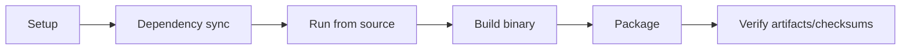

<!--
SPDX-License-Identifier: GPL-2.0-only

Project: Ecli
File: docs/contributor/build-from-source.md
Website: https://www.ecli.io
Repository: https://github.com/SSobol77/ecli
PyPI: https://pypi.org/project/ecli-editor/0.0.1/

Copyright (c) 2026 Siergej Sobolewski

Licensed under the GNU General Public License version 2 only.
See the LICENSE file in the project root for full license text.
-->
# Build From Source

## Operational Build Flow



## Step-by-Step Path

1. Sync dependencies: `uv sync`

2. Runtime check: `python main.py`

3. Build/package by target artifact

4. Verify output naming and checksums

## Build Dependencies

### F4 linter tools in source checkouts

Source checkouts are not ECLI Full installs. They do not imply automatic
provisioning of Biome, markdownlint-cli2, yamllint, ShellCheck, Zig, Hadolint,
Taplo, actionlint, Clang-Tidy, Cppcheck, Checkstyle, PMD, Cargo Clippy,
Clang-Format, SpotBugs, golangci-lint, SQLFluff, or TFLint.

For source checkout diagnostics, install required tools manually using
`docs/extensions/f4-linter-manual-installation.md` and verify every executable
with its version command. For release packaging work, Full linter provisioning
must be implemented and verified by the artifact-specific installer flow across
exactly 21 artifact contract entries; manual setup is not release evidence for a
Full artifact.

### TextMate syntax engine

The default syntax engine is extension-backed and depends on `python-textmate`;
that dependency pulls `onigurumacffi`, which uses the Oniguruma regular-expression
engine. Binary wheels cover common Linux, macOS, and Windows builds, but source
builds need the Oniguruma development headers/library available before dependency
sync.

Use the platform package where required:

- Debian/Ubuntu-style systems: `libonig-dev` or `oniguruma`.
- Arch and Nix: `oniguruma`.
- FreeBSD: `devel/oniguruma`.

Packaging and smoke validation must accept only two outcomes: TextMate rendering
is available, or ECLI logs the deterministic fallback diagnostic and starts with
the legacy highlighter. A missing tokenizer must not crash startup.

### SUSE / openSUSE

Install the local RPM/package build toolchain:

```bash
sudo zypper install python3 python3-pip python3-devel gcc make rpm-build
```

Runtime dependency checks for installed packages use:

```bash
sudo zypper install ncurses6 libyaml-0-2 xclip xsel
```

### Slackware

Slackware `.txz` package builds require a Slackware build host with `makepkg`, `tar`, `xz`, `python3`, PyInstaller, and the project Python build dependencies.

Install `ncurses`, `libyaml`, and `xclip` or `xsel` from the official
Slackware series or SlackBuilds according to the target release.

### Windows

Source and package builds on Windows require `Python 3.11+`, `Git`, and `PowerShell 7`. Installer builds additionally require NSIS.

Visual Studio Build Tools are only required if native dependencies or build tooling need local compilation.

## Build Matrix

Use `make help` for the short developer workflow and `make help-full` for the
complete package/validation/release command surface. `make doctor` checks local
tool availability without building packages, and `make sysinfo` prints the
configured version, release directory, OS, and architecture variables.

| Target artifact | Script / entrypoint | Environment | Expected output | Validation step |
|---|---|---|---|---|
| Linux binary | `scripts/build_pyinstaller_linux.py` | Linux | `dist/` executable | smoke run + file existence |
| DEB | `scripts/build_and_package_deb.py` | Linux | `releases/<version>/ecli_<version>_linux_<arch>.deb` | checksum + contract check |
| RPM | `scripts/build_and_package_rpm.py` | Linux/RPM tooling | `releases/<version>/ecli_<version>_linux_<arch>.rpm` | checksum + contract check |
| openSUSE RPM | `scripts/build_and_package_opensuse_rpm.py` | openSUSE/SUSE RPM tooling | `releases/<version>/ecli_<version>_opensuse_<arch>.rpm` | checksum + package contents |
| Arch package | `scripts/build_and_package_arch.py` or `packaging/arch/PKGBUILD` | Arch Linux | `releases/<version>/ecli_<version>_arch_<arch>.pkg.tar.zst` | checksum + package contents |
| Slackware TXZ | `scripts/build_and_package_slackware.py` | Slackware with `makepkg` | `releases/<version>/ecli_<version>_slackware_<arch>.txz` | checksum + package contents |
| Nix package | `flake.nix` / `packaging/nix/package.nix` | Nix with flakes | `result/` symlink from `nix build .` | `nix run .` smoke test |
| FreeBSD PKG | `scripts/build_and_package_freebsd.py` | FreeBSD host/VM | `releases/<version>/ecli_<version>_freebsd_<arch>.pkg` | checksum + contract check |
| macOS DMG | `scripts/build_and_package_macos.py` | macOS | `releases/<version>/ecli_<version>_macos_<arch>.dmg` | checksum + contract check |
| Windows EXEs | `scripts/build-and-package-windows.ps1` | Windows + NSIS | `releases/<version>/ecli_<version>_win_x86_64.exe` and `releases/<version>/ecli_<version>_win_x86_64_setup.exe` | checksum + contract check |

## Known Unsupported/Constrained Combinations

- FreeBSD native package build on Linux Docker host is not a supported native path.

- Slackware `.txz` builds require Slackware `makepkg`; this is not validated on non-Slackware hosts.

- Arch `makepkg` builds require Arch packaging tools and package names from Arch repositories.

- Nix builds require flakes and a nixpkgs input; this repository does not claim nixpkgs publication.

- Platform packaging without required local toolchain is expected to fail.

## Artifact Checksums and Verification

Checksum sidecars and verification use standard-library Python entrypoints
(part of the staged shell-to-Python script migration; see
`docs/release/artifact-contract.md` under `Shell-to-Python Script Migration`):

```bash
# Generate the basename-only SHA256 sidecar(s)
python3 scripts/sign_checksums.py releases/<version>/<artifact>

# Verify an artifact against its sidecar (granular exit codes 0-5)
uv run python scripts/verify_artifact.py releases/<version>/<artifact>
```

Active shell wrappers under `scripts/` have been removed. Use the canonical
Python entrypoints directly in new docs, automation, and tests, including
`scripts/verify_artifact.py`, `scripts/sign_checksums.py`, and all platform
build scripts above. `scripts/build-and-package-windows.ps1` is a separate
Windows-native packaging surface and is not part of this migration.
`tools/freebsd-chroot-build.sh` remains a FreeBSD chroot helper outside the
script migration. The unused tracked helper the removed FreeBSD package-renaming shell helper was
removed during no-shell cleanup.

## Expected Outputs and Contract

- Output naming and location are governed by `docs/release/artifact-contract.md`.

- The full set of buildable artifacts is the `Canonical 21-Item Platform &
  Packaging Artifact Matrix` in `docs/release/artifact-contract.md`. The table
  above lists the local build entrypoints; the canonical matrix additionally maps
  each artifact to its required `tests/packaging/` test, Claude command, Codex
  prompt, and GitHub workflow.

- Verification commands are governed by `docs/release/artifact-verification.md`.

## Validation Required

- Workflow/script drift (for example around optional packaging spec files) must be checked before release-critical builds.
