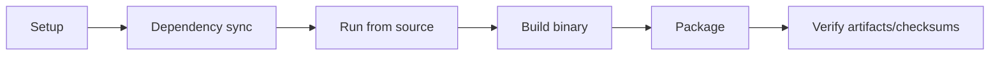

<!--
SPDX-License-Identifier: Apache-2.0

Project: Ecli
File: docs/contributor/build-from-source.md
Website: https://www.ecli.io
Repository: https://github.com/SSobol77/ecli
PyPI: https://pypi.org/project/ecli-editor/0.0.1/

Copyright (c) 2026 Siergej Sobolewski

Licensed under the Apache License, Version 2.0.
See the LICENSE file in the project root for full license text.
-->
# Build From Source

## Operational Build Flow

## Step-by-Step Path

1. Sync dependencies: `uv sync`
2. Runtime check: `python main.py`
3. Build/package by target artifact
4. Verify output naming and checksums

## Build Matrix

| Target artifact | Script / entrypoint | Environment | Expected output | Validation step |
|---|---|---|---|---|
| Linux binary | `scripts/build_pyinstaller_linux.sh` | Linux | `dist/` executable | smoke run + file existence |
| DEB | `scripts/build-and-package-deb.sh` | Linux | `releases/<ver>/ecli_<ver>_linux_<arch>.deb` | checksum + contract check |
| RPM | `scripts/build-and-package-rpm.sh` | Linux/RPM tooling | `releases/<ver>/ecli_<ver>_linux_<arch>.rpm` | checksum + contract check |
| FreeBSD PKG | `scripts/build-and-package-freebsd.sh` | FreeBSD host/VM | `releases/<ver>/ecli_<ver>_freebsd_<arch>.pkg` | checksum + contract check |
| macOS DMG | `scripts/build-and-package-macos.sh` | macOS | `releases/<ver>/ecli_<ver>_macos_<arch>.dmg` | checksum + contract check |
| Windows EXEs | `scripts/build-and-package-windows.ps1` | Windows + NSIS | `releases/<ver>/ecli_<ver>_win_x86_64.exe` and `releases/<ver>/ecli_<ver>_win_x86_64_setup.exe` | checksum + contract check |

## Known Unsupported/Constrained Combinations

- FreeBSD native package build on Linux Docker host is not a supported native path.
- Platform packaging without required local toolchain is expected to fail.

## Expected Outputs and Contract

- Output naming and location are governed by `docs/release/artifact-contract.md`.
- Verification commands are governed by `docs/release/artifact-verification.md`.

## Validation Required

- Workflow/script drift (for example around optional packaging spec files) must be checked before release-critical builds.
