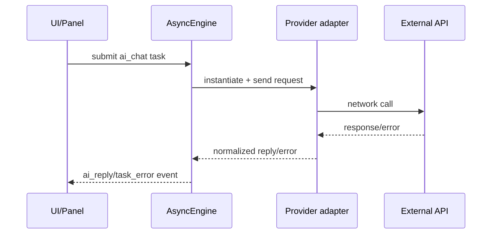

<!--
SPDX-License-Identifier: Apache-2.0

Project: Ecli
File: docs/extensions/ai-provider-runtime.md
Website: https://www.ecli.io
Repository: https://github.com/SSobol77/ecli
PyPI: https://pypi.org/project/ecli-editor/0.0.1/

Copyright (c) 2026 Siergej Sobolewski

Licensed under the Apache License, Version 2.0.
See the LICENSE file in the project root for full license text.
-->
# AI Provider Runtime Contract

## Current vs Target

- Observed current state: provider adapters exist in `src/ecli/integrations/AI.py` and are invoked via async engine paths.
- Target state: unified provider lifecycle, error taxonomy, and telemetry tags.

## Provider Request Lifecycle

## Runtime Stage Matrix

| Runtime stage | Responsibility | Failure class | User-visible behavior |
|---|---|---|---|
| task submit | enqueue request | queue/validation | status/error feedback |
| adapter setup | resolve key/model/provider | config/auth | task error |
| network request | call provider API | timeout/rate/auth/server | degraded AI response |
| response normalize | parse provider payload | malformed/empty payload | normalized error text |
| UI re-entry | consume queue event | consumer handling issue | fallback status message |

## Error Class Policy

| Error class | Retry? | Fallback? | Log severity | UI effect |
|---|---:|---:|---|---|
| auth/credential error | No | Yes | Error | clear provider auth failure |
| timeout | Limited | Yes | Warning/Error | request timeout message |
| rate-limit/quota | Limited | Yes | Warning | rate-limit/quota message |
| provider server error | Limited | Yes | Error | provider unavailable message |
| malformed payload | No | Yes | Error | unexpected response message |

## Timeout/Retry/Fallback Classes

- Timeout classes: short/medium/long by provider operation profile (validation required per provider).
- Retry classes:
  - R0 no retry for deterministic failures,
  - R1 one retry for transient failures.
- Fallback: always return user-readable error and keep editor interactive.

## Secret Resolution Behavior

- API keys resolved from environment/config channels only.
- Secret values must not be logged.

## Telemetry / Observability Expectations

- include provider id, model id, latency class, outcome class (success/error type).
- avoid payload content logging by default.

## UI Degradation Examples

- Provider unavailable -> panel shows failure text and editor remains usable.
- Missing API key -> immediate task error and no blocking behavior.
