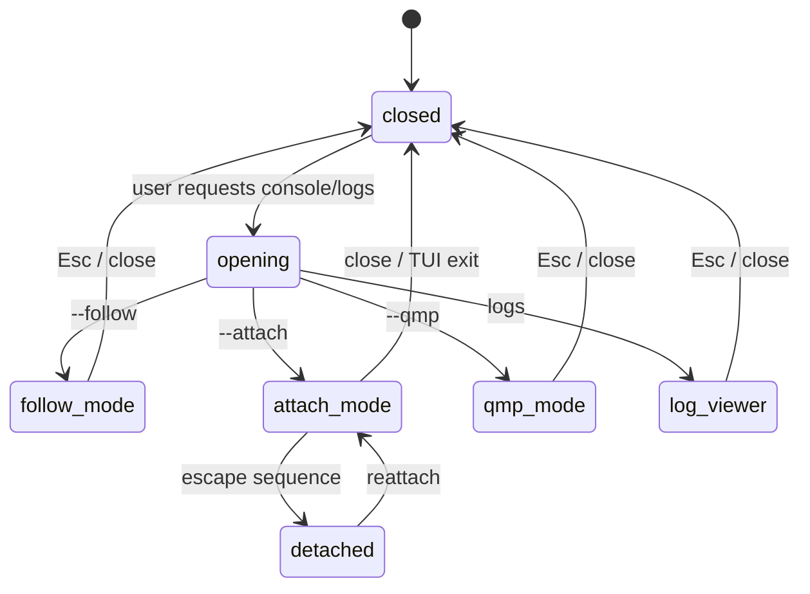
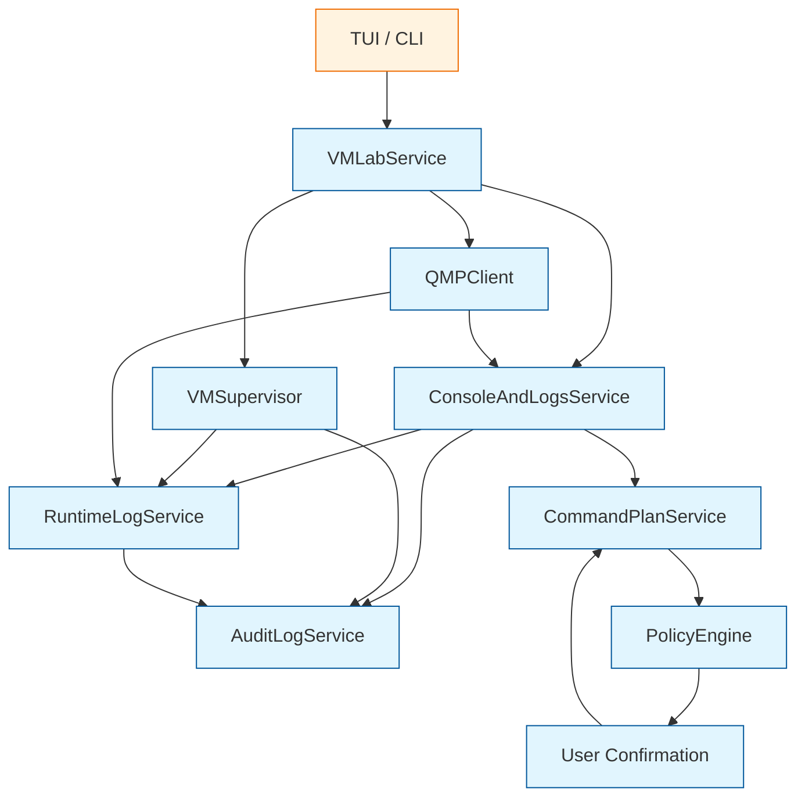

<!--
SPDX-License-Identifier: Apache-2.0

Project: ECLI
File: docs/extensions/vmlab-console-and-logs.md
Website: https://www.ecli.io
Repository: https://github.com/SSobol77/ecli
Author: Siergej Sobolewski
License: Apache License, Version 2.0

Copyright (c) 2026 Siergej Sobolewski

Licensed under the Apache License, Version 2.0.
See the LICENSE file in the project root for full license text.
-->

# Console and Logs Contract

**Phase 2 Runtime I/O and Observability**

**Version:** 1.0
**Date:** 2026-05-15
**Status:** Strategic Architecture Direction
**Part of:**
[Product Vision](../architecture/product-vision.md) |
[Services Foundation](../architecture/services-foundation.md) |
[CommandPlanService](../architecture/command-plan-service.md) |
[VMLab Overview](./vmlab-overview.md) |
[VMLab Profile Schema](./vmlab-profile-schema.md) |
[QMP Client Contract](./vmlab-qmp-client.md) |
[VMSupervisor Contract](./vmlab-runtime-supervisor.md)

---

## 1. Purpose

This document defines the console and logs contract for VMLab.

VMLab provides three distinct console modes and structured runtime log workflows for QEMU-based virtual machines:

- serial console follow;
- serial console attach;
- QMP diagnostics console;
- runtime log viewing, export, redaction, and crash preservation.

These capabilities are not raw passthrough layers.

They are mediated, async-safe, TUI-compatible I/O abstractions that:

- preserve terminal state across attach and detach cycles;
- enforce single-attacher locks for interactive serial sessions;
- provide read-only serial follow mode for safe concurrent observation;
- expose QMP diagnostics in read-only mode by default;
- route mutating QMP actions through `CommandPlanService`;
- treat raw runtime logs as sensitive artifacts;
- apply redaction for TUI display, audit summaries, exports, and AI context;
- integrate with `RuntimeLogService` for indexing, rotation, retention, and export;
- support dry-run behavior that never opens devices, creates files, or starts handlers.

Critical rule:

```text
Console and log handlers never mutate VM lifecycle state directly.
Serial attach may send user input to the guest, but host-side runtime mutations must be plan-mediated.
````

---

## 2. Scope and Boundaries

### 2.1 Console and Logs Own

| Capability              | Description                                                        |
| ----------------------- | ------------------------------------------------------------------ |
| Serial follow mode      | Read-only observation of serial output                             |
| Serial attach mode      | Interactive bidirectional serial I/O with exclusive lock           |
| QMP diagnostics view    | Read-only QMP event/query diagnostics by default                   |
| Console panel lifecycle | Open, close, attach, detach, restore terminal state                |
| Attach lock handling    | Acquire/release interactive serial attach lock                     |
| Redaction-on-view       | Mask sensitive tokens in displayed output                          |
| Log viewer integration  | Render logs from `RuntimeLogService` without owning storage policy |
| Export request flow     | Request redacted diagnostic exports through service layer          |
| Dry-run report          | Validate intended paths and modes without opening devices or files |

### 2.2 Console and Logs Do Not Own

| Excluded                      | Owner / Reason                      |
| ----------------------------- | ----------------------------------- |
| Profile validation            | `VMProfileService` / profile schema |
| QEMU argv generation          | `VMLabService`                      |
| Process lifecycle             | `VMSupervisor`                      |
| QMP protocol implementation   | `QMPClient`                         |
| QMP mutation authorization    | `CommandPlanService`                |
| Runtime log storage policy    | `RuntimeLogService`                 |
| Log rotation policy           | `RuntimeLogService`                 |
| Audit persistence             | `AuditLogService`                   |
| Privilege escalation          | `PrivilegedActionService`           |
| Guest OS serial configuration | Guest OS responsibility             |
| Network/cloud observability   | Future `ObservabilityService`       |

---

## 3. Console Modes

VMLab supports three console modes, each with separate semantics and safety guarantees.

### 3.1 Mode Comparison

| Mode   | CLI Surface                          | Mutating?            | Lock Required | Primary Use                                |
| ------ | ------------------------------------ | -------------------- | ------------- | ------------------------------------------ |
| Follow | `ecli vm console --follow <profile>` | No                   | No            | Observe boot logs and serial output        |
| Attach | `ecli vm console --attach <profile>` | Guest input only     | Yes           | Interact with bootloader, shell, installer |
| QMP    | `ecli vm console --qmp <profile>`    | Read-only by default | No            | Inspect QMP status/events                  |

Important distinction:

```text
Serial attach sends bytes to the guest.
It does not mutate host runtime state by itself.
Host-side lifecycle mutations still require CommandPlanService.
```

---

## 4. Serial Console Follow Mode

### 4.1 Behavior

Follow mode:

- opens a serial log stream or file in read-only mode;
- tails new serial output as it arrives;
- does not send input to the VM;
- allows multiple concurrent follow sessions;
- does not require an exclusive lock;
- does not require privilege escalation;
- does not interpret guest output as commands.

### 4.2 TUI Behavior

The TUI panel should provide:

- scrollback;
- search;
- copy selected lines;
- timestamp display where available;
- optional kernel/log highlighting;
- clear indication that mode is read-only.

Suggested interactions:

```text
Esc       close panel
/         search
n / N     next / previous match
c         copy selected line/range
?         help
```

### 4.3 Safety Rules

- Follow mode never writes to the serial device.
- Follow mode never writes to the serial log.
- Follow mode must not block the TUI main loop.
- Follow mode must tolerate log rotation.
- Guest escape sequences must not be interpreted as ECLI commands.

---

## 5. Serial Console Attach Mode

### 5.1 Behavior

Attach mode:

- opens the serial device or socket in read-write mode;
- forwards keyboard input to the guest serial interface;
- forwards guest serial output to the TUI panel;
- suspends most ECLI editor keybindings while active;
- exits only through an explicit detach sequence or panel close;
- requires a single-attacher lock.

### 5.2 Attach Lock Contract

Attach mode requires an exclusive lock.

Default lock path:

```text
.ecli/vmlab/run/<profile>/serial.attach.lock
```

Rules:

- only one attach session may hold the lock;
- follow sessions do not require this lock;
- lock acquisition must be atomic;
- stale locks must be detected read-only first;
- stale lock cleanup is a filesystem mutation and must be explicit or policy-mediated;
- lock metadata should include owner PID, user, start time, and console target.

Conceptual lock metadata:

```json
{
  "schema_version": 1,
  "profile_name": "kernel-dev",
  "mode": "serial-attach",
  "owner_pid": 12345,
  "user": "ssobol",
  "created_at": "2026-05-12T18:30:45Z",
  "target": ".ecli/vmlab/run/kernel-dev/serial.sock"
}
```

### 5.3 Escape Sequence Contract

Default escape sequence:

```text
Ctrl+]  # ASCII 0x1D
```

Rules:

- escape sequence must be visible in the panel header;
- escape sequence must be configurable via `[console].escape_sequence`;
- profile validation must detect conflicts with core ECLI keybindings;
- escape sequence exits attach mode but does not stop the VM;
- detach must restore terminal state.

### 5.4 Terminal State Contract

Attach mode must:

1. save current terminal state;
2. enter raw input mode;
3. forward bytes to the guest;
4. detect detach sequence;
5. restore terminal state;
6. release attach lock;
7. return user to normal ECLI TUI mode.

Conceptual interface:

```python
# Conceptual contract only — implementation details belong in code.

from typing import Protocol


class TerminalStateManager(Protocol):
    """Terminal mode save/restore boundary for interactive console attach."""

    def save_state(self) -> "TerminalState":
        """Capture current terminal settings."""
        ...

    def apply_raw_mode(self) -> None:
        """Switch terminal to raw input mode for serial forwarding."""
        ...

    def restore_state(self, state: "TerminalState") -> None:
        """Restore terminal settings after detach or failure."""
        ...
```

### 5.5 Safety Rules

- Attach mode must not corrupt terminal state after detach.
- Attach mode must release locks on normal detach.
- Attach mode must attempt lock release on panel close, TUI exit, or exception.
- Guest input is forwarded as bytes and must not be interpreted by ECLI.
- Attach mode must not execute host commands based on guest output.
- Attach mode must not require privilege escalation for normal PTY/socket access.

---

## 6. QMP Diagnostics Console

### 6.1 Behavior

QMP diagnostics mode:

- connects to QMP through `QMPClient`;
- displays QMP events;
- allows read-only QMP queries;
- does not auto-execute commands on connect;
- does not expose TCP QMP;
- treats mutating commands as plan-mediated operations.

### 6.2 Read-Only Default

Allowed by default:

```text
query-status
query-version
query-block
query-blockstats
query-netdev
query-chardev
```

These may be executed through `QMPClient.query_readonly()`.

### 6.3 Mutating QMP Commands

Examples:

```text
stop
cont
quit
system_reset
system_powerdown
device_add
device_del
blockdev-snapshot-sync
```

Rules:

- mutating QMP commands require `CommandPlanService`;
- TUI must show a confirmation dialog;
- approved plan metadata must include QMP command and redacted arguments;
- QMP diagnostics console must fail closed if authorization is missing;
- user-entered mutating commands must not be sent directly.

### 6.4 TUI Behavior

The QMP panel should show:

- connection state;
- socket path;
- QMP version;
- event stream;
- read-only query input;
- warning banner for mutating command attempts.

Suggested interactions:

```text
Enter     run read-only query
Esc       close panel
f         filter events
e         export visible events
?         help
```

---

## 7. Runtime Log Handling

### 7.1 Runtime Log Sources

| Source | Future Runtime Path | Development/Test Path | Owner |
|--------|---------------------|-----------------------|-------|
| QEMU stdout | `.ecli/vmlab/run/<profile>/stdout.log` | `logs/vmlab/runtime/<profile>/stdout.log` | `VMSupervisor` capture, `RuntimeLogService` indexing |
| QEMU stderr | `.ecli/vmlab/run/<profile>/stderr.log` | `logs/vmlab/runtime/<profile>/stderr.log` | `VMSupervisor` capture, `RuntimeLogService` indexing |
| Serial output | `.ecli/vmlab/run/<profile>/serial.log` | `logs/vmlab/serial/<profile>.log` | Console capture / `RuntimeLogService` |
| QMP events | `.ecli/vmlab/run/<profile>/qmp-events.log` optional | `logs/vmlab/qmp/<profile>-events.log` | `QMPClient` + `RuntimeLogService` |
| Crash report | `.ecli/vmlab/logs/<profile>/crash-<timestamp>.log` | `logs/vmlab/crash/<profile>-crash-<timestamp>.log` | `VMSupervisor` + `RuntimeLogService` |

Rules:

- future runtime paths describe eventual user runtime state;
- development and skeleton tests must use only `logs/`;
- Phase 2A skeleton must not create `.ecli/vmlab/run/` or `.ecli/vmlab/logs/`;
- any test or development code writing outside `logs/` violates the development log invariant.

### 7.2 RuntimeLogService Responsibilities

`RuntimeLogService` owns:

- log indexing;
- rotation;
- retention;
- export;
- redaction-on-export;
- crash log preservation;
- structured metadata for log segments.

It does not own:

- QEMU process lifecycle;
- serial attach mode;
- QMP command execution;
- audit storage;
- AI provider transmission.

### 7.3 Raw Logs vs Audit Logs

Important distinction:

```text
Raw runtime logs preserve diagnostic evidence.
Audit logs preserve sanitized security-relevant summaries.
```

Raw runtime logs:

- may contain arbitrary guest or QEMU output;
- are treated as sensitive local artifacts;
- are not automatically redacted at capture time;
- should not be uploaded or shared without review;
- may be redacted on view or export.

Audit logs:

- must be redacted;
- must not include raw secrets;
- should log lifecycle events, exports, rotations, crash preservation, and access events;
- should not log every runtime log line by default.

### 7.4 Development Log Storage Rule

For development and skeleton implementation, `RuntimeLogService` must write all log artifacts only under the repository-level `logs/` directory.

The `.ecli/vmlab/run/` paths shown in conceptual runtime diagrams are future production/runtime layout examples and must not be used for development log output in the skeleton.

Development log paths:

```text
logs/vmlab/console/
logs/vmlab/runtime/
logs/vmlab/qmp/
logs/vmlab/exports/
logs/vmlab/tests/
````

No console, serial, QMP, runtime, crash, export, or test log may be written outside `logs/` during development.

---

## 8. Redaction Policy

### 8.1 Redaction Contexts

| Context                    | Redaction Rule                                                    |
| -------------------------- | ----------------------------------------------------------------- |
| Raw runtime logs           | Preserve by default; sensitive local artifact                     |
| TUI display                | Redaction-on-view enabled by default                              |
| Search results             | Redaction-on-view enabled by default                              |
| Exported diagnostic bundle | Redact by default                                                 |
| AI context                 | Always redact before sending to provider                          |
| Audit records              | Always redact                                                     |
| Debug trace                | Redact unless developer explicitly enables unsafe local debugging |

### 8.2 Sensitive Token Denylist

Case-insensitive substring matching:

```text
password
passwd
token
api_key
apikey
secret
private_key
credential
authorization
bearer
x-api-key
access_key
secret_key
session_key
```

### 8.3 Redaction Format

Example:

```text
Original: auth_token=sk-proj-abc123
Redacted: auth_token=***REDACTED***
```

Redaction must preserve enough structure for debugging while removing secret values.

### 8.4 AI Context Rule

Before logs are sent to any external AI provider:

- redaction is mandatory;
- user confirmation may be required depending on configuration;
- provider name and redaction status should be visible to the user;
- audit summary should record that redacted context was exported to AI, without storing the content.

---

## 9. Log Rotation, Retention, and Export

### 9.1 Rotation

`RuntimeLogService` owns rotation.

Default configurable policy:

| Trigger                         | Action                                             |
| ------------------------------- | -------------------------------------------------- |
| Log file exceeds size threshold | Rotate segment                                     |
| VM stops cleanly                | Flush and index segment                            |
| VM crashes                      | Preserve crash segment                             |
| User requests rotation          | Generate rotation plan or execute if policy allows |
| Retention limit exceeded        | Generate cleanup plan                              |

Manual rotation or cleanup is a filesystem mutation.

It must be:

- explicit;
- policy-controlled;
- logged;
- plan-mediated when deleting or modifying files.

### 9.2 Retention

Retention policy should be configurable.

Example conceptual policy:

```toml
[vmlab.logs]
max_file_mb = 100
max_segments = 10
retain_days = 14
redact_exports_by_default = true
```

Rules:

- retention cleanup must not delete current active logs;
- retention cleanup must not delete VM profiles;
- retention cleanup must not delete disk images;
- destructive cleanup requires confirmation.

### 9.3 Export

Exported diagnostic bundles may include:

- redacted stdout/stderr excerpts;
- redacted serial logs;
- QMP event summaries;
- crash metadata;
- profile hash;
- argv hash;
- selected acceleration;
- validation warnings;
- SystemDoctor findings.

Export must not include:

- raw secrets;
- private keys;
- API tokens;
- unredacted guest command history;
- full disk images;
- VM profiles containing sensitive paths unless user explicitly confirms.

---

## 10. TUI Integration Contract

### 10.1 Panel Modes

| Panel           | CLI Equivalent                       | Primary Actions                |
| --------------- | ------------------------------------ | ------------------------------ |
| Serial follow   | `ecli vm console --follow <profile>` | scroll, search, copy, close    |
| Serial attach   | `ecli vm console --attach <profile>` | send input, detach, close      |
| QMP diagnostics | `ecli vm console --qmp <profile>`    | query, filter events, export   |
| Log viewer      | `ecli vm logs <profile>`             | scroll, search, export, rotate |

### 10.2 Panel Lifecycle



### 10.3 TUI Requirements

The TUI must:

- keep rendering responsive during log follow;
- never block on serial or QMP reads;
- restore terminal state after attach;
- show current mode prominently;
- show attach escape sequence;
- show redaction status;
- show source path or stream identity;
- handle terminal resize;
- tolerate log rotation while viewing;
- show clear errors for missing serial/QMP endpoints.

---

## 11. CLI Contract

### 11.1 Console Commands

```bash
ecli vm console --follow <profile>
ecli vm console --attach <profile>
ecli vm console --qmp <profile>
```

### 11.2 Log Commands

```bash
ecli vm logs <profile>
ecli vm logs <profile> --follow
ecli vm logs <profile> --search <pattern>
ecli vm logs <profile> --export <path>
ecli vm logs <profile> --export <path> --no-redact
ecli vm logs <profile> --rotate
```

### 11.3 CLI Safety Rules

- `--follow` is read-only.
- `--attach` requires exclusive lock.
- `--qmp` is read-only by default.
- `--no-redact` requires explicit warning and confirmation.
- `--rotate` is a filesystem mutation and must be policy-controlled.
- export paths must be validated.
- export must not overwrite existing files unless explicitly confirmed.

---

## 12. Dry-Run Contract

For:

```bash
ecli vm console --follow kernel-dev --dry-run
ecli vm console --attach kernel-dev --dry-run
ecli vm logs kernel-dev --export ./bundle.tar.zst --dry-run
```

Dry-run may:

- validate profile console/log configuration;
- inspect metadata for intended paths;
- check whether parent directories exist;
- check apparent permissions read-only;
- report intended lock path;
- report intended redaction policy;
- report intended export contents.

Dry-run must not:

- open serial devices;
- open QMP sockets;
- open log files for writing;
- create lock files;
- create export files;
- rotate logs;
- delete logs;
- start TUI panels;
- send guest input;
- send QMP commands.

---

## 13. Integration with Services Foundation

### 13.1 Architecture Flow



### 13.2 Audit Integration

Audit should record security-relevant events, not every raw line.

| Event                          | Audit Type                          | Metadata                               |
| ------------------------------ | ----------------------------------- | -------------------------------------- |
| Serial follow started          | `vm.console.follow_started`         | profile, source, redaction_status      |
| Serial attach started          | `vm.console.attach_started`         | profile, lock_path, user               |
| Serial attach detached         | `vm.console.attach_detached`        | profile, duration_seconds              |
| Attach lock conflict           | `vm.console.attach_lock_conflict`   | profile, lock_owner_summary            |
| QMP diagnostics opened         | `vm.console.qmp_opened`             | profile, qmp_socket                    |
| Mutating QMP command requested | `vm.console.qmp_mutation_requested` | profile, command, plan_id              |
| Log export created             | `vm.log.exported`                   | profile, export_path, redacted         |
| Log rotation requested         | `vm.log.rotation_requested`         | profile, target_logs                   |
| Crash log preserved            | `vm.log.crash_preserved`            | profile, crash_id                      |
| AI context export              | `vm.log.ai_context_exported`        | provider, redacted, content_not_stored |

Audit records must redact sensitive paths, guest data, command content, and tokens.

---

## 14. Security and Safety Rules

These rules are non-negotiable for v1:

1. Follow mode is read-only.
2. Attach mode requires exclusive lock.
3. Attach mode must provide a documented escape sequence.
4. Attach mode must restore terminal state.
5. QMP diagnostics mode is read-only by default.
6. Mutating QMP commands require `CommandPlanService`.
7. Raw runtime logs are sensitive artifacts.
8. Redaction is mandatory for audit, export-to-AI, and default diagnostic export.
9. `--no-redact` requires explicit user confirmation.
10. Dry-run never opens devices, sockets, or files for mutation.
11. Log rotation and cleanup are policy-controlled.
12. Runtime logs must not be silently uploaded.
13. Guest output must not be interpreted as ECLI commands.
14. Console handlers must not perform privilege escalation.
15. Every attach session must release locks on detach or failure where possible.

---

## 15. Required Tests

Implementations must include tests for:

| Test Category       | Example Cases                                                           |
| ------------------- | ----------------------------------------------------------------------- |
| Follow mode         | read-only tail, concurrent followers, no input sent                     |
| Attach mode         | exclusive lock, stale lock detection, escape sequence, terminal restore |
| QMP console         | read-only queries allowed, mutating commands require plan               |
| Runtime log viewing | read, search, follow rotation-safe behavior                             |
| Redaction           | audit/display/export redaction; raw logs preserved                      |
| AI context export   | redaction mandatory before provider send                                |
| Crash preservation  | crash metadata created and indexed                                      |
| Dry-run             | no files created, no devices opened, no sockets connected               |
| Terminal state      | restore after detach, exception, resize                                 |
| Audit integration   | security-relevant events logged only with sanitized metadata            |
| Export safety       | no overwrite without confirmation, `--no-redact` warning                |
| Rotation policy     | rotation/cleanup requires policy or plan                                |
| Lock semantics      | second attach fails with clear diagnostic                               |
| Non-blocking I/O    | no main TUI thread blocking                                             |

Tests must use actual repository imports and must not assume module names that do not exist yet.

---

## 16. Relationship to Other Documents

This document implements the console and logs contract required by:

- [Product Vision](../architecture/product-vision.md)
- [Services Foundation](../architecture/services-foundation.md)
- [CommandPlanService](../architecture/command-plan-service.md)
- [VMLab Overview](./vmlab-overview.md)
- [VMLab Profile Schema](./vmlab-profile-schema.md)
- [QMP Client Contract](./vmlab-qmp-client.md)
- [VMSupervisor Contract](./vmlab-runtime-supervisor.md)

Future documents that build on this contract:

- `docs/extensions/vmlab-security-model.md`
- `docs/extensions/vmlab-smoke-runner.md`

---

## Appendix A: Example Serial Console Configuration

```toml
# .ecli/vmlab/profiles/kernel-dev.toml

[serial]
enabled = true
mode = "pty"
logfile = "logs/kernel-dev-serial.log"

[console]
auto_attach = false
escape_sequence = "ctrl+]"
```

Mode semantics:

- `pty`: QEMU creates a PTY; ECLI can attach through console attach mode;
- `file`: serial output is written to a file and can be followed;
- `socket`: Unix domain socket for external tools and possible attach mode;
- `none`: serial console disabled.

---

## Appendix B: Example Log Redaction Behavior

Raw runtime log:

```text
[2026-05-12T18:30:45Z] QEMU starting with args: -drive file=images/root.qcow2,format=qcow2
[2026-05-12T18:30:46Z] Guest kernel booting: console=ttyS0 root=/dev/vda1
[2026-05-12T18:30:47Z] Guest shell: export API_KEY=sk-proj-abc123
```

TUI display:

```text
[2026-05-12T18:30:45Z] QEMU starting with args: -drive file=images/root.qcow2,format=qcow2
[2026-05-12T18:30:46Z] Guest kernel booting: console=ttyS0 root=/dev/vda1
[2026-05-12T18:30:47Z] Guest shell: export API_KEY=***REDACTED***
```

Audit record:

```json
{
  "event_type": "vm.log.exported",
  "profile": "kernel-dev",
  "export_path": "./kernel-dev-diagnostics.tar.zst",
  "redacted": true,
  "content_not_stored": true
}
```

---

## Appendix C: Example Crash Log Annotation

```text
--- CRASH METADATA ---
timestamp: 2026-05-12T19:45:12Z
profile: kernel-dev
exit_code: 139
signal: 11
argv_hash: sha256:a1b2c3d4e5f6
profile_hash: sha256:1a2b3c4d5e6f
serial_mode: pty
qmp_enabled: true

last_10_lines_from_stderr_redacted:
  [2026-05-12T19:45:10Z] qemu-system-x86_64: warning: device failed to initialize
  [2026-05-12T19:45:11Z] qemu-system-x86_64: fatal: memory access violation

remediation_hint: Run 'ecli vm doctor kernel-dev' to inspect runtime findings.
--- END CRASH METADATA ---
```

---

## Approval

- **Status:** Approved as VMLab Console and Logs Strategic Architecture Direction after review corrections
- **Approved by:** Siergej Sobolewski
- **Date:** 2026-05-12
- **Next step:** Prepare `docs/extensions/vmlab-security-model.md`
