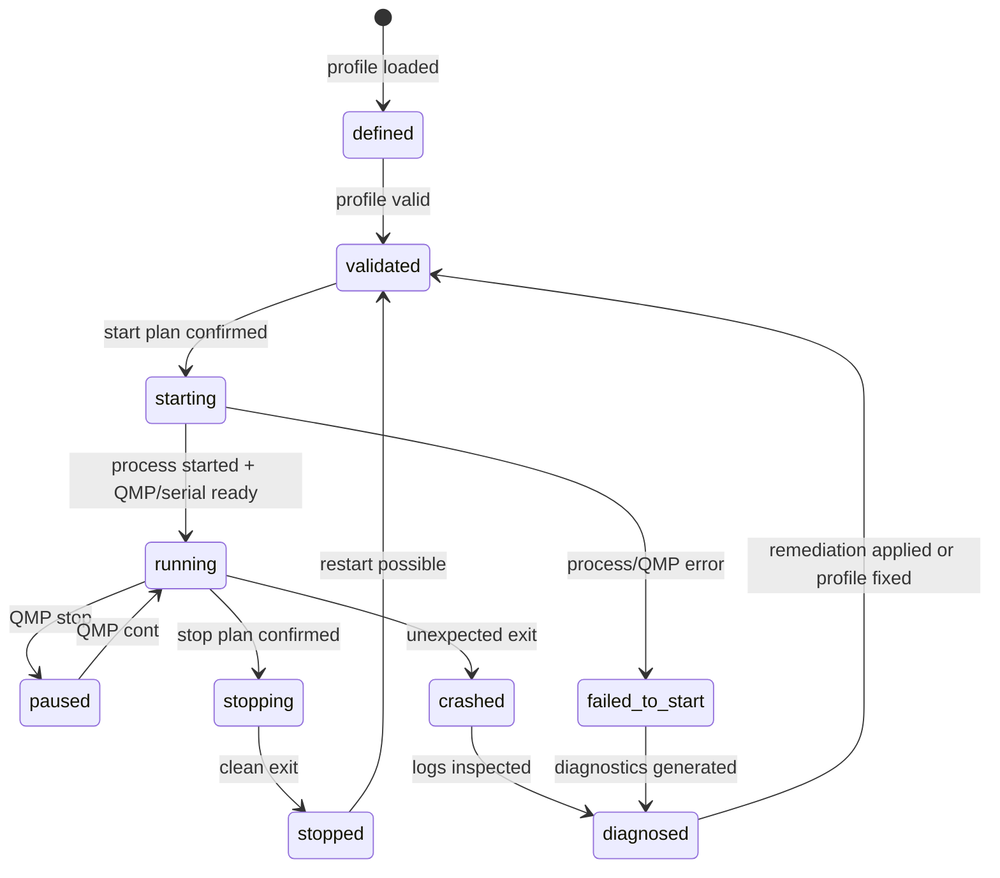
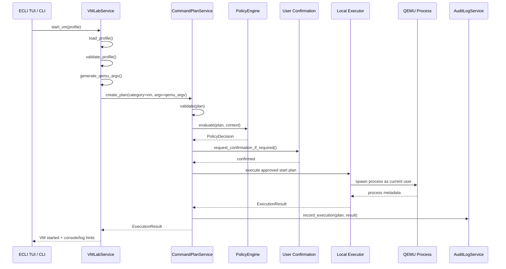
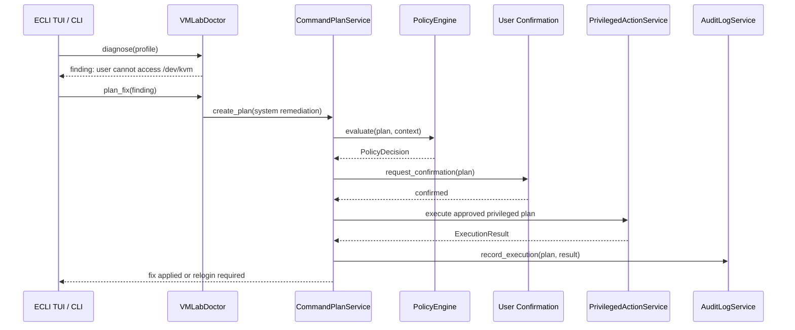

<!--
SPDX-License-Identifier: Apache-2.0

Project: ECLI
File: docs/extensions/vmlab-overview.md
Website: https://www.ecli.io
Repository: https://github.com/SSobol77/ecli
Author: Siergej Sobolewski
License: Apache License, Version 2.0

Copyright (c) 2026 Siergej Sobolewski

Licensed under the Apache License, Version 2.0.
See the LICENSE file in the project root for full license text.
-->

# VMLab Overview

**First Runtime-Management Module of ECLI Professional Operations Workbench**

**Version:** 1.0
**Date:** 2026-05-15
**Status:** Strategic Architecture Direction
**Part of:** [Product Vision](../architecture/product-vision.md) | [Services Foundation](../architecture/services-foundation.md) | [CommandPlanService](../architecture/command-plan-service.md)

---

## 1. Purpose

**VMLab is the first runtime-management module of ECLI Professional Operations Workbench, built on top of Services Foundation and CommandPlanService.**

VMLab provides a terminal-native interface for managing local virtual machine runtimes as first-class engineering artifacts.

It is not a simple QEMU launcher.

It is not the final product boundary of ECLI.

It is not a replacement for libvirt, virt-manager, Proxmox, cloud VM consoles, or full infrastructure orchestration platforms.

VMLab is a structured, safe, auditable, and reproducible workflow for:

- defining VM profiles as versionable configuration;
- validating VM profiles before execution;
- generating explicit command plans for VM lifecycle operations;
- supervising local runtime processes;
- controlling QEMU through QMP where available;
- following and attaching to serial consoles;
- collecting boot logs and runtime logs;
- diagnosing runtime prerequisites such as QEMU availability, KVM access, disk paths, and profile errors;
- generating remediation plans through `CommandPlanService`;
- routing privileged fixes through `PrivilegedActionService`;
- recording significant runtime events through `AuditLogService`.

VMLab exists because engineers need a terminal-first, plan-mediated, audit-ready way to work with local VMs without leaving ECLI, without silent privilege escalation, and without losing reproducibility.

The strategic product direction remains:

```text
ECLI = terminal-first IDE + DevOps control plane + VM/runtime lab + cloud/system orchestration console
```

VMLab is the first proof of this direction.

---

## 2. Product Positioning

VMLab must be understood as part of ECLI Professional Operations Workbench.

It is:

- a runtime lab for local engineering workflows;
- a profile-driven QEMU management layer;
- a terminal-native VM lifecycle surface;
- a serial-console and boot-log workflow;
- a diagnostics and remediation planning module;
- a validation target for `CommandPlanService`, `PrivilegedActionService`, `AuditLogService`, and `SystemDoctor`.

It is not:

- a standalone virtualization product;
- a full virt-manager clone;
- a cloud VM manager;
- a Kubernetes replacement;
- a hidden daemon that mutates host state;
- a GUI-first VM tool;
- a module that bypasses ECLI services.

VMLab validates that ECLI can safely manage real runtime operations while preserving the core rules:

```text
UI never performs infrastructure actions directly.
UI calls services.
Services generate plans.
Plans are previewed.
User confirms.
Executor applies.
Audit log records the result.
```

---

## 3. Strategic Context

### 3.1 Position in ECLI Architecture

```mermaid
graph TD
    subgraph "ECLI Core Services"
        SR[ServiceRegistry]
        CFG[ConfigService]
        PRJ[ProjectService]
        CPS[CommandPlanService]
        PE[PolicyEngine]
        PAS[PrivilegedActionService]
        ALS[AuditLogService]
        SD[SystemDoctor]
        RT[RuntimeService]
    end

    subgraph "VMLab Module"
        VML[VMLabService]
        VMP[VMProfileService]
        SUP[VMSupervisor]
        QMP[QMPClient]
        CON[SerialConsoleService]
        LOG[RuntimeLogService]
        DOC[VMLabDoctor]
    end

    subgraph "Execution Backends"
        EXEC[Local Executor]
        QEMU[QEMU Process]
        QIMG[qemu-img]
        KVM[/dev/kvm]
        DISK[Disk Images]
        SOCK[QMP / Serial Sockets]
    end

    SR --> CFG
    SR --> PRJ
    SR --> CPS
    SR --> PAS
    SR --> ALS
    SR --> SD
    SR --> RT
    SR --> VML

    VML --> CFG
    VML --> PRJ
    VML --> CPS
    VML --> ALS
    VML --> SD
    VML --> RT

    VML --> VMP
    VML --> SUP
    VML --> QMP
    VML --> CON
    VML --> LOG
    VML --> DOC

    CPS --> PE
    CPS --> EXEC
    CPS --> PAS
    CPS --> ALS

    EXEC --> QEMU
    EXEC --> QIMG
    QEMU --> KVM
    QEMU --> DISK
    QEMU --> SOCK
    QMP --> SOCK
    CON --> SOCK

    classDef core fill:#e1f5fe,stroke:#01579b;
    classDef vmlab fill:#fff3e0,stroke:#ef6c00;
    classDef backend fill:#e8f5e9,stroke:#2e7d32;
    class SR,CFG,PRJ,CPS,PE,PAS,ALS,SD,RT core;
    class VML,VMP,SUP,QMP,CON,LOG,DOC vmlab;
    class EXEC,QEMU,QIMG,KVM,DISK,SOCK backend;
```

### 3.2 Critical Architecture Rule

VMLab does not execute QEMU directly from UI code.

VMLab does not run privileged host remediation directly.

VMLab does not mutate host or VM state without a plan.

All mutating operations follow this route:

```text
TUI / CLI
  -> VMLabService
  -> CommandPlanService
  -> PolicyEngine
  -> User Confirmation
  -> Executor / PrivilegedActionService
  -> AuditLogService
```

Runtime read operations may be direct service calls when they are non-mutating, for example:

- list profiles;
- show profile;
- validate profile;
- read serial log;
- query cached VM state;
- follow a read-only log file;
- show QMP status if QMP connection is already established.

Mutating operations require command plans.

---

## 4. Why VMLab First?

VMLab is the natural first runtime-management module because:

| Reason                                                                | Implication                                                   |
| --------------------------------------------------------------------- | ------------------------------------------------------------- |
| QEMU is widely used for OS, kernel, embedded, and runtime development | Strong fit for engineering users                              |
| VM profiles are plain configuration                                   | Fits ECLI's config-first model                                |
| Serial console workflows are terminal-native                          | Fits ECLI's TUI strengths                                     |
| KVM/HVF/WHPX readiness requires diagnostics                           | Strong fit for SystemDoctor                                   |
| Permission remediation requires safety controls                       | Strong fit for CommandPlanService and PrivilegedActionService |
| VM lifecycle is operational but local                                 | Lower risk than cloud or production Kubernetes                |
| Runtime logs are useful for AI-assisted diagnostics                   | Good future fit for AI Operations Assistant                   |

VMLab is therefore a controlled proof point before larger operational modules such as Kubernetes, Cloud Inventory, Terraform, Ansible, CI/CD, and Observability.

---

## 5. Scope and Boundaries

### 5.1 VMLab Owns

| Capability                | Description                                                                  |
| ------------------------- | ---------------------------------------------------------------------------- |
| VM profile discovery      | Locate project-local, user-global, and system-wide profiles                  |
| VM profile schema         | Define typed TOML schema for QEMU-based profiles                             |
| Profile validation        | Detect missing fields, invalid paths, incompatible options, unsafe settings  |
| Lifecycle plan generation | Generate command plans for start, stop, pause, resume, reset, destroy        |
| Runtime supervision       | Track QEMU process metadata through VMSupervisor                             |
| QMP client abstraction    | Query and control QEMU through QMP where available                           |
| Serial console handling   | Follow or attach to serial output safely                                     |
| Runtime logs              | Capture and present QEMU stdout/stderr, serial logs, and crash metadata      |
| Acceleration diagnostics  | Detect KVM/HVF/WHPX/TCG availability and readiness                           |
| Remediation planning      | Generate command plans for missing packages, permissions, and profile issues |
| Project integration       | Store project profiles under `.ecli/vmlab/profiles/`                         |
| Export                    | Export profile, generated QEMU argv, and diagnostic reports                  |

### 5.2 VMLab Does Not Own

| Excluded                        | Owner / Reason                                |
| ------------------------------- | --------------------------------------------- |
| Privilege escalation mechanics  | `PrivilegedActionService`                     |
| Policy decisions                | `PolicyEngine`                                |
| Audit persistence               | `AuditLogService`                             |
| Generic command planning        | `CommandPlanService`                          |
| Low-level process execution     | Executor / RuntimeService                     |
| General package installation    | SystemDoctor + CommandPlanService             |
| Cloud VM provisioning           | Future CloudInventoryService                  |
| Kubernetes runtime management   | Future KubernetesService                      |
| Terraform/Ansible orchestration | Future TerraformService / AnsibleService      |
| GUI-specific rendering          | TUI/GUI layers                                |
| Secret storage                  | Future CredentialService / external providers |

### 5.3 Non-Goals for VMLab v1

VMLab v1 is not:

- a full virt-manager replacement;
- a libvirt manager;
- a cloud VM manager;
- a multi-host VM orchestrator;
- a cluster orchestration platform;
- a hidden privileged daemon;
- a GUI-only workflow;
- a full QMP coverage layer;
- a full networking laboratory;
- a module that mutates infrastructure without explicit plans.

---

## 6. Profile Discovery

VMLab supports three profile scopes.

Discovery order:

```text
1. ./.ecli/vmlab/profiles/*.toml
2. $XDG_CONFIG_HOME/ecli/vmlab/profiles/*.toml
3. /etc/ecli/vmlab/profiles/*.toml
```

Rules:

- project-local profiles have highest priority;
- user-global profiles are reusable personal templates;
- system-wide profiles are shared machine defaults;
- higher-priority profile wins on name conflict;
- conflicts are reported in verbose mode;
- project-local profiles are preferred for reproducible project workflows;
- system-wide profiles may define organizational defaults but must not silently weaken safety policy.

Example:

```text
./.ecli/vmlab/profiles/kernel-dev.toml
~/.config/ecli/vmlab/profiles/freebsd-test.toml
/etc/ecli/vmlab/profiles/default-x86_64.toml
```

VMLab must never silently merge conflicting profiles with the same name unless a future schema explicitly defines merge semantics.

---

## 7. VM Profile Schema

VMLab defines VMs using typed TOML profiles.

Profiles are plain text, Git-friendly, reviewable, and reproducible.

### 7.1 Conceptual Profile Example

```toml
# .ecli/vmlab/profiles/kernel-dev.toml

schema_version = 1

[vm]
name = "kernel-dev"
description = "Local OS/runtime development VM"
qemu_binary = "/usr/bin/qemu-system-x86_64"

[hardware]
arch = "x86_64"
cpu = "host"
cores = 4
memory_mb = 8192
acceleration = "auto" # auto | kvm | hvf | whpx | tcg

[[storage.disks]]
name = "root"
path = "images/kernel-dev-root.qcow2"
format = "qcow2"
size_gb = 40
boot = true
readonly = false

[[storage.disks]]
name = "source"
path = "../source-tree"
format = "host-path"
readonly = true

[[network.interfaces]]
name = "net0"
type = "user" # user | tap | bridge
hostfwd = [
  "tcp:127.0.0.1:2222-:22",
  "tcp:127.0.0.1:8080-:80"
]

[serial]
enabled = true
mode = "pty" # pty | file | socket
logfile = "logs/kernel-dev-serial.log"

[qmp]
enabled = true
socket = "run/kernel-dev.qmp.sock"

[console]
auto_attach = false
escape_sequence = "ctrl+]"

[kernel]
enabled = false
bzimage = ""
initrd = ""
append = ""
```

### 7.2 Schema Rules

- `schema_version` is required.
- `vm.name` is required and must be stable.
- `hardware.arch` is required.
- `hardware.memory_mb` must be positive.
- `hardware.cores` must be positive.
- `hardware.acceleration = "auto"` uses deterministic probing.
- at least one bootable disk or direct kernel boot configuration is required;
- relative paths are resolved against the project root;
- absolute paths are allowed but must be shown during plan preview;
- profile validation must happen before command plan generation;
- profile validation must not spawn QEMU;
- invalid profiles produce structured diagnostics, not stack traces;
- secrets must not be stored in VM profiles.

### 7.3 Acceleration Selection

When `acceleration = "auto"`, VMLab uses deterministic probing.

Linux:

```text
kvm -> tcg
```

FreeBSD:

```text
qemu tcg in v1
bhyve later
```

macOS:

```text
hvf best effort
```

Windows:

```text
whpx best effort
```

The selected acceleration mode must be visible in the generated command plan.

VMLab must not silently fall back from hardware acceleration to TCG without reporting it in the plan or diagnostics.

---

## 8. Runtime State Model

VMs managed by VMLab follow an explicit state model.



### 8.1 State Rules

- `defined` means the profile exists but was not validated.
- `validated` means the profile passed static checks.
- `starting` means a start plan was approved and execution began.
- `running` means QEMU process exists and runtime metadata is available.
- `paused` means QMP reports paused state.
- `stopping` means a graceful stop was requested.
- `stopped` means process exited cleanly.
- `crashed` means unexpected process exit or fatal runtime error.
- `failed_to_start` means QEMU did not reach usable runtime state.
- `diagnosed` means VMLab generated findings or remediation suggestions.

All meaningful state transitions must be audit-logged.

---

## 9. Runtime Control

### 9.1 QEMU Process Start

VMLab generates QEMU `argv` from a validated profile.

QEMU process start is a mutating runtime operation and must be represented as a `CommandPlan`.

Rules:

- QEMU should run as the current user whenever possible.
- QEMU must not be run with `sudo` by default.
- KVM access should be solved by permissions, not by running QEMU as root.
- generated `argv` must be previewable and exportable;
- generated `argv` must not include secrets in plain text;
- generated command must include QMP socket when QMP is enabled;
- generated command should include serial/log configuration when enabled.

### 9.2 QMP Control

VMLab uses QMP for structured runtime control where available.

QMP is used for:

- query status;
- pause;
- resume;
- graceful shutdown;
- reset;
- quit;
- device/media operations where supported;
- runtime diagnostics.

QMP commands that mutate runtime state must be mediated through `CommandPlanService` or an equivalent plan-confirmation path.

Read-only QMP queries may be executed directly by `QMPClient`.

### 9.3 QMP Client Contract

```python
# Conceptual interface — implementation details belong in code, not docs.

class QMPClient:
    async def connect(self, socket_path: str) -> None:
        """Connect to QMP socket and negotiate capabilities."""
        ...

    async def query_status(self) -> VMStatus:
        """Return current VM state using a read-only QMP query."""
        ...

    async def pause(self) -> QMPResponse:
        """Pause the VM after plan/confirmation flow has approved it."""
        ...

    async def resume(self) -> QMPResponse:
        """Resume the VM after plan/confirmation flow has approved it."""
        ...

    async def graceful_shutdown(self) -> QMPResponse:
        """Request graceful shutdown after plan/confirmation flow has approved it."""
        ...

    async def quit(self) -> QMPResponse:
        """Terminate the VM process after plan/confirmation flow has approved it."""
        ...

    async def close(self) -> None:
        """Close the QMP connection."""
        ...
```

---

## 10. Console and Logs

VMLab supports separate console modes.

### 10.1 Console Modes

```bash
ecli vm console --follow <profile-name>
ecli vm console --attach <profile-name>
ecli vm console --qmp <profile-name>
```

### 10.2 `console --follow`

Read-only serial log follow.

Rules:

- default safe mode;
- safe for multiple sessions;
- reads from log file or stream;
- does not send input to the VM;
- does not require exclusive lock.

### 10.3 `console --attach`

Interactive serial socket attach.

Rules:

- single-attacher lock required;
- sends user input to VM serial;
- must provide a detach escape sequence;
- must recover terminal state on exit;
- must not corrupt TUI state after detach.

### 10.4 `console --qmp`

Raw QMP diagnostics for power users.

Rules:

- read-only by default;
- mutating QMP commands require explicit confirmation;
- all QMP diagnostics must be optional and clearly labeled;
- QMP errors must be displayed as structured diagnostics.

### 10.5 Log Handling

VMLab may collect:

- QEMU stdout;
- QEMU stderr;
- serial output;
- QMP connection logs;
- process exit metadata;
- crash metadata;
- generated `argv` metadata with redaction.

Audit and logs must not leak secrets.

---

## 11. Integration with Services Foundation

### 11.1 CommandPlanService Integration

Every VMLab operation that affects system state routes through `CommandPlanService`.

| Operation                   | Category | Default Risk | Confirmation                            |
| --------------------------- | -------- | ------------ | --------------------------------------- |
| Validate profile            | `vm`     | `low`        | No                                      |
| Show generated command      | `vm`     | `low`        | No                                      |
| Start VM using TCG          | `vm`     | `low`        | Optional                                |
| Start VM using KVM/HVF/WHPX | `vm`     | `medium`     | Yes if policy requires                  |
| Pause VM                    | `vm`     | `low`        | Optional                                |
| Resume VM                   | `vm`     | `low`        | Optional                                |
| Graceful stop               | `vm`     | `low`        | Yes if policy requires                  |
| Force stop                  | `vm`     | `medium`     | Yes                                     |
| Destroy VM metadata         | `vm`     | `high`       | Yes                                     |
| Delete disk image           | `vm`     | `critical`   | Yes + explicit destructive confirmation |
| Create disk image           | `vm`     | `medium`     | Yes if large or privileged path         |
| Fix KVM permissions         | `system` | `low`        | Yes                                     |
| Install QEMU package        | `system` | `medium`     | Yes                                     |
| Modify running VM profile   | `vm`     | `medium`     | Yes                                     |

### 11.2 Start VM Flow



### 11.3 Remediation Flow

Privileged remediation is separate from normal VM start.

Example: missing KVM group membership.



Important:

```text
VMLab must not run QEMU with sudo to bypass /dev/kvm permission issues.
VMLab must propose a remediation plan instead.
```

### 11.4 PrivilegedActionService Integration

VMLab relies on `PrivilegedActionService` only for host remediation actions.

Examples:

| Scenario                         | Example Command                       | Notes                             |
| -------------------------------- | ------------------------------------- | --------------------------------- |
| Add user to KVM group            | `sudo usermod -aG kvm <user>`         | Requires relogin                  |
| Install QEMU package             | `sudo apt install qemu-system-x86`    | Platform-specific package manager |
| Adjust owned profile directory   | `sudo chown -R <user>:<group> <path>` | Must be previewed                 |
| Create privileged network device | future TAP/bridge workflow            | Not Phase 1                       |

VMLab never invokes `sudo` directly.

All privileged commands are:

- represented as `argv`;
- previewed to the user;
- confirmed explicitly;
- executed via `PrivilegedActionService`;
- audit-logged with sanitized context.

### 11.5 SystemDoctor Integration

VMLab-specific diagnostics may include:

| Check                        | Finding                               | Remediation                           |
| ---------------------------- | ------------------------------------- | ------------------------------------- |
| QEMU binary missing          | `qemu-system-*` not found             | Install package plan                  |
| `/dev/kvm` missing           | KVM device absent                     | Explain BIOS/module/host support      |
| `/dev/kvm` permission denied | User cannot read/write KVM device     | Add user to group plan                |
| acceleration fallback        | KVM unavailable, TCG selected         | Warning + performance note            |
| disk path missing            | profile references missing disk       | Create disk or fix path plan          |
| disk space low               | target path lacks required free space | Warning or resize/free-space guidance |
| QMP socket unavailable       | QMP could not connect                 | Runtime diagnostic                    |
| serial log path invalid      | log directory missing                 | Create directory plan                 |
| profile schema invalid       | TOML/profile error                    | Edit profile guidance                 |

SystemDoctor must detect and report.

CommandPlanService must plan.

PrivilegedActionService must execute privileged fixes.

---

## 12. Safety Model

VMLab inherits the safety model defined by `CommandPlanService`.

### 12.1 Non-Negotiable Rules

1. No direct QEMU execution from UI code.
2. No silent privilege escalation.
3. No running QEMU as root to bypass permission problems.
4. No hidden VM profile state.
5. No mutating QMP command without plan/confirmation path.
6. No AI-autopilot.
7. No destructive disk operations without explicit confirmation.
8. No secret leakage in QEMU argv, logs, profiles, or audit records.
9. No profile mutation while VM is running without explicit warning.
10. No automatic fallback from hardware acceleration to TCG without visible diagnostic.

### 12.2 Risk Classification

| Operation                   | Default Risk      | Escalation Factors               |
| --------------------------- | ----------------- | -------------------------------- |
| Profile validation          | `low`             | None                             |
| QEMU argv export            | `low`             | Secret-like arguments            |
| Start VM with TCG           | `low`             | Large memory/CPU allocation      |
| Start VM with KVM/HVF/WHPX  | `medium`          | Device access, host acceleration |
| Pause/resume VM             | `low`             | None                             |
| Graceful stop               | `low`             | Unsaved guest workload           |
| Force stop                  | `medium`          | Possible data loss               |
| Reset VM                    | `medium`          | Possible data loss               |
| Delete VM metadata          | `high`            | Loss of configuration            |
| Delete disk image           | `critical`        | Irreversible data loss           |
| Create/resize disk image    | `medium`          | Disk space, filesystem impact    |
| Fix host permissions        | `low` to `medium` | Privileged host mutation         |
| Install host packages       | `medium`          | Privileged system mutation       |
| AI-suggested profile change | `medium`          | Source requires human review     |

### 12.3 Dry-Run Guarantees

VMLab dry-run mode:

```bash
ecli vm start kernel-dev --dry-run
```

Guarantees:

- no QEMU process is spawned;
- no disk state is modified;
- no network interface is created;
- no QMP socket is opened;
- no privileged command is executed;
- profile validation still runs;
- prerequisite checks may run if they are read-only;
- output includes exact generated `argv`;
- output includes selected acceleration mode;
- output includes warnings and remediation suggestions.

---

## 13. CLI Contract

### 13.1 Profile Commands

```bash
ecli vm list
ecli vm show <profile-name>
ecli vm validate <profile-name>
ecli vm export <profile-name> --format json
ecli vm export <profile-name> --format qemu-argv
```

### 13.2 Lifecycle Commands

```bash
ecli vm start <profile-name>
ecli vm start <profile-name> --dry-run
ecli vm pause <profile-name>
ecli vm resume <profile-name>
ecli vm stop <profile-name>
ecli vm stop <profile-name> --force
ecli vm restart <profile-name>
ecli vm destroy <profile-name>
```

### 13.3 Console and Logs

```bash
ecli vm console --follow <profile-name>
ecli vm console --attach <profile-name>
ecli vm console --qmp <profile-name>

ecli vm logs <profile-name>
ecli vm logs <profile-name> --follow
```

### 13.4 Diagnostics

```bash
ecli vm doctor <profile-name>
ecli vm doctor <profile-name> --json
ecli vm doctor <profile-name> --plan-fixes
ecli vm doctor <profile-name> --apply-fixes
```

Phase rule:

```text
--apply-fixes may exist as planned CLI surface, but real privileged execution depends on CommandPlanService and PrivilegedActionService readiness.
```

### 13.5 CLI Safety Rules

- `--dry-run` never mutates state.
- `--force` must not bypass policy.
- `--force` must not bypass confirmation for destructive actions.
- `--apply-fixes` still requires confirmation for privileged operations.
- exported QEMU argv must redact secrets.
- destructive operations require explicit confirmation phrase or equivalent TUI confirmation.
- failed operations must preserve sanitized diagnostic output.

---

## 14. TUI Contract

VMLab integrates as a panel in ECLI.

Suggested keybinding:

```text
F8 or Ctrl+V — VMLab panel
```

Final keybinding must be defined in the keybinding configuration and must not conflict with existing core editor shortcuts.

### 14.1 Panel Layout

```text
┌────────────────────────────────────────────┐
│ VMLab • kernel-dev • running               │
├────────────────────────────────────────────┤
│ Profile: .ecli/vmlab/profiles/kernel-dev   │
│ Accel:   kvm                               │
│ CPU/RAM: 4 cores / 8192 MB                 │
├────────────────────────────────────────────┤
│ Storage                                    │
│  • root   images/kernel-dev-root.qcow2     │
│  • source ../source-tree       readonly    │
├────────────────────────────────────────────┤
│ Network                                    │
│  • net0 user  127.0.0.1:2222 -> guest:22   │
├────────────────────────────────────────────┤
│ Serial: pty / logs/kernel-dev-serial.log   │
├────────────────────────────────────────────┤
│ [Start] [Stop] [Console] [Logs] [Doctor]  │
│ [Profile] [Export] [Help]                 │
└────────────────────────────────────────────┘
```

### 14.2 TUI Actions

| Action  | Behavior                              |
| ------- | ------------------------------------- |
| `Enter` | Open details for selected VM/resource |
| `s`     | Start VM through CommandPlanService   |
| `S`     | Stop VM through CommandPlanService    |
| `p`     | Pause/resume through QMP plan flow    |
| `c`     | Console attach/follow selection       |
| `l`     | Open logs                             |
| `d`     | Run VMLab Doctor                      |
| `e`     | Export profile or generated argv      |
| `?`     | Show VMLab help                       |

### 14.3 Confirmation Dialog

For privileged or destructive actions, TUI must show:

```text
Confirm Plan: Start VM "kernel-dev"

Risk: MEDIUM
Category: vm
Source: user
Acceleration: kvm

Command:
  /usr/bin/qemu-system-x86_64 -enable-kvm -cpu host -smp 4 -m 8192 ...

Affected resources:
  /dev/kvm
  images/kernel-dev-root.qcow2
  run/kernel-dev.qmp.sock

Rollback:
  graceful QMP quit if startup succeeds

[Y] Confirm  [N] Cancel  [E] Export  [?] Help
```

TUI must not hide generated command details.

---

## 15. Phase Scope

### 15.1 Phase 1 — VMLab Skeleton

Phase 1 VMLab work is allowed only after Services Foundation contracts exist.

Goal:

```text
Validate architecture, not deliver full VM management.
```

Included:

| Component               | Scope                                                              |
| ----------------------- | ------------------------------------------------------------------ |
| Profile discovery       | Project/user/system discovery                                      |
| Profile schema          | Typed model and validation                                         |
| VMLabService skeleton   | `list_profiles`, `load_profile`, `validate_profile`                |
| Command plan generation | Generate start/stop dry-run plans                                  |
| CLI surface             | `ecli vm list`, `show`, `validate`, `export`                       |
| Doctor integration      | Read-only diagnostics and plan generation                          |
| Tests                   | Verify VMLab routes mutating operations through CommandPlanService |

Excluded:

- real QEMU process execution;
- real privileged remediation execution;
- full QMP command coverage;
- interactive serial attach;
- disk image mutation;
- network device mutation;
- AI-assisted profile suggestions;
- GUI Desktop.

### 15.2 Phase 2 — VMLab Professional

Goal:

```text
Deliver production-quality local VM workflows.
```

Planned:

| Feature             | Description                                     |
| ------------------- | ----------------------------------------------- |
| VMSupervisor        | Process lifecycle, PID files, crash detection   |
| QMPClient           | query-status, pause, resume, quit, shutdown     |
| Serial console      | follow/attach modes with single-attacher lock   |
| Log aggregator      | QEMU stdout/stderr, serial logs, crash metadata |
| Acceleration doctor | KVM/HVF/WHPX/TCG probing and remediation plans  |
| Disk management     | qemu-img create/resize/snapshot through plans   |
| Profile templates   | Project and user templates                      |
| Smoke runner        | Run VM boot checks and collect logs             |

### 15.3 Phase 3+ — Runtime Expansion

Exploratory:

- multi-VM runtime groups;
- remote QEMU over SSH;
- FreeBSD bhyve backend;
- libvirt adapter;
- cloud runtime inventory;
- kernel/debug workflow integration;
- AI-assisted log analysis and runbook generation.

---

## 16. Required Tests

VMLab must include tests for:

- profile discovery order;
- profile validation;
- invalid TOML diagnostics;
- generated QEMU argv correctness;
- acceleration selection logic;
- dry-run non-mutation;
- command plan generation;
- privileged remediation plan generation;
- no direct QEMU execution from UI;
- no direct sudo execution from VMLab;
- audit event emission;
- serial console lock semantics;
- QMP read-only query handling;
- QMP mutation confirmation path.

Tests must use actual repository imports and must not assume module names that do not exist yet.

---

## 17. Risks and Mitigations

### Risk 1 — VMLab Becomes a QEMU Wrapper

Mitigation:

- no direct `subprocess.run(["qemu..."])` in UI or VMLab orchestration code;
- mutating operations must generate command plans;
- code review checklist must verify service boundaries;
- architecture tests should detect forbidden direct execution paths.

### Risk 2 — Privileged Remediation Is Too Aggressive

Mitigation:

- remediation is plan-only by default;
- privileged plans require preview and confirmation;
- no automatic `sudo`;
- no password capture;
- audit every remediation action;
- default policy blocks auto-application of privileged fixes.

### Risk 3 — QMP Complexity Expands Too Early

Mitigation:

- start with minimal QMP subset;
- query-status first;
- add pause/resume/quit only after plan path exists;
- keep QMP client internal to VMLabService;
- mock QMP in tests.

### Risk 4 — Serial Console Breaks Terminal State

Mitigation:

- follow mode before attach mode;
- single-attacher lock for interactive mode;
- explicit detach sequence;
- terminal state restoration on exit;
- tests for attach/detach lifecycle.

### Risk 5 — AI Suggests Unsafe VM Configurations

Mitigation:

- AI-generated plans marked `source: ai-assistant`;
- AI plans route through PolicyEngine;
- high-risk AI plans require human review;
- TUI highlights AI-sourced plans;
- audit logs record AI model metadata when available.

### Risk 6 — Profile Schema Becomes Too QEMU-Specific

Mitigation:

- keep profile model QEMU-first but not QEMU-hardcoded where avoidable;
- isolate backend-specific fields;
- introduce backend adapters later;
- avoid exposing raw QEMU flags as the primary schema.

### Risk 7 — VMLab Scope Expands into Full Orchestration

Mitigation:

- v1 supports single-VM workflows;
- multi-VM groups are Phase 3+;
- cloud, Kubernetes, Terraform, and Ansible remain separate services;
- VMLab focuses on local runtime lab first.

---

## 18. Relationship to Other Documents

This document implements the runtime module specification required by:

- [Product Vision](../architecture/product-vision.md)
- [Services Foundation](../architecture/services-foundation.md)
- [CommandPlanService](../architecture/command-plan-service.md)

VMLab must be implemented on top of these foundations.

Future documents may include:

- `docs/extensions/vmlab-profile-schema.md`
- `docs/extensions/vmlab-qmp-client.md`
- `docs/extensions/vmlab-tui-spec.md`
- `docs/extensions/vmlab-security-model.md`
- `docs/extensions/vmlab-smoke-runner.md`

---

## Appendix A: Example CommandPlan for Starting a VM

```json
{
  "schema_version": 1,
  "plan_id": "plan-20260512T183045Z-vmstart01",
  "title": "Start VM 'kernel-dev' with KVM acceleration",
  "description": "Launch QEMU with profile kernel-dev using KVM acceleration.",
  "category": "vm",
  "risk": "medium",
  "status": "draft",
  "requires_privilege": false,
  "confirmation_required": true,
  "commands": [
    {
      "step_id": "check-kvm-access",
      "title": "Verify KVM access",
      "argv": ["test", "-r", "/dev/kvm"],
      "display": "test -r /dev/kvm",
      "requires_privilege": false,
      "destructive": false,
      "expected_exit_codes": [0],
      "timeout_seconds": 5
    },
    {
      "step_id": "start-qemu",
      "title": "Launch QEMU",
      "argv": [
        "/usr/bin/qemu-system-x86_64",
        "-enable-kvm",
        "-cpu", "host",
        "-smp", "4",
        "-m", "8192",
        "-qmp", "unix:run/kernel-dev.qmp.sock,server=on,wait=off",
        "-drive", "file=images/kernel-dev-root.qcow2,format=qcow2",
        "-netdev", "user,id=net0,hostfwd=tcp:127.0.0.1:2222-:22",
        "-device", "virtio-net-pci,netdev=net0",
        "-serial", "pty",
        "-name", "kernel-dev"
      ],
      "display": "qemu-system-x86_64 -enable-kvm -cpu host -smp 4 -m 8192 ...",
      "requires_privilege": false,
      "destructive": false,
      "expected_exit_codes": [0],
      "timeout_seconds": null
    }
  ],
  "rollback": [
    {
      "step_id": "qmp-quit",
      "title": "Request QEMU quit through QMP",
      "argv": ["ecli", "vm", "qmp", "kernel-dev", "quit"],
      "display": "ecli vm qmp kernel-dev quit",
      "requires_privilege": false,
      "destructive": false,
      "expected_exit_codes": [0, 1],
      "timeout_seconds": 10
    }
  ],
  "explanation": "Starts the kernel-dev VM using KVM acceleration. Requires current user access to /dev/kvm but does not require running QEMU as root.",
  "affected_resources": [
    "/dev/kvm",
    "images/kernel-dev-root.qcow2",
    "run/kernel-dev.qmp.sock",
    "serial PTY"
  ],
  "estimated_impact": "VM will consume approximately 8192 MB RAM and 4 CPU cores while running.",
  "created_at": "2026-05-12T18:30:45Z",
  "created_by": "ssobol",
  "source": "user",
  "metadata": {
    "profile_name": "kernel-dev",
    "profile_hash": "sha256:a1b2c3d4"
  }
}
```

---

## Appendix B: Example Remediation Plan for KVM Access

```json
{
  "schema_version": 1,
  "plan_id": "plan-20260512T184100Z-kvmfix01",
  "title": "Enable KVM access for current user",
  "description": "Add the current user to the kvm group so QEMU can access /dev/kvm without running as root.",
  "category": "system",
  "risk": "low",
  "status": "draft",
  "requires_privilege": true,
  "confirmation_required": true,
  "requires_relogin": true,
  "commands": [
    {
      "step_id": "add-user-to-kvm-group",
      "title": "Add current user to kvm group",
      "argv": ["sudo", "usermod", "-aG", "kvm", "ssobol"],
      "display": "sudo usermod -aG kvm \"$USER\"",
      "requires_privilege": true,
      "destructive": false,
      "idempotent": true,
      "expected_exit_codes": [0],
      "timeout_seconds": 30
    }
  ],
  "rollback": [
    {
      "step_id": "remove-user-from-kvm-group",
      "title": "Remove current user from kvm group",
      "argv": ["sudo", "gpasswd", "-d", "ssobol", "kvm"],
      "display": "sudo gpasswd -d \"$USER\" kvm",
      "requires_privilege": true,
      "destructive": false,
      "idempotent": true,
      "expected_exit_codes": [0, 6],
      "timeout_seconds": 30
    }
  ],
  "explanation": "This fix changes group membership. A new login session may be required before /dev/kvm access works.",
  "affected_resources": [
    "user-group-membership:kvm",
    "/dev/kvm"
  ],
  "estimated_impact": "No running process is changed. A relogin may be required.",
  "created_at": "2026-05-12T18:41:00Z",
  "created_by": "ssobol",
  "source": "doctor",
  "metadata": {
    "doctor_finding_id": "finding-kvm-permission"
  }
}
```

---

## Approval

- **Status:** Approved as VMLab Strategic Architecture Direction after review corrections
- **Approved by:** Siergej Sobolewski
- **Date:** 2026-05-12
- **Next step:** Prepare implementation prompt for VMLab skeleton after Phase 1 services skeleton exists
