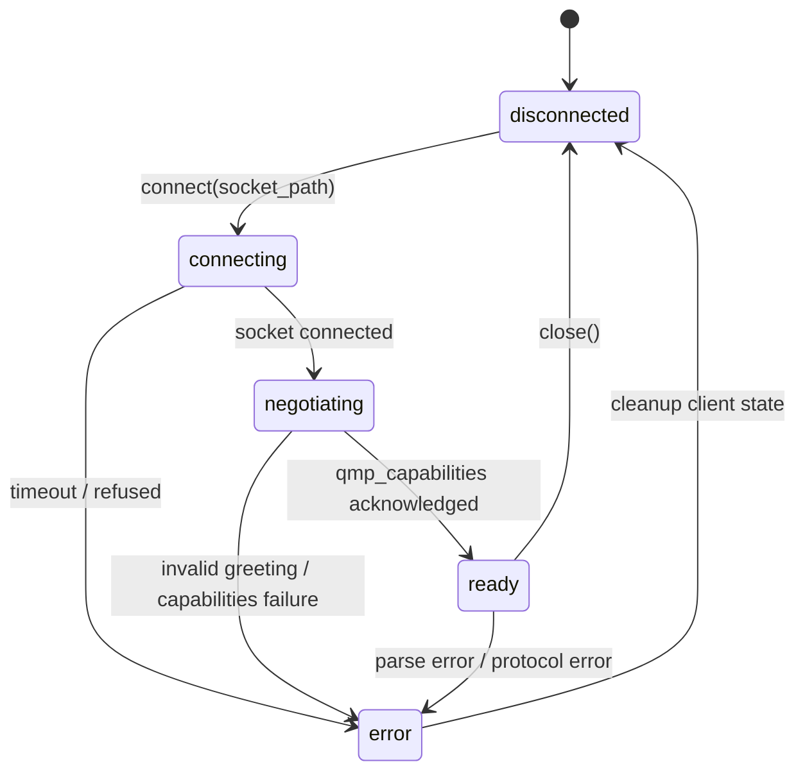
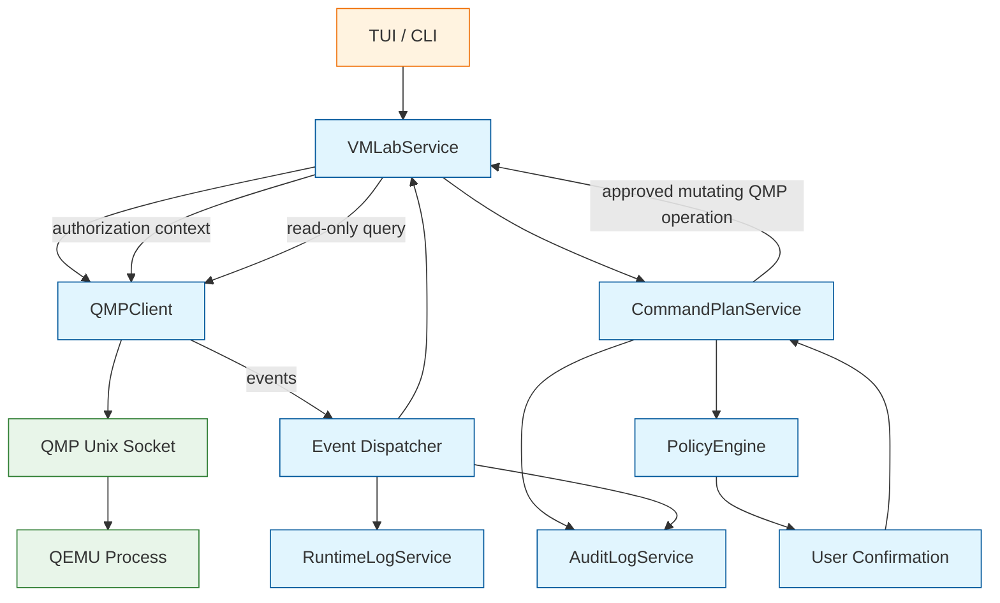

<!--
SPDX-License-Identifier: Apache-2.0

Project: ECLI
File: docs/extensions/vmlab-qmp-client.md
Website: https://www.ecli.io
Repository: https://github.com/SSobol77/ecli
Author: Siergej Sobolewski
License: Apache License, Version 2.0

Copyright (c) 2026 Siergej Sobolewski

Licensed under the Apache License, Version 2.0.
See the LICENSE file in the project root for full license text.
-->

# QMP Client Contract

**Phase 2 Runtime Protocol Abstraction**

**Version:** 1.0
**Date:** 2026-05-15
**Status:** Strategic Architecture Direction
**Part of:**
[Product Vision](../architecture/product-vision.md) |
[Services Foundation](../architecture/services-foundation.md) |
[CommandPlanService](../architecture/command-plan-service.md) |
[VMLab Overview](./vmlab-overview.md) |
[VMLab Profile Schema](./vmlab-profile-schema.md)

---

## 1. Purpose

This document defines the QMP client contract for VMLab.

QMP, the QEMU Machine Protocol, is a JSON-based command, response, and event protocol exposed by QEMU for structured runtime inspection and control.

The QMP client is not a raw passthrough layer.

It is a mediated, async-safe, event-aware protocol client that:

- manages client-side connections to QEMU QMP Unix sockets;
- negotiates QMP capabilities;
- executes read-only runtime queries safely;
- requires plan authorization for mutating commands;
- dispatches asynchronous QMP events to VMLab components;
- handles timeouts, disconnects, and parsing errors gracefully;
- preserves TUI responsiveness through non-blocking I/O;
- records security-relevant runtime events through the logging and audit layer.

Critical rule:

```text
The QMP client never mutates VM state directly from UI code.
Read-only queries may be executed directly.
Mutating QMP commands require CommandPlanService mediation and explicit authorization.
````

---

## 2. Scope and Boundaries

### 2.1 QMP Client Owns

| Capability                           | Description                                                          |
| ------------------------------------ | -------------------------------------------------------------------- |
| Client connection lifecycle          | Connect, negotiate capabilities, close client connection             |
| QMP command framing                  | Send commands with IDs and parse responses                           |
| Read-only query execution            | Safe commands such as `query-status`, `query-version`, `query-block` |
| Authorized mutating command dispatch | Execute mutating QMP commands only with approved plan context        |
| Event stream dispatch                | Route asynchronous QMP events to subscribers                         |
| Timeout enforcement                  | Per-request and connection-level timeouts                            |
| Error classification                 | Map QMP errors to typed client errors                                |
| Connection state tracking            | Disconnected, connecting, negotiating, ready, error                  |
| Non-blocking I/O                     | Async/await or selector-based operation compatible with TUI          |

### 2.2 QMP Client Does Not Own

| Excluded                               | Owner / Reason                                 |
| -------------------------------------- | ---------------------------------------------- |
| VM process lifecycle                   | `VMSupervisor` / `RuntimeService`              |
| QMP socket creation                    | QEMU process startup generated by VMLab plan   |
| Stale socket cleanup                   | `VMSupervisor`, not QMPClient                  |
| Privilege escalation                   | `PrivilegedActionService`                      |
| Plan generation and confirmation       | `CommandPlanService`                           |
| UI rendering or TUI loop management    | ECLI TUI layer                                 |
| Guest OS networking or disk management | Guest OS, profile, or dedicated VMLab services |
| TCP/network QMP exposure               | Out of scope for v1; Unix sockets only         |

---

## 3. QMP Protocol Overview

QMP uses JSON messages over a stream socket.

QEMU sends an initial greeting. The client then enables QMP capabilities and may send commands. QEMU may also emit asynchronous events independently of request/response cycles.

### 3.1 Handshake Sequence

```text
1. ECLI connects to the QMP Unix socket.
2. QEMU sends an initial greeting with version and capabilities.
3. ECLI sends qmp_capabilities.
4. QEMU acknowledges capabilities.
5. Connection enters ready state.
```

Example:

```json
{ "QMP": { "version": { "qemu": { "major": 9, "minor": 2, "micro": 0 }, "package": "" }, "capabilities": ["oob"] } }
```

```json
{ "execute": "qmp_capabilities", "id": 1 }
```

```json
{ "return": {}, "id": 1 }
```

### 3.2 Command / Response Format

Request:

```json
{ "execute": "query-status", "id": 42 }
```

Success response:

```json
{ "return": { "running": true, "singlestep": false, "status": "running" }, "id": 42 }
```

Error response:

```json
{ "error": { "class": "DeviceNotFound", "desc": "Device 'net0' not found" }, "id": 42 }
```

### 3.3 Asynchronous Events

QEMU may emit events independently:

```json
{ "event": "RESET", "timestamp": { "seconds": 1715550000, "microseconds": 123456 } }
```

```json
{ "event": "BLOCK_IO_ERROR", "data": { "device": "virtio0", "action": "stop" } }
```

ECLI must:

- parse and dispatch events without blocking the main loop;
- notify VMLab components of state-relevant events;
- ignore unknown events gracefully;
- sanitize event data before logs or audit records;
- treat event names as extensible.

---

## 4. Client Architecture and Connection Lifecycle

### 4.1 State Machine



### 4.2 Connection Rules

- Socket path must be validated before connection.
- Default connect timeout is 5 seconds.
- QMP capability negotiation is mandatory.
- v1 uses Unix domain sockets only.
- v1 allows one active QMP client session per VM instance unless the supervisor explicitly supports multiplexing later.
- QMPClient closes its own connection but does not own QMP socket file cleanup.
- Stale QMP socket cleanup belongs to `VMSupervisor`.
- Reconnection is not automatic in v1. It must be requested by `VMLabService` or `VMSupervisor`.

### 4.3 Conceptual Interface

```python
# Conceptual contract only — implementation details belong in code.

from enum import Enum
from typing import Any, Callable, Protocol


class QMPState(str, Enum):
    """Client-side QMP connection state."""

    DISCONNECTED = "disconnected"
    CONNECTING = "connecting"
    NEGOTIATING = "negotiating"
    READY = "ready"
    ERROR = "error"


class QMPCommandKind(str, Enum):
    """Routing class for QMP commands."""

    READ_ONLY = "read_only"
    MUTATING = "mutating"


class QMPPlanAuthorization(Protocol):
    """Authorization marker proving that a mutating QMP command was plan-approved."""

    @property
    def plan_id(self) -> str:
        """Return approved CommandPlan identifier."""
        ...


class QMPClient(Protocol):
    """Async-safe QMP protocol client contract."""

    @property
    def state(self) -> QMPState:
        """Return current client connection state."""
        ...

    async def connect(self, socket_path: str, timeout: float = 5.0) -> None:
        """Establish client connection and negotiate QMP capabilities."""
        ...

    async def query_readonly(
        self,
        command: str,
        args: dict[str, Any] | None = None,
        timeout: float | None = None,
    ) -> dict[str, Any]:
        """Execute a read-only QMP query."""
        ...

    async def execute_authorized(
        self,
        command: str,
        args: dict[str, Any] | None,
        authorization: QMPPlanAuthorization,
        timeout: float | None = None,
    ) -> dict[str, Any]:
        """Execute a mutating QMP command only after plan authorization."""
        ...

    async def close(self) -> None:
        """Close client-side QMP connection and clear pending requests."""
        ...

    def subscribe_events(self, handler: Callable[[dict[str, Any]], None]) -> None:
        """Register an event callback for asynchronous QMP events."""
        ...
```

Important:

```text
The public API separates read-only queries from mutating commands.
This prevents UI code from accidentally calling mutating QMP commands through a generic query() path.
```

---

## 5. Routing Contract: Read-Only vs Mutating Commands

This is the most important architectural boundary for QMP integration.

### 5.1 Command Classification

| Command                     | Type      | Execution Path                        | Rationale                 |
| --------------------------- | --------- | ------------------------------------- | ------------------------- |
| `query-status`              | Read-only | `QMPClient.query_readonly()`          | VM state inspection       |
| `query-version`             | Read-only | `QMPClient.query_readonly()`          | Capability detection      |
| `query-block`               | Read-only | `QMPClient.query_readonly()`          | Disk state inspection     |
| `query-blockstats`          | Read-only | `QMPClient.query_readonly()`          | Diagnostics               |
| `query-netdev`              | Read-only | `QMPClient.query_readonly()`          | Network inspection        |
| `query-chardev`             | Read-only | `QMPClient.query_readonly()`          | Console diagnostics       |
| `stop`                      | Mutating  | `CommandPlanService` → authorized QMP | Pauses guest execution    |
| `cont`                      | Mutating  | `CommandPlanService` → authorized QMP | Resumes guest execution   |
| `system_reset`              | Mutating  | `CommandPlanService` → authorized QMP | Guest reboot              |
| `quit`                      | Mutating  | `CommandPlanService` → authorized QMP | VM termination            |
| `system_powerdown`          | Mutating  | `CommandPlanService` → authorized QMP | Guest shutdown request    |
| `blockdev-snapshot-sync`    | Mutating  | `CommandPlanService` → authorized QMP | Disk state mutation       |
| `device_add` / `device_del` | Mutating  | `CommandPlanService` → authorized QMP | Runtime hardware mutation |

### 5.2 Enforcement Rules

1. UI components must not call mutating QMP commands directly.
2. `VMLabService` owns routing policy for QMP usage.
3. Read-only commands may be executed directly through `query_readonly()`.
4. Mutating commands require an approved `CommandPlan`.
5. `QMPClient.execute_authorized()` requires plan authorization metadata.
6. Plan metadata must include:

   - `qmp_command`;
   - `qmp_args` with redaction;
   - `vm_name`;
   - `profile_hash`;
   - `qmp_socket`;
   - `operation_reason`.
7. Unauthorized mutating commands must fail closed.

---

## 6. Error Handling and Resilience

### 6.1 Error Categories

| Category                       | Behavior                                                                     |
| ------------------------------ | ---------------------------------------------------------------------------- |
| Socket timeout                 | Return typed connection error, transition to `ERROR`, log sanitized context  |
| Socket refused / missing       | Return connection error, suggest runtime state inspection                    |
| Invalid greeting               | Close connection, transition to `ERROR`, report protocol failure             |
| Capability negotiation failure | Close connection, transition to `ERROR`, report incompatible QMP             |
| Invalid JSON                   | Close or quarantine connection depending on severity                         |
| QMP `error` response           | Return typed QMP error with `class` and sanitized `desc`                     |
| Unknown event                  | Debug log, dispatch if subscribed, continue processing                       |
| Command timeout                | Cancel pending request, preserve connection if protocol state is still valid |
| Connection lost                | Transition to `ERROR`, notify `VMSupervisor` and `VMLabService`              |

### 6.2 TUI Compatibility

- All I/O must be non-blocking or async.
- No synchronous `socket.recv()` in the main TUI thread.
- Event handlers must not perform long-running work.
- Event dispatch should be bounded and backpressure-aware.
- Long-running QMP operations must use timeouts.
- QMP client must expose cancellation behavior for clean panel close or VM shutdown.

### 6.3 Fail-Closed Behavior

For mutating commands, failure mode must be conservative:

```text
If authorization is missing, invalid, expired, or not linked to an approved CommandPlan,
the mutating QMP command must not be sent.
```

For read-only queries:

```text
If connection state is not READY,
the query must return a structured error and must not block the TUI.
```

---

## 7. Integration with Services Foundation

### 7.1 Architecture Flow



### 7.2 Audit and Logging Integration

Not every read-only QMP query must become an audit record.

Default behavior:

| Event                             | Destination                                           | Metadata                            |
| --------------------------------- | ----------------------------------------------------- | ----------------------------------- |
| QMP connection established        | Audit + debug log                                     | socket path, QMP version            |
| QMP connection failed             | Audit + debug log                                     | reason, sanitized socket path       |
| Read-only query executed          | Debug / trace log                                     | command, latency, no sensitive data |
| Security-relevant read-only query | Audit optional                                        | command, result summary             |
| Mutating command approved         | Audit                                                 | plan ID, command, redacted args     |
| Mutating command executed         | Audit                                                 | plan ID, result, latency            |
| QMP event received                | Debug by default; audit for lifecycle/security events | event type, sanitized data summary  |
| Connection lost                   | Audit + debug log                                     | reason, uptime seconds              |

Lifecycle/security-relevant events include:

- `SHUTDOWN`;
- `RESET`;
- `STOP`;
- `RESUME`;
- `BLOCK_IO_ERROR`;
- `WATCHDOG`;
- unexpected disconnects.

Audit records must never log full QMP arguments if they may contain sensitive guest data.

---

## 8. Security and Safety Rules

These rules are non-negotiable for v1:

1. Unix socket only; no TCP/network QMP in v1.
2. QMP socket path must be validated from profile config.
3. Preferred socket location is project-local `run/<profile>.qmp.sock` or `$XDG_RUNTIME_DIR/ecli/`.
4. `/tmp` sockets are discouraged and should produce a warning unless policy allows them.
5. QMP socket permissions should be owner-only where possible.
6. QMPClient must not expose unauthenticated TCP QMP.
7. Mutating commands require CommandPlanService mediation.
8. UI must not call mutating QMP commands directly.
9. QMPClient must fail closed on missing authorization.
10. Event data must be sanitized before logs and audit records.
11. Non-blocking I/O is mandatory.
12. Timeouts are mandatory.
13. QMPClient must not remove socket files owned by QEMU/VMSupervisor.
14. If QMP is unavailable, fallback to process signals is allowed only through explicit policy and plan mediation.

---

## 9. Required Tests

Implementations must include tests for:

| Test Category             | Example Cases                                      |
| ------------------------- | -------------------------------------------------- |
| Connection lifecycle      | success, timeout, refused, invalid socket, close   |
| Capability negotiation    | success, failure, invalid greeting                 |
| Read-only query routing   | `query-status` succeeds without plan               |
| Mutating command routing  | `quit` requires plan authorization                 |
| Unauthorized mutation     | mutating command fails closed                      |
| JSON parsing resilience   | malformed response, missing ID, unknown fields     |
| Event handling            | known event dispatch, unknown event ignored safely |
| Timeout behavior          | request timeout returns structured error           |
| TUI non-blocking          | no blocking call on main thread                    |
| Audit integration         | mutating command audit records emitted             |
| Logging redaction         | sensitive QMP args are redacted                    |
| Socket ownership boundary | QMPClient close does not unlink socket file        |

Tests must use actual repository imports and must not assume module names that do not exist yet.

---

## 10. Relationship to Other Documents

This document implements the QMP protocol contract required by:

- [Product Vision](../architecture/product-vision.md)
- [Services Foundation](../architecture/services-foundation.md)
- [CommandPlanService](../architecture/command-plan-service.md)
- [VMLab Overview](./vmlab-overview.md)
- [VMLab Profile Schema](./vmlab-profile-schema.md)

Future documents that build on this contract:

- `docs/extensions/vmlab-runtime-supervisor.md`
- `docs/extensions/vmlab-console-and-logs.md`
- `docs/extensions/vmlab-security-model.md`

---

## Appendix A: Example QMP Messages

### A.1 Handshake

QEMU greeting:

```json
{
  "QMP": {
    "version": {
      "qemu": {
        "micro": 0,
        "minor": 2,
        "major": 9
      },
      "package": ""
    },
    "capabilities": [
      "oob"
    ]
  }
}
```

ECLI capabilities request:

```json
{
  "execute": "qmp_capabilities",
  "id": 1
}
```

QEMU acknowledgment:

```json
{
  "return": {},
  "id": 1
}
```

### A.2 Read-Only Query

Request:

```json
{
  "execute": "query-status",
  "id": 2
}
```

Response:

```json
{
  "return": {
    "running": true,
    "singlestep": false,
    "status": "running"
  },
  "id": 2
}
```

### A.3 Mutating Command

A mutating QMP command may only be sent after plan approval.

Request:

```json
{
  "execute": "quit",
  "id": 3
}
```

Response:

```json
{
  "return": {},
  "id": 3
}
```

Required plan metadata:

```json
{
  "metadata": {
    "vm_name": "kernel-dev",
    "profile_hash": "sha256:a1b2c3d4",
    "qmp_command": "quit",
    "qmp_args": {},
    "qmp_socket": "run/kernel-dev.qmp.sock",
    "operation_reason": "User requested VM shutdown from VMLab panel"
  }
}
```

---

## Appendix B: Socket Security Guidelines

| Aspect               | Rule                                               |
| -------------------- | -------------------------------------------------- |
| Preferred location   | `run/<profile>.qmp.sock` under project root        |
| Alternative location | `$XDG_RUNTIME_DIR/ecli/<profile>.qmp.sock`         |
| Discouraged location | `/tmp`, unless policy explicitly allows            |
| Permissions          | owner-only where possible                          |
| Ownership            | current user for normal VM runs                    |
| Cleanup owner        | `VMSupervisor`, not `QMPClient`                    |
| Exposure             | never TCP in v1                                    |
| Symlinks             | must not point outside allowed runtime directories |

---

## Approval

- **Status:** Approved as VMLab QMP Client Strategic Architecture Direction after review corrections
- **Approved by:** Siergej Sobolewski
- **Date:** 2026-05-12
- **Next step:** Prepare `docs/extensions/vmlab-runtime-supervisor.md`
