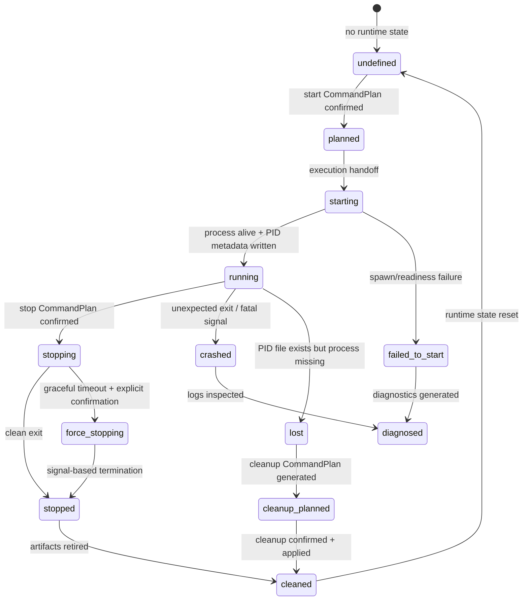
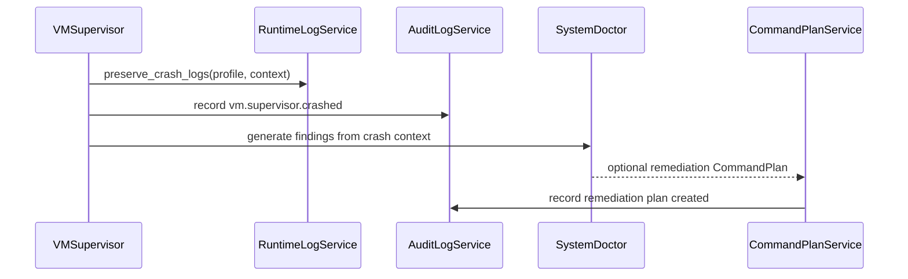
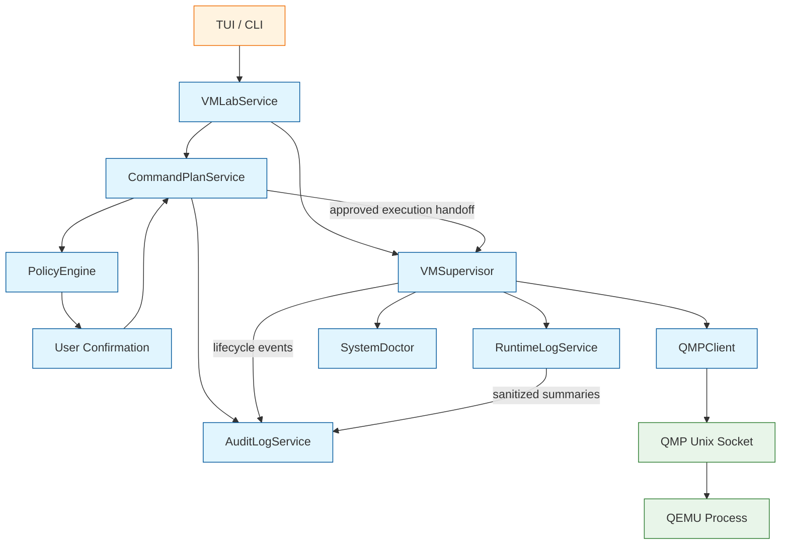

<!--
SPDX-License-Identifier: Apache-2.0

Project: ECLI
File: docs/extensions/vmlab-runtime-supervisor.md
Website: https://www.ecli.io
Repository: https://github.com/SSobol77/ecli
Author: Siergej Sobolewski
License: Apache License, Version 2.0

Copyright (c) 2026 Siergej Sobolewski

Licensed under the Apache License, Version 2.0.
See the LICENSE file in the project root for full license text.
-->

# VMSupervisor Contract

**Phase 2 Runtime Process Lifecycle Management**

**Version:** 1.0
**Date:** 2026-05-15
**Status:** Strategic Architecture Direction
**Part of:**
[Product Vision](../architecture/product-vision.md) |
[Services Foundation](../architecture/services-foundation.md) |
[CommandPlanService](../architecture/command-plan-service.md) |
[VMLab Overview](./vmlab-overview.md) |
[VMLab Profile Schema](./vmlab-profile-schema.md) |
[QMP Client Contract](./vmlab-qmp-client.md)

---

## 1. Purpose

This document defines the VMSupervisor contract for VMLab.

`VMSupervisor` is responsible for the lifecycle supervision of QEMU processes launched from validated VMLab profiles and approved command plans.

It is not a generic process manager.

It is not a replacement for systemd, libvirtd, virt-manager, Proxmox, or cloud orchestration.

It is not allowed to bypass `CommandPlanService`.

`VMSupervisor` is a focused, plan-mediated, audit-aware runtime supervisor that:

- starts QEMU processes only from approved `CommandPlan` execution paths;
- tracks process state through runtime metadata and PID files;
- captures QEMU stdout and stderr into runtime logs;
- detects crashes, unexpected exits, stale PID files, and orphaned runtime artifacts;
- coordinates with `QMPClient` for status inspection and graceful stop flows where available;
- cleans up stale runtime artifacts only through explicit cleanup policy and command plans;
- exposes read-only status APIs for TUI/CLI;
- enforces dry-run and no-mutation contracts for safe testing.

Critical rule:

```text
VMSupervisor never starts, stops, kills, cleans up, or mutates QEMU runtime state without an approved CommandPlan or explicitly defined read-only status path.
````

---

## 2. Scope and Boundaries

### 2.1 VMSupervisor Owns

| Capability                 | Description                                                             |
| -------------------------- | ----------------------------------------------------------------------- |
| Approved process launch    | Spawn QEMU from a confirmed command plan                                |
| PID file management        | Write, read, validate, and retire PID metadata                          |
| Runtime metadata tracking  | Track PID, start time, profile hash, argv hash, socket paths            |
| stdout/stderr capture      | Route QEMU output to runtime log files                                  |
| Process state inspection   | Determine whether a supervised process is alive, exited, stale, or lost |
| Crash and exit detection   | Classify clean exit, crash, signal termination, failed start            |
| Graceful stop coordination | Prefer guest-aware/QMP stop flows before signals                        |
| Stale artifact detection   | Detect old PID files, stale sockets, incomplete runtime directories     |
| Read-only status API       | Provide runtime status for TUI/CLI without mutation                     |
| Dry-run reporting          | Validate launch readiness without spawning processes or writing files   |

### 2.2 VMSupervisor Does Not Own

| Excluded                    | Owner / Reason                                     |
| --------------------------- | -------------------------------------------------- |
| Profile validation          | `VMProfileService` / VMLab profile schema          |
| QEMU argv generation        | `VMLabService` / profile-to-argv mapping           |
| Command plan creation       | `CommandPlanService`                               |
| Policy decisions            | `PolicyEngine`                                     |
| User confirmation           | TUI/CLI confirmation flow via `CommandPlanService` |
| Privilege escalation        | `PrivilegedActionService`                          |
| QMP protocol implementation | `QMPClient`                                        |
| Interactive serial I/O      | `SerialConsoleService`                             |
| Runtime log presentation    | `RuntimeLogService` / TUI log viewer               |
| Audit persistence           | `AuditLogService`                                  |
| Guest OS management         | Guest OS responsibility                            |

---

## 3. Process Lifecycle Model

### 3.1 State Machine



### 3.2 State Definitions

| State             | Meaning                                                             |
| ----------------- | ------------------------------------------------------------------- |
| `undefined`       | No active runtime state exists for the profile                      |
| `planned`         | Start/stop/cleanup command plan exists and is confirmed             |
| `starting`        | Supervisor received approved execution handoff and is starting QEMU |
| `running`         | QEMU process is alive and runtime metadata is valid                 |
| `failed_to_start` | Process failed before reaching usable runtime state                 |
| `stopping`        | Graceful stop flow is in progress                                   |
| `force_stopping`  | Signal-based stop flow is in progress after explicit confirmation   |
| `stopped`         | Process exited cleanly                                              |
| `crashed`         | Process exited unexpectedly or with fatal signal                    |
| `lost`            | Runtime metadata exists but the process is no longer present        |
| `diagnosed`       | Logs and metadata were inspected and findings were generated        |
| `cleanup_planned` | Stale artifact cleanup plan was generated                           |
| `cleaned`         | Runtime artifacts were safely retired or removed                    |

### 3.3 Transition Rules

- `undefined -> planned` requires a confirmed `CommandPlan`.
- `planned -> starting` requires execution handoff from the approved plan path.
- `starting -> running` requires successful process spawn and valid runtime metadata.
- `starting -> failed_to_start` preserves logs and startup diagnostics.
- `running -> stopping` requires an approved stop plan.
- `running -> crashed` is detected by exit status, fatal signal, or unexpected process loss.
- `running -> lost` is detected by PID metadata mismatch or missing process.
- `lost -> cleanup_planned` requires generation of a cleanup `CommandPlan`.
- `cleanup_planned -> cleaned` requires user confirmation if cleanup mutates filesystem state.
- All security-relevant transitions must be audit logged.

---

## 4. Process Launch Contract

### 4.1 Pre-Launch Requirements

Before `VMSupervisor` may spawn QEMU:

1. Profile must be validated.
2. QEMU argv must be generated from the validated profile.
3. QEMU argv must contain:

   - no unresolved variables;
   - no shell expansions;
   - no raw secrets;
   - resolved paths;
   - explicit QMP/serial/log options if configured.
4. A `CommandPlan` must be created with:

   - `category = "vm"`;
   - accurate risk classification;
   - exact `argv`;
   - affected resources;
   - selected acceleration mode;
   - rollback or stop metadata where applicable.
5. Plan must pass `PolicyEngine` evaluation.
6. User confirmation must be obtained when required.
7. Plan must be in an approved execution state.

### 4.2 Approved Launch Execution

```python
# Conceptual contract only — implementation details belong in code.

from pathlib import Path
from typing import Protocol


class VMSupervisor(Protocol):
    async def start_from_approved_plan(
        self,
        plan: CommandPlan,
        profile: VMProfile,
        runtime_dir: Path,
    ) -> ProcessMetadata:
        """
        Launch QEMU from an approved VM start CommandPlan.

        Preconditions:
        - plan is approved for execution by CommandPlanService.
        - profile is validated.
        - argv contains no secrets or unresolved variables.
        - runtime_dir is profile-scoped and owned by the current user.
        - dry-run mode is disabled.

        Postconditions:
        - QEMU process is spawned as the current user unless policy says otherwise.
        - PID metadata is written atomically.
        - stdout/stderr capture is configured.
        - ProcessMetadata is returned.
        - lifecycle events are logged and audit-relevant events are recorded.
        """
        ...
```

### 4.3 Process Metadata

```python
# Conceptual model only.

from dataclasses import dataclass
from datetime import datetime
from pathlib import Path


@dataclass(frozen=True)
class ProcessMetadata:
    """Immutable snapshot of a supervised QEMU process."""

    pid: int
    profile_name: str
    profile_hash: str
    argv_hash: str
    start_time: datetime

    runtime_dir: Path
    pid_file: Path
    stdout_log: Path
    stderr_log: Path

    qmp_socket: Path | None
    serial_path: Path | None

    acceleration_selected: str
```

---

## 5. Runtime Directory and PID File Contract

### 5.1 Directory Layout

Runtime artifacts are profile-scoped.

Preferred layout:

```text
<project-root>/
└── .ecli/
    └── vmlab/
        ├── profiles/
        │   └── kernel-dev.toml
        ├── run/
        │   └── kernel-dev/
        │       ├── qemu.pid
        │       ├── runtime.json
        │       ├── qmp.sock
        │       ├── serial.sock
        │       ├── stdout.log
        │       └── stderr.log
        └── logs/
            └── kernel-dev/
                ├── qemu.log
                ├── serial.log
                └── crash-20260512T194512Z.log
```

Rules:

- each profile has its own runtime directory;
- runtime directory permissions should be `0700`;
- runtime files must be owned by the current user for normal VM runs;
- runtime directories are not shared between profiles;
- paths must not use shell expansion;
- symlink escape checks are required before mutating cleanup operations.

### 5.2 PID File Rules

| Rule                                                           | Rationale                            |
| -------------------------------------------------------------- | ------------------------------------ |
| PID file path is `.ecli/vmlab/run/<profile>/qemu.pid`          | Profile-scoped and predictable       |
| PID metadata includes PID, start time, profile hash, argv hash | Integrity and traceability           |
| PID file is written atomically                                 | Avoid partial metadata               |
| PID file is retired on clean shutdown                          | Avoid stale state                    |
| Stale PID files are detected read-only first                   | No mutation during status checks     |
| Cleanup of stale PID files requires explicit cleanup plan      | Filesystem mutation must be mediated |
| PID files are never used for privilege escalation              | Prevent trust boundary abuse         |

### 5.3 Runtime Metadata File

`runtime.json` may store runtime metadata.

Required fields:

```json
{
  "schema_version": 1,
  "profile_name": "kernel-dev",
  "profile_hash": "sha256:1a2b3c4d",
  "argv_hash": "sha256:a1b2c3d4",
  "pid": 12345,
  "start_time": "2026-05-12T18:30:45Z",
  "qmp_socket": ".ecli/vmlab/run/kernel-dev/qmp.sock",
  "stdout_log": ".ecli/vmlab/run/kernel-dev/stdout.log",
  "stderr_log": ".ecli/vmlab/run/kernel-dev/stderr.log",
  "acceleration_selected": "kvm"
}
```

Rules:

- `runtime.json` is runtime state, not source configuration;
- it must not be committed to source control by default;
- it must not contain secrets;
- it must be validated before being trusted;
- stale metadata must not be treated as proof that a VM is running.

---

## Development Log Location Invariant

During development, all VMLab-related logs, runtime evidence, test logs, dry-run reports, smoke outputs, and agent-generated debug artifacts must be written exclusively under the repository-level `logs/` directory.

No development log may be written to `.ecli/`, `/tmp`, the user home directory, source directories, or test directories.

This rule applies to:

- QEMU stdout/stderr captures in skeleton tests;
- dry-run reports;
- supervisor diagnostics;
- crash simulation outputs;
- test evidence;
- agent implementation logs;
- smoke-run outputs.

Production runtime directory layout may be specified separately in future documents, but the development implementation must use only `logs/`.

Required development layout:

```text
logs/
└── vmlab/
    ├── runtime/
    ├── qmp/
    ├── console/
    ├── doctor/
    ├── dry-run/
    ├── tests/
    └── smoke/
```

Any code path that attempts to write logs outside `logs/` during development must fail tests.

---

## 6. Log Capture and Rotation

### 6.1 stdout/stderr Handling

`VMSupervisor` captures QEMU stdout and stderr separately.

Future runtime default files:

```text
.ecli/vmlab/run/<profile>/stdout.log
.ecli/vmlab/run/<profile>/stderr.log
```

Development and test output override:

```text
logs/vmlab/runtime/<profile>/stdout.log
logs/vmlab/runtime/<profile>/stderr.log
```

Rules:

- `.ecli/vmlab/run/` is a future production/runtime layout concept;
- Phase 2A skeleton development must not create `.ecli/vmlab/run/`;
- skeleton tests and agent-generated evidence must use `logs/vmlab/`;
- dry-run must not create either runtime logs or development logs unless a specific log-report generation test is being executed under `logs/`.

Rules:

- logs are append-only during a single VM run;
- process output must be flushed on shutdown where possible;
- supervisor must preserve logs on crash;
- logs must not block the process if consumers are slow;
- full runtime logs may contain guest or tool output and should be treated as sensitive runtime artifacts;
- audit records must use sanitized summaries, not raw logs.

Important distinction:

```text
Runtime logs preserve execution evidence.
Audit logs preserve sanitized security-relevant summaries.
```

### 6.2 Redaction Policy

Raw runtime logs may contain arbitrary QEMU or guest-adjacent output.

Therefore:

- audit summaries must be redacted;
- TUI display may apply redaction-on-view;
- exported diagnostic bundles must apply redaction by default;
- raw runtime logs should not be uploaded, published, or attached to bug reports without review.

Sensitive tokens include:

```text
password
passwd
token
api_key
secret
private_key
credential
authorization
```

### 6.3 Log Rotation

Log rotation belongs primarily to `RuntimeLogService`.

`VMSupervisor` may notify `RuntimeLogService` when:

- log file exceeds configured threshold;
- VM stops cleanly;
- VM crashes;
- user requests rotation through a command plan.

Default policy:

| Trigger                    | Action                                          |
| -------------------------- | ----------------------------------------------- |
| log file exceeds threshold | `RuntimeLogService` rotates according to config |
| VM stopped                 | final segment flushed and indexed               |
| crash detected             | crash segment preserved                         |
| manual cleanup             | cleanup plan generated and confirmed            |

---

## 7. Crash Detection and Recovery

### 7.1 Crash Detection Methods

| Method                           | Description                                                          |
| -------------------------------- | -------------------------------------------------------------------- |
| Exit code monitoring             | Non-zero exit is classified as failure or crash depending on context |
| Signal detection                 | Fatal signals such as SIGSEGV or SIGABRT indicate crash              |
| Failed startup readiness         | QEMU exits before runtime metadata becomes usable                    |
| QMP disconnect with process exit | May indicate crash or normal shutdown depending on exit status       |
| PID/process mismatch             | PID file exists but process is missing                               |
| Runtime metadata mismatch        | PID exists but argv/profile hash mismatch                            |

### 7.2 Crash Response Flow



### 7.3 No Automatic Restart Policy

`VMSupervisor` does not automatically restart crashed VMs in v1.

Rationale:

- automatic restart may hide real failures;
- repeated restart loops can damage guest state;
- restart may require profile or host remediation;
- user should inspect logs before re-execution.

If restart is desired, it must be:

1. proposed as a remediation plan by `SystemDoctor` or `VMLabService`;
2. evaluated by `PolicyEngine`;
3. confirmed by the user if policy requires;
4. executed through `CommandPlanService`.

---

## 8. Graceful Shutdown Protocol

### 8.1 Shutdown Preference Order

VMLab distinguishes guest-aware shutdown from process termination.

Preferred order:

```text
1. QMP system_powerdown      # Ask guest to power down through ACPI when available
2. Wait for clean process exit
3. QMP quit                  # Ask QEMU to exit
4. SIGTERM by exact PID      # Process-level graceful termination
5. SIGKILL by exact PID      # Last resort, explicit confirmation required
```

Rules:

- `system_powerdown` is preferred when guest supports it;
- `quit` exits QEMU and may be less guest-aware than `system_powerdown`;
- signals must use exact PID from validated runtime metadata;
- `SIGKILL` requires explicit confirmation;
- no shutdown path may use unbounded pattern matching.

### 8.2 Shutdown Plan Requirements

Every stop operation must be represented as a `CommandPlan`.

Plan metadata should include:

```json
{
  "metadata": {
    "operation": "vm-stop",
    "vm_name": "kernel-dev",
    "profile_hash": "sha256:1a2b3c4d",
    "pid": 12345,
    "preferred_shutdown": "qmp_system_powerdown",
    "fallbacks": ["qmp_quit", "sigterm", "sigkill"],
    "requires_confirmation_for_sigkill": true
  }
}
```

### 8.3 Why Not `pkill -f`

Using pattern-based process termination such as:

```text
pkill -f "qemu.*kernel-dev"
```

is forbidden as the default stop mechanism.

Reasons:

- it may match unrelated processes;
- it is not tied to supervised runtime metadata;
- it bypasses QMP graceful paths;
- it is hard to audit precisely;
- it may terminate the wrong VM.

Preferred approach:

- use QMP `system_powerdown` where possible;
- use QMP `quit` as QEMU-level fallback;
- use exact PID-based `SIGTERM`;
- use exact PID-based `SIGKILL` only as last resort.

---

## 9. Cleanup Contract

Cleanup is a filesystem mutation and must be controlled.

### 9.1 Read-Only Detection

Read-only status checks may detect:

- stale PID files;
- stale QMP sockets;
- stale serial sockets;
- incomplete runtime directories;
- orphaned log files;
- runtime metadata mismatch.

Read-only detection must not delete or modify files.

### 9.2 Cleanup Plan

Cleanup requires an explicit cleanup command plan unless the operation is part of the same approved lifecycle plan.

Cleanup plan metadata should include:

```json
{
  "metadata": {
    "operation": "vm-runtime-cleanup",
    "vm_name": "kernel-dev",
    "artifacts": [
      ".ecli/vmlab/run/kernel-dev/qemu.pid",
      ".ecli/vmlab/run/kernel-dev/qmp.sock"
    ],
    "reason": "stale runtime artifacts after crashed VM"
  }
}
```

### 9.3 Cleanup Rules

- cleanup must not remove disk images;
- cleanup must not remove VM profiles;
- cleanup must not remove source files;
- cleanup of runtime logs requires separate confirmation or retention policy;
- stale socket cleanup belongs to `VMSupervisor`, but only through policy-controlled cleanup flow.

---

## 10. Integration with Services Foundation

### 10.1 Architecture Flow



### 10.2 Audit Integration

| Event                    | Audit Type                           | Metadata                               |
| ------------------------ | ------------------------------------ | -------------------------------------- |
| Start requested          | `vm.supervisor.start_requested`      | plan_id, profile_hash, argv_hash       |
| Process started          | `vm.supervisor.started`              | pid, start_time, runtime_dir           |
| Process stopped cleanly  | `vm.supervisor.stopped`              | exit_code, duration_seconds            |
| Failed to start          | `vm.supervisor.failed_to_start`      | reason, sanitized log tail             |
| Process crashed          | `vm.supervisor.crashed`              | exit_code or signal, sanitized summary |
| Lost process detected    | `vm.supervisor.lost`                 | pid_file, process_state                |
| Stale artifact detected  | `vm.supervisor.stale_artifact_found` | artifact_type, path                    |
| Cleanup plan created     | `vm.supervisor.cleanup_plan_created` | plan_id, artifacts                     |
| Runtime artifact cleaned | `vm.supervisor.artifact_cleaned`     | artifact_type, sanitized path          |

Audit records must redact sensitive argv elements and sensitive paths.

---

## 11. Dry-Run Contract

`VMSupervisor` must support dry-run mode.

For:

```bash
ecli vm start kernel-dev --dry-run
```

Dry-run may:

- validate profile state;
- validate generated argv;
- inspect whether required paths exist;
- check whether runtime directory parent exists;
- report intended PID/log/socket paths;
- report selected acceleration mode;
- report command plan metadata.

Dry-run must not:

- spawn QEMU;
- create directories;
- create PID files;
- create log files;
- create sockets;
- delete stale artifacts;
- send QMP commands;
- send signals;
- mutate filesystem state;
- mutate process state.

Dry-run output must be structured enough for CLI and TUI rendering.

---

## 12. Security and Safety Rules

These rules are non-negotiable for v1:

1. No process start without approved `CommandPlan`.
2. No stop/kill/cleanup without approved `CommandPlan` or explicitly approved lifecycle path.
3. No silent privilege escalation.
4. QEMU runs as the current user by default.
5. QEMU must not be run as root to bypass `/dev/kvm` permissions.
6. PID files include profile and argv hashes.
7. Runtime metadata must not be blindly trusted.
8. Runtime directory is profile-scoped and owner-only.
9. Runtime logs are treated as sensitive artifacts.
10. Audit records must be sanitized.
11. No automatic restart after crash.
12. Graceful shutdown preference: `system_powerdown` -> `quit` -> `SIGTERM` -> `SIGKILL`.
13. No `pkill -f` or process-pattern termination as default.
14. Dry-run never mutates filesystem or process state.
15. Cleanup never removes VM profiles, disk images, or source files.

---

## 13. Required Tests

Implementations must include tests for:

| Test Category          | Example Cases                                                |
| ---------------------- | ------------------------------------------------------------ |
| Plan mediation         | start/stop without approved plan fails closed                |
| Dry-run                | no process spawned, no file created, no socket created       |
| PID lifecycle          | atomic write, read, validation, stale detection              |
| Runtime metadata       | profile hash and argv hash mismatch detection                |
| Log capture            | stdout/stderr routed separately                              |
| Redaction              | audit summaries redact sensitive data                        |
| Crash detection        | non-zero exit, signal, failed startup                        |
| Lost process detection | PID exists but process missing                               |
| Graceful shutdown      | `system_powerdown` preferred, fallbacks ordered              |
| Force stop             | `SIGKILL` requires explicit confirmation                     |
| No pattern kill        | `pkill -f` not used as default path                          |
| Cleanup policy         | stale cleanup requires plan and never deletes disks/profiles |
| Runtime isolation      | per-profile runtime dirs, no cross-profile contamination     |
| Audit integration      | lifecycle events emitted with sanitized metadata             |

Tests must use actual repository imports and must not assume module names that do not exist yet.

---

## 14. Relationship to Other Documents

This document implements the runtime supervisor contract required by:

- [Product Vision](../architecture/product-vision.md)
- [Services Foundation](../architecture/services-foundation.md)
- [CommandPlanService](../architecture/command-plan-service.md)
- [VMLab Overview](./vmlab-overview.md)
- [VMLab Profile Schema](./vmlab-profile-schema.md)
- [QMP Client Contract](./vmlab-qmp-client.md)

Future documents that build on this contract:

- `docs/extensions/vmlab-console-and-logs.md`
- `docs/extensions/vmlab-security-model.md`
- `docs/extensions/vmlab-smoke-runner.md`

---

## Appendix A: Example PID File Format

```text
# Future runtime example:
# .ecli/vmlab/run/kernel-dev/qemu.pid
#
# Development/test evidence must use:
# logs/vmlab/runtime/kernel-dev/qemu.pid
pid=12345
start_time=2026-05-12T18:30:45Z
argv_hash=sha256:a1b2c3d4e5f6
profile_hash=sha256:1a2b3c4d5e6f
runtime_json=.ecli/vmlab/run/kernel-dev/runtime.json
```

Validation rules:

- file must be readable by current user;
- `pid` must be a valid integer;
- PID must refer to a live process owned by current user unless policy allows otherwise;
- process command metadata should match expected QEMU binary where possible;
- `argv_hash` must match the approved command plan;
- `profile_hash` must match the loaded profile;
- stale PID file alone must not prove VM is running.

---

## Appendix B: Example Runtime Metadata

```json
{
  "schema_version": 1,
  "profile_name": "kernel-dev",
  "profile_hash": "sha256:1a2b3c4d5e6f",
  "argv_hash": "sha256:a1b2c3d4e5f6",
  "pid": 12345,
  "start_time": "2026-05-12T18:30:45Z",
  "runtime_dir": ".ecli/vmlab/run/kernel-dev",
  "pid_file": ".ecli/vmlab/run/kernel-dev/qemu.pid",
  "stdout_log": ".ecli/vmlab/run/kernel-dev/stdout.log",
  "stderr_log": ".ecli/vmlab/run/kernel-dev/stderr.log",
  "qmp_socket": ".ecli/vmlab/run/kernel-dev/qmp.sock",
  "serial_path": ".ecli/vmlab/run/kernel-dev/serial.sock",
  "acceleration_selected": "kvm"
}
```

---

## Appendix C: Example Crash Log Header

```text
--- CRASH DETECTED ---
timestamp: 2026-05-12T19:45:12Z
profile: kernel-dev
exit_code: 139
signal: 11
argv_hash: sha256:a1b2c3d4e5f6
profile_hash: sha256:1a2b3c4d5e6f
last_10_lines_redacted:
  [2026-05-12T19:45:10Z] qemu: warning: device failed to initialize
  [2026-05-12T19:45:11Z] qemu: fatal: memory access violation
remediation_hint: Run 'ecli vm doctor kernel-dev' to inspect runtime findings.
--- END CRASH ---
```

---

## Approval

- **Status:** Approved as VMLab Runtime Supervisor Strategic Architecture Direction after review corrections
- **Approved by:** Siergej Sobolewski
- **Date:** 2026-05-12
- **Next step:** Prepare `docs/extensions/vmlab-console-and-logs.md`
