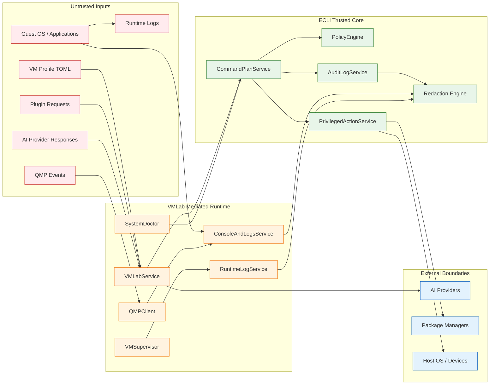
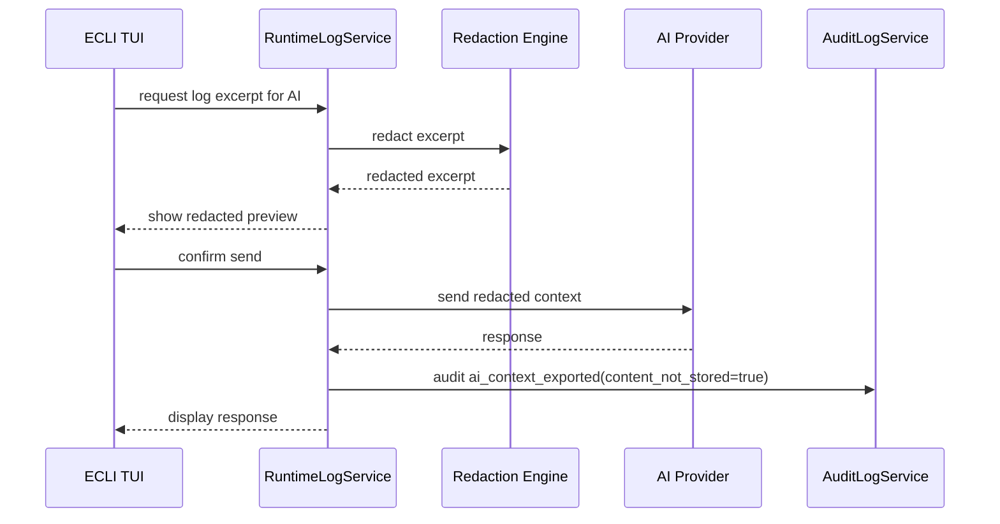
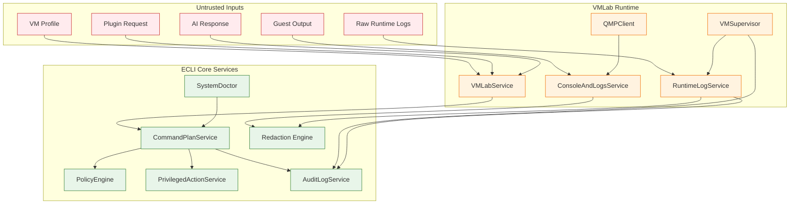

<!--
SPDX-License-Identifier: Apache-2.0

Project: ECLI
File: docs/extensions/vmlab-security-model.md
Website: https://www.ecli.io
Repository: https://github.com/SSobol77/ecli
Author: Siergej Sobolewski
License: Apache License, Version 2.0

Copyright (c) 2026 Siergej Sobolewski

Licensed under the Apache License, Version 2.0.
See the LICENSE file in the project root for full license text.
-->

# VMLab Security Model

**Phase 2 Runtime Safety and Trust Boundaries**

**Version:** 1.0
**Date:** 2026-05-15
**Status:** Strategic Architecture Direction
**Part of:**
[Product Vision](../architecture/product-vision.md) |
[Services Foundation](../architecture/services-foundation.md) |
[CommandPlanService](../architecture/command-plan-service.md) |
[VMLab Overview](./vmlab-overview.md) |
[VMLab Profile Schema](./vmlab-profile-schema.md) |
[QMP Client Contract](./vmlab-qmp-client.md) |
[VMSupervisor Contract](./vmlab-runtime-supervisor.md) |
[Console and Logs Contract](./vmlab-console-and-logs.md)

---

## 1. Purpose

This document defines the security and safety model for VMLab.

VMLab operates at the boundary between:

- the ECLI host environment;
- the user terminal;
- the host filesystem;
- QEMU runtime processes;
- guest operating systems;
- serial console streams;
- QMP runtime control;
- runtime logs;
- external AI providers;
- package managers and host remediation workflows.

The security model ensures that:

- host state cannot be mutated without explicit, plan-mediated authorization;
- guest output cannot be interpreted as trusted host commands;
- profile content cannot bypass validation and policy checks;
- QMP mutating commands cannot bypass `CommandPlanService`;
- secrets are never written to audit records, diagnostic exports, or AI context without redaction;
- privilege escalation is explicit, previewable, confirmable, policy-checkable, and auditable;
- runtime artifacts have clear ownership, permissions, retention, and cleanup rules;
- console handlers preserve terminal integrity;
- log export and AI integration flows apply mandatory redaction before data leaves the host.

Critical rule:

```text
VMLab never trusts guest output, profile content, plugin requests, AI responses, QMP events, or runtime logs as safe for direct execution.

All mutating operations require CommandPlanService mediation.

All sensitive data must be redacted before audit, export, or AI transmission.
````

---

## 2. Threat Model

### 2.1 Assets to Protect

| Asset                | Threat                                                        | Impact if Compromised                 |
| -------------------- | ------------------------------------------------------------- | ------------------------------------- |
| Host filesystem      | malicious profile, path traversal, symlink escape, plugin bug | data loss, unintended host mutation   |
| Host credentials     | raw log leakage, diagnostic export, AI context leak           | credential theft, API abuse           |
| Host process state   | unauthorized QMP mutation, PID misuse, pattern kill           | VM loss, wrong process termination    |
| Runtime directories  | stale socket/PID abuse, unsafe cleanup                        | incorrect VM state, data loss         |
| User terminal state  | malicious serial output, raw mode failure                     | broken TUI, input confusion           |
| Audit records        | secret leakage, log injection, deletion                       | forensic loss, compliance failure     |
| AI context           | prompt injection, raw log upload                              | data exfiltration, unsafe suggestions |
| Policy configuration | unsafe local override                                         | weakened safety guarantees            |

### 2.2 Trust Boundaries



### 2.3 Security Assumptions

| Assumption                                         | Rationale                                                                       |
| -------------------------------------------------- | ------------------------------------------------------------------------------- |
| QEMU is not fully trusted                          | VM escape vulnerabilities may exist; host must defend itself                    |
| Guest output is untrusted                          | Serial/log output may contain escape sequences, secrets, or misleading commands |
| Profile TOML is untrusted input                    | Profiles are user-authored and may contain mistakes or malicious paths          |
| Plugins are constrained but not inherently trusted | Plugin API must not expose direct privileged execution                          |
| AI responses are untrusted                         | Prompt injection and hallucination risks require validation                     |
| Runtime logs are sensitive local artifacts         | Logs may contain guest secrets or operational details                           |
| External providers are semi-trusted                | Data must be redacted before leaving the host                                   |
| Local user config may be unsafe                    | User config must not silently weaken project/system safety policy               |

---

## 3. Security Precedence

VMLab security policy uses a restrictive precedence model.

```text
system policy > project policy > user config > built-in defaults
```

Rules:

- higher-precedence policy may tighten restrictions;
- lower-precedence config must not silently weaken stricter policy;
- user config may improve convenience only within allowed policy boundaries;
- project policy may require stricter redaction, confirmation, or path limits;
- system policy may block unsafe operations globally;
- policy conflicts must fail closed.

Example:

```text
If system policy forbids unredacted exports,
user config cannot enable --no-redact.

If project policy forbids TAP networking,
user config cannot silently allow TAP for that project.
```

---

## 4. Security Domains

VMLab security is organized into nine domains.

### 4.1 Privilege Escalation Boundary

Rule:

```text
No privilege escalation without PrivilegedActionService mediation.
```

| Scenario                      | Allowed Path                                               | Forbidden Path                   |
| ----------------------------- | ---------------------------------------------------------- | -------------------------------- |
| Add user to `kvm` group       | `SystemDoctor` → `CommandPlan` → `PrivilegedActionService` | direct `sudo usermod` from VMLab |
| Install QEMU package          | `SystemDoctor` → `CommandPlan` → user confirmation         | auto-install on profile load     |
| Adjust file permissions       | explicit `CommandPlan` with previewed argv                 | silent `chmod` / `chown`         |
| Create TAP/bridge networking  | future plan-mediated workflow                              | direct `ip tuntap` from UI       |
| Clean privileged runtime path | cleanup plan                                               | silent unlink as root            |

Enforcement:

- `PrivilegedActionService` is the only elevation entry point;
- privileged commands must be represented as `argv`;
- exact commands must be previewed before execution;
- passwords must never be captured, stored, logged, or replayed;
- failed privilege setup must fail closed.

Failure mode:

```text
If PrivilegedActionService is unavailable, privileged operations fail closed with a structured diagnostic.
```

---

### 4.2 Path and Filesystem Safety

Rule:

```text
Host filesystem mutations require plan mediation.
Path-like values must be validated before use.
```

| Path Type          | Validation Rule                                                            |
| ------------------ | -------------------------------------------------------------------------- |
| Profile paths      | Resolve relative to project root; reject unsafe traversal                  |
| Disk image paths   | Validate existence or plan creation; no shell expansion                    |
| Host-path shares   | Must be explicit and policy-allowed                                        |
| Runtime paths      | Must stay under `.ecli/vmlab/run/<profile>/` or approved runtime directory |
| Export paths       | Must be user-controlled; overwrite requires confirmation                   |
| QMP/serial sockets | Must be profile-scoped or policy-allowed                                   |
| Forbidden paths    | `/proc`, `/sys`, unsafe `/dev`, credential directories, shell expansions   |

Sensitive or restricted paths include:

```text
/proc
/sys
/dev/*
~/.ssh
~/.gnupg
~/.aws
~/.config/gcloud
~/.kube
/etc/shadow
/etc/sudoers
```

Path validation must distinguish between:

- plain strings;
- path-like fields;
- command arguments;
- QEMU resource descriptors.

Important:

```text
Policy must not treat every argv element as a filesystem path.
Only path-like fields and known resource arguments are path-validated.
```

Conceptual helper:

```python
# Conceptual validation helper only — implementation details belong in code.

from pathlib import Path


def is_path_within_root(path: Path, root: Path) -> bool:
    """
    Return True if the resolved path is inside the allowed root.

    This check prevents symlink escapes and directory traversal.
    If resolution fails, the path must be treated as unsafe.
    """
    try:
        resolved = path.resolve(strict=False)
        resolved_root = root.resolve(strict=True)
        return resolved == resolved_root or resolved_root in resolved.parents
    except (OSError, RuntimeError):
        return False
```

Failure mode:

```text
If path validation fails, profile validation or plan validation fails.
No filesystem mutation occurs.
```

---

### 4.3 Process Lifecycle Safety

Rule:

```text
No QEMU process start, stop, kill, restart, or cleanup without CommandPlanService approval.
```

| Operation              | Required Path                   | Forbidden Shortcut             |
| ---------------------- | ------------------------------- | ------------------------------ |
| Start QEMU             | approved VM start `CommandPlan` | direct UI `subprocess.Popen()` |
| Stop QEMU              | approved stop plan              | `pkill -f`                     |
| Force kill QEMU        | explicit SIGKILL plan           | unbounded signal               |
| Restart QEMU           | stop plan + start plan          | automatic restart loop         |
| Clean stale PID/socket | cleanup plan                    | silent unlink on profile load  |

Shutdown preference:

```text
1. QMP system_powerdown
2. wait for clean exit
3. QMP quit
4. SIGTERM by exact PID
5. SIGKILL by exact PID with explicit confirmation
```

Failure mode:

```text
If plan approval is missing, expired, invalid, or policy-blocked, lifecycle operation fails closed.
```

---

### 4.4 QMP Safety

Rule:

```text
Read-only QMP queries may be direct.
Mutating QMP commands require plan authorization.
```

Read-only examples:

```text
query-status
query-version
query-block
query-blockstats
query-netdev
query-chardev
```

Mutating examples:

```text
stop
cont
quit
system_reset
system_powerdown
device_add
device_del
blockdev-snapshot-sync
```

QMP security rules:

- Unix socket only in v1;
- no TCP QMP exposure in v1;
- socket path must be validated from profile/runtime metadata;
- `/tmp` socket path is discouraged and policy-warning by default;
- mutating commands require `CommandPlanService`;
- unauthorized mutating commands fail closed;
- QMP event data is untrusted and must be sanitized before audit/export.

Failure mode:

```text
If QMP authorization is missing, the mutating command must not be sent.
```

---

### 4.5 Console and I/O Safety

Rule:

```text
Console handlers preserve terminal integrity and do not interpret untrusted guest output as commands.
```

| Mode            | Safety Guarantee                 | Enforcement                                    |
| --------------- | -------------------------------- | ---------------------------------------------- |
| Serial follow   | Read-only observation            | no input forwarding                            |
| Serial attach   | Guest input only, exclusive lock | `.ecli/vmlab/run/<profile>/serial.attach.lock` |
| QMP diagnostics | Read-only by default             | mutating command gating                        |
| Log viewer      | Redaction-on-view                | redaction engine before display                |

Terminal safety:

- attach mode must save terminal state;
- raw input mode must be restored on detach;
- attach lock must be released on normal exit;
- best-effort lock release must run on failure;
- guest escape sequences must not be interpreted as host commands;
- guest output must not trigger ECLI actions.

Failure mode:

```text
If terminal state cannot be restored, ECLI returns to safe mode and displays a recovery diagnostic.
```

---

### 4.6 Event and Log Sanitization

Rule:

```text
Raw runtime logs are preserved locally.
Audit, display, export, and AI context are redacted.
```

| Context            | Redaction Policy                                      |
| ------------------ | ----------------------------------------------------- |
| Raw runtime logs   | preserved as sensitive local artifacts                |
| TUI display        | redaction-on-view by default                          |
| Search results     | redaction-on-view by default                          |
| Audit records      | always redacted                                       |
| Diagnostic exports | redacted by default                                   |
| AI context         | always redacted before transmission                   |
| Debug traces       | redacted unless unsafe local debug explicitly enabled |

Sensitive token denylist:

```text
password
passwd
token
api_key
apikey
secret
private_key
credential
authorization
bearer
x-api-key
access_key
secret_key
session_key
```

Redaction format:

```text
Original: auth_token=sk-proj-abc123
Redacted: auth_token=***REDACTED***
```

Failure mode:

```text
If redaction fails, audit/export/AI operation fails closed.
No unredacted content is transmitted or written to audit.
```

---

### 4.7 Development Artifact Containment

Rule:

```text
Generated development artifacts must be contained under repository-level logs/.
```

This includes:

- dry-run reports;
- test evidence;
- QEMU argv previews;
- mock QMP events;
- serial console samples;
- crash samples;
- audit JSONL files created during development;
- agent-generated debug output;
- smoke outputs.

Allowed root:

```text
logs/
```

Recommended VMLab layout:

```text
logs/vmlab/
logs/vmlab/dry-run/
logs/vmlab/qmp/
logs/vmlab/serial/
logs/vmlab/runtime/
logs/vmlab/crash/
logs/vmlab/tests/
logs/vmlab/smoke/
```

Forbidden development artifact locations:

```text
.ecli/
.ecli/vmlab/
src/
tests/
tmp/
.tmp/
.cache/
$HOME/
/tmp/
project root outside logs/
```

Security rationale:

- prevents accidental commits of sensitive runtime artifacts;
- keeps generated evidence reviewable in one location;
- prevents tests from polluting source and test directories;
- makes CI artifact collection deterministic;
- prevents agent-generated debug output from being scattered across the repository.

Failure mode:

```text
If development code attempts to write generated artifacts outside logs/, the operation must fail closed during development and tests.
```

---

### 4.8 Export and AI Context Safety

Rule:

```text
No runtime data leaves the host without redaction and explicit user-visible context.
```

| Export Target          | Required Safeguards                                       |
| ---------------------- | --------------------------------------------------------- |
| Diagnostic bundle      | redacted by default; overwrite confirmation               |
| AI provider context    | mandatory redaction; provider visible to user             |
| Bug report bundle      | redacted by default; raw export requires explicit warning |
| Remote log aggregation | future explicit configuration only                        |
| Clipboard copy         | redaction-on-copy by default for sensitive matches        |

AI context flow:



Audit rule:

```text
Audit records may store provider name, size estimate, profile name, and redaction status.
Audit records must not store AI prompt content, raw logs, or provider response content by default.
```

---

### 4.9 Profile and Configuration Safety

Rule:

```text
Profile validation catches unsafe configurations before plan generation.
```

| Check                   | Validation Rule                                   |
| ----------------------- | ------------------------------------------------- |
| Schema version          | must be supported or migration proposal generated |
| Required fields         | missing required fields fail validation           |
| Shell expansion         | `$VAR`, `$(...)`, backticks rejected              |
| Secret-like fields      | warning or rejection based on policy              |
| Forbidden paths         | rejected or blocked by policy                     |
| Acceleration fallback   | visible warning, never silent                     |
| host-path shares        | explicit, policy-allowed, never implicit          |
| TAP/bridge networking   | requires plan-mediated setup                      |
| QMP socket path         | validated and policy-checked                      |
| Console escape sequence | validated against keybinding conflicts            |

Failure mode:

```text
If profile validation fails, no command plan is generated.
```

---

## 5. Integration with Services Foundation

### 5.1 Architecture Flow



### 5.2 Enforcement Matrix

| Operation                   | Service Boundary                                    | Requires Plan | Requires Confirmation | Audit          |
| --------------------------- | --------------------------------------------------- | ------------- | --------------------- | -------------- |
| Validate profile            | `VMLabService`                                      | No            | No                    | optional/debug |
| Generate QEMU argv          | `VMLabService`                                      | No            | No                    | optional/debug |
| Start VM                    | `CommandPlanService` → `VMSupervisor`               | Yes           | Policy-based          |                |
| Yes                         |                                                     |               |                       |                |
| Stop VM gracefully          | `CommandPlanService` → `VMSupervisor` / `QMPClient` | Yes           | Policy-based          | Yes            |
| Force stop VM               | `CommandPlanService`                                | Yes           | Yes                   | Yes            |
| Attach serial               | `ConsoleAndLogsService`                             | No            | No                    | Yes            |
| Follow serial               | `ConsoleAndLogsService`                             | No            | No                    | optional/debug |
| Mutating QMP command        | `CommandPlanService` → `QMPClient`                  | Yes           | Yes                   | Yes            |
| Export logs redacted        | `RuntimeLogService`                                 | Policy-based  | Usually yes           | Yes            |
| Export logs raw             | `RuntimeLogService`                                 | Yes           | Yes                   | Yes            |
| Send logs to AI             | `RuntimeLogService` / AI integration                | Policy-based  | Yes                   | Yes            |
| Cleanup stale runtime files | `CommandPlanService`                                | Yes           | Policy-based          | Yes            |
| Privileged host fix         | `PrivilegedActionService`                           | Yes           | Yes                   | Yes            |

---

## 6. Audit Event Taxonomy

| Event Category       | Example Event Types                                                 | Redaction Required                    |
| -------------------- | ------------------------------------------------------------------- | ------------------------------------- |
| Profile lifecycle    | `vm.profile.loaded`, `vm.profile.validation_failed`                 | profile hash; no full profile content |
| Plan lifecycle       | `vm.plan.created`, `vm.plan.rejected`, `vm.plan.executed`           | argv redaction                        |
| Process lifecycle    | `vm.supervisor.started`, `vm.supervisor.crashed`                    | sanitized metadata                    |
| Console sessions     | `vm.console.attach_started`, `vm.console.attach_detached`           | no guest input                        |
| QMP operations       | `vm.qmp.mutation_requested`, `vm.qmp.mutation_executed`             | args redacted                         |
| Log operations       | `vm.log.exported`, `vm.log.rotation_requested`                      | content not stored                    |
| Privilege escalation | `vm.privileged.executed`, `vm.privileged.refused`                   | password never logged                 |
| AI integration       | `vm.log.ai_context_exported`                                        | content not stored                    |
| Security violations  | `vm.security.path_escape_attempted`, `vm.security.redaction_failed` | sanitized diagnostic only             |

Conceptual audit record:

```json
{
  "event_id": "audit-20260512T183045Z-xyz",
  "timestamp": "2026-05-12T18:30:45Z",
  "event_type": "vm.log.ai_context_exported",
  "actor": "ssobol",
  "profile": "kernel-dev",
  "metadata": {
    "provider": "configured-ai-provider",
    "redacted": true,
    "content_not_stored": true,
    "token_count_estimate": 150
  },
  "redacted_fields": [
    "context_content",
    "ai_response"
  ]
}
```

---

## 7. PolicyEngine Integration

Security-relevant policy rules may include:

- block privileged operation without confirmation;
- block AI-generated high-risk mutation;
- block path escape;
- block raw log export by default;
- block QMP mutation without approved plan;
- block TAP/bridge setup without explicit policy;
- block destructive cleanup without confirmation;
- block profile migration write without confirmation.

Conceptual policy rule examples:

```python
# Conceptual rules only — implementation details belong in code.

from pathlib import Path


class VMLabSecurityRules:
    """Built-in policy rules for VMLab safety."""

    @staticmethod
    def block_privileged_without_confirmation(plan: CommandPlan, context: PolicyContext) -> PolicyDecision:
        """Require explicit confirmation for privileged VMLab operations."""
        if plan.requires_privilege and not context.user_confirmed_privileged:
            return PolicyDecision(
                allowed=False,
                reason="Privileged VMLab operation requires explicit confirmation",
                policy_id="vmlab:privileged-confirmation",
                override_allowed=False,
            )
        return PolicyDecision(allowed=True, reason="Policy check passed")

    @staticmethod
    def block_ai_high_risk_mutation(plan: CommandPlan, context: PolicyContext) -> PolicyDecision:
        """Block AI-generated high-risk VMLab mutations without human review."""
        if plan.source == PlanSource.AI_ASSISTANT and plan.risk in (PlanRisk.HIGH, PlanRisk.CRITICAL):
            return PolicyDecision(
                allowed=False,
                reason="AI-generated high-risk VMLab operation requires human review",
                policy_id="vmlab:ai-high-risk",
                override_allowed=False,
            )
        return PolicyDecision(allowed=True, reason="Policy check passed")

    @staticmethod
    def block_path_escape(plan: CommandPlan, context: PolicyContext) -> PolicyDecision:
        """
        Block path-like affected resources outside allowed roots.

        This rule checks affected_resources and typed resource metadata,
        not every argv string.
        """
        for resource in plan.affected_resources:
            if resource.startswith("path:"):
                raw_path = resource.removeprefix("path:")
                path = Path(raw_path)
                if not is_path_within_root(path, context.project_root):
                    return PolicyDecision(
                        allowed=False,
                        reason="Path-like affected resource escapes project root",
                        policy_id="vmlab:path-safety",
                        override_allowed=False,
                    )

        return PolicyDecision(allowed=True, reason="Policy check passed")
```

---

## 8. Failure Modes and Recovery

### 8.1 Fail-Closed Principle

For security-critical operations:

```text
If authorization is missing, validation fails, policy is unavailable, or redaction cannot be applied, the operation fails closed.
```

### 8.2 Diagnostic Output Rules

| Failure Type             | User-Facing Message                | Log/Audit Detail             |
| ------------------------ | ---------------------------------- | ---------------------------- |
| Profile validation error | field + safe reason                | structured field diagnostics |
| Path escape attempt      | safe path summary                  | path hash, rule ID           |
| Privilege refused        | confirmation required              | plan ID, policy rule         |
| Redaction failure        | operation aborted                  | redaction rule ID            |
| QMP mutation blocked     | authorization required             | command name, no raw args    |
| Terminal restore failure | safe mode recovery message         | terminal state summary       |
| PolicyEngine unavailable | operation blocked by safety policy | policy engine error code     |

Rules:

- user-facing messages must not leak secrets;
- audit messages must not store raw sensitive content;
- internal stack traces must not appear in TUI;
- remediation hints must be actionable and safe.

### 8.3 Recovery Procedures

| Failure                            | Recovery Action                                    |
| ---------------------------------- | -------------------------------------------------- |
| Stale attach lock                  | detect read-only → cleanup plan → confirmation     |
| Stale PID/socket                   | detect read-only → cleanup plan                    |
| Crash with logs                    | preserve crash metadata → suggest `ecli vm doctor` |
| Redaction failure                  | abort export/AI/audit content write                |
| Policy misconfiguration            | use most restrictive built-in policy               |
| QMP socket permission error        | suggest SystemDoctor remediation plan              |
| Runtime directory permission issue | generate explicit permission-fix plan              |

---

## 9. Required Tests

Implementations must include tests for:

| Test Category      | Example Cases                                                    |
| ------------------ | ---------------------------------------------------------------- |
| Privilege boundary | direct sudo path forbidden; only PrivilegedActionService allowed |
| Path safety        | symlink escape; forbidden paths; safe relative paths             |
| Process mediation  | start/stop/cleanup without approved plan fails                   |
| QMP safety         | mutating command without authorization fails                     |
| Console safety     | attach lock; terminal restore; guest output not interpreted      |
| Redaction          | audit/display/export/AI redaction; raw logs preserved            |
| AI context         | redaction mandatory; content not stored in audit                 |
| Profile validation | shell expansion rejected; secret-like values detected            |
| PolicyEngine       | built-in rules block unsafe operations                           |
| Fail-closed        | redaction failure, policy failure, authorization failure         |
| Audit integration  | security events recorded with sanitized metadata                 |
| Config precedence  | user config cannot weaken system/project policy                  |
| Export safety      | raw export requires explicit confirmation                        |
| Cleanup safety     | cleanup never removes profiles, disks, or source files           |
| Development artifact containment | generated dry-run/test/debug artifacts outside `logs/` fail closed |

Tests must use actual repository imports and must not assume module names that do not exist yet.

---

## 10. Security Acceptance Criteria

VMLab security model is acceptable only when all of the following are true:

| Criterion                                                  | Verification                    |
| ---------------------------------------------------------- | ------------------------------- |
| No direct privileged execution exists in VMLab code        | code review / architecture test |
| All lifecycle mutations route through `CommandPlanService` | integration tests               |
| Mutating QMP commands require authorization                | QMP tests                       |
| Raw log export requires explicit confirmation              | CLI/TUI tests                   |
| AI context is always redacted                              | AI integration tests            |
| Runtime cleanup is plan-mediated                           | cleanup tests                   |
| Path traversal and symlink escape are blocked              | path safety tests               |
| Audit logs contain no secrets                              | redaction tests                 |
| User config cannot weaken stricter policy                  | config precedence tests         |
| Dry-run performs no mutation                               | dry-run tests                   |
| Generated development artifacts cannot escape `logs/` | log invariant tests and CI script |

---

## 11. Relationship to Other Documents

This document implements the security model required by:

- [Product Vision](../architecture/product-vision.md)
- [Services Foundation](../architecture/services-foundation.md)
- [CommandPlanService](../architecture/command-plan-service.md)
- [VMLab Overview](./vmlab-overview.md)
- [VMLab Profile Schema](./vmlab-profile-schema.md)
- [QMP Client Contract](./vmlab-qmp-client.md)
- [VMSupervisor Contract](./vmlab-runtime-supervisor.md)
- [Console and Logs Contract](./vmlab-console-and-logs.md)

Future documents that build on this model:

- `docs/extensions/vmlab-implementation-prompt.md`
- `docs/extensions/vmlab-smoke-runner.md`
- `docs/extensions/vmlab-plugin-sandbox.md`

---

## Appendix A: Example Security-Aware Profile Validation

```toml
# .ecli/vmlab/profiles/kernel-dev.toml

schema_version = 1

[vm]
name = "kernel-dev"
qemu_binary = "/usr/bin/qemu-system-x86_64"

[hardware]
arch = "x86_64"
cores = 4
memory_mb = 8192
acceleration = "auto"

[[storage.disks]]
name = "root"
path = "images/kernel-dev-root.qcow2"
format = "qcow2"
boot = true

[serial]
enabled = true
mode = "pty"

[qmp]
enabled = true
socket = "run/kernel-dev.qmp.sock"
```

Validation checks:

- `schema_version` is supported;
- `vm.name` is valid;
- disk path resolves safely;
- no shell expansions are present;
- no forbidden host paths are referenced;
- no secret-like values are detected;
- QMP socket path is policy-acceptable;
- acceleration fallback is visible if hardware acceleration is unavailable.

---

## Appendix B: Example Redacted Audit Record

```json
{
  "event_id": "audit-20260512T194512Z-crash01",
  "timestamp": "2026-05-12T19:45:12Z",
  "event_type": "vm.supervisor.crashed",
  "actor": "ssobol",
  "profile": "kernel-dev",
  "metadata": {
    "exit_code": 139,
    "signal": 11,
    "argv_hash": "sha256:a1b2c3d4e5f6",
    "profile_hash": "sha256:1a2b3c4d5e6f",
    "last_log_lines_summary": "QEMU warning followed by fatal runtime error",
    "remediation_plan_suggested": true
  },
  "redacted_fields": [
    "full_argv",
    "guest_log_content"
  ]
}
```

---

## Appendix C: Example Security Policy Configuration

```toml
# ~/.config/ecli/config.toml

[vmlab.security]
require_privileged_confirmation = true
block_ai_high_risk = true
redact_exports_by_default = true
allow_no_redact_with_warning = true
block_tcp_qmp = true
block_qemu_as_root = true
block_pattern_kill = true

[vmlab.logs]
retain_days = 14
max_file_mb = 100
max_segments = 10
redact_ai_context = true
redact_diagnostic_exports = true
```

Important:

```text
This user configuration may tighten local behavior.
It must not weaken stricter project or system policy.
```

---

## Development Logging Security Rule

During development, all logs and evidence artifacts must be centralized under `logs/`.

This is a security and auditability requirement.

Forbidden development log locations:

- `.ecli/`
- `/tmp`
- `$HOME`
- source directories
- test directories
- arbitrary project-local paths outside `logs/`

Rationale:

- prevents accidental pollution of source/config directories;
- makes cleanup deterministic;
- prevents hidden runtime artifacts;
- simplifies audit review;
- makes agent-generated evidence easy to inspect;
- reduces risk of leaking logs into committed source paths.

---

## Approval

- **Status:** Approved as VMLab Security Model Strategic Architecture Direction after review corrections
- **Approved by:** Siergej Sobolewski
- **Date:** 2026-05-12
- **Next step:** Prepare `docs/extensions/vmlab-implementation-prompt.md`
