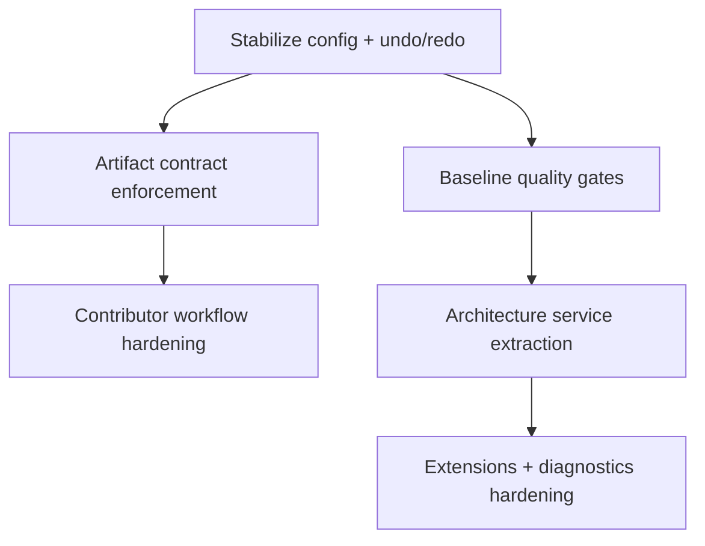

<!--
SPDX-License-Identifier: GPL-2.0-only

Project: Ecli
File: docs/planning/execution-sequencing.md
Website: https://www.ecli.io
Repository: https://github.com/SSobol77/ecli
PyPI: https://pypi.org/project/ecli-editor/0.0.1/

Copyright (c) 2026 Siergej Sobolewski

Licensed under the GNU General Public License version 2 only.
See the LICENSE file in the project root for full license text.
-->
# Execution Sequencing

## Dependency Graph

## Sequencing Matrix

| Step | Preconditions | Parallelizable? | Validation gate | Notes |
|---|---|---:|---|---|
| S1 correctness stabilization | critical defect inventory | No | invariant and parse checks pass | foundation step |
| S2 release contract rollout | S1 | Partial | release CI contract checks | can run with S3 partially |
| S3 quality baseline | S1 | Yes | lint/format/test baseline | supports S5 safety |
| S4 contributor hardening | S2 | Yes | command/path docs verified | ties release+contributor docs |
| S5 architecture extraction | S1 + S3 | No | parity tests and contract checks | do not start before S3 |
| S6 extension/diagnostics formalization | S5 | Partial | extension contract checks | depends on stable mutation boundaries |

## Freeze Points

- Freeze F1: before release contract enforcement in production release branches.
- Freeze F2: before architecture slice merges impacting core mutation paths.

## Go / No-Go Gates

- Go if preconditions and validation evidence are complete.
- No-go if critical contract test or release artifact contract gate fails.

## Sequencing Hazards / Anti-Patterns

- Starting service extraction before characterization tests.
- Updating contributor docs without verifying scripts/workflows.
- Launching extension stabilization before mutation boundaries are enforced.
