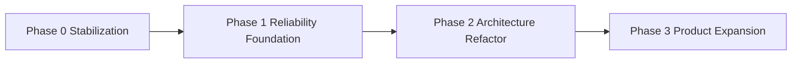

<!--
Filename: docs/planning/roadmap.md
Project:  ECLI
License:  MIT
Author:   Siergej Sobolewski
Copyright: (c) 2026 Siergej Sobolewski
-->

# Roadmap (Execution Governance)

## Phase Flow

## Workstream Matrix

| ID | Phase | Owner | Dependencies | DoR | DoD | Acceptance criteria | Evidence | Governing docs |
|---|---|---|---|---|---|---|---|---|
| R0-1 | 0 | Core maintainers | none | defect reproduced and scoped | config validation gate + fixed default parse path | no release with malformed default config | CI evidence + startup run | `docs/config/*`, `docs/quality/*` |
| R0-2 | 0 | Core maintainers | baseline tests | failing undo/redo sequences captured | invariant tests pass | deterministic undo/redo for covered matrix | test outputs | `docs/architecture/*`, `docs/quality/test-strategy.md` |
| R0-3 | 0 | Release maintainers | artifact contract | mismatch inventory complete | release checks enforce naming | release pipeline blocks contract drift | CI release checks | `docs/release/*` |
| R1-1 | 1 | Quality maintainers | phase 0 completion | test scope agreed | baseline test suite established | minimum regression protection in place | CI run | `docs/quality/*` |
| R1-2 | 1 | Contributor/release maintainers | R1-1 | command inventory verified | contributor docs aligned to real commands | onboarding/release commands reproducible | validation logs | `docs/contributor/*`, `docs/release/*` |
| R2-1 | 2 | Core maintainers | R0-2, R1-1 | characterization tests in place | service extraction slices merged | reduced orchestrator coupling without regressions | diff + tests | `docs/architecture/target-architecture.md` |
| R2-2 | 2 | UI maintainers | R2-1 | panel boundary contracts agreed | panel decomposition completed | panel mutation rules enforced | tests + review checklist | `docs/architecture/module-contracts.md` |
| R2-3 | 2 | Config maintainers | R0-1 | canonical schema inventory accepted | migration + strict validation policy operational | schema drift reduced | CI schema checks | `docs/config/*` |
| R3-1 | 3 | Extensions maintainers | R2 baseline complete | extension boundary contracts defined | extension model v1 documented/validated | stable extension pathway begins | integration tests/docs evidence | `docs/extensions/*` |
| R3-2 | 3 | Integration maintainers | R2-3 | error taxonomy defined | AI/diagnostics runtime hardening evidence | graceful degradation consistency | runtime logs + tests | `docs/extensions/ai-provider-runtime.md` |
